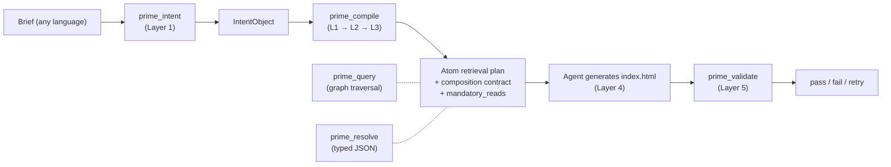

<p align="center">
  
</p>

# prime-corpus-frontend-design

> **The reference frontend-design corpus and reference application built on Skill Wiki.**
> 899 atoms, 31 personas, 14 verbs, 100% reachability — see what a real Skill Wiki corpus looks like in production.

[English](#english) · [中文](./README.zh-CN.md)

---

## English

### What this repo is

This repo is a **complete, runnable Skill Wiki application** for one domain:
frontend design. It ships:

1. The **frontend-design corpus** — 899 typed atoms across 9 domains
   (frontend-design, accessibility, security, ux, motion, typography,
   color, content, …), 31 design personas, ~3,500 declared edges.
2. The **reference application** — five domain-specific MCP tools
   (`prime_compile`, `prime_query`, `prime_intent`, `prime_validate`,
   `prime_resolve`), a 6-axis retrieval algorithm, a composition-contract
   merger, an HTML output validator, and a 30-yaml task taxonomy.
3. The **`prime-decompose` Claude Code Skill** — an authoring assistant
   that turns markdown documents into valid `.prime` atom drafts.
4. The **A/B benchmark harness** — 20 fixed-task fixtures plus the
   sonnet/haiku × prime/skill matrix runner, with raw outputs reproducible.

If the system repo is a *generic* knowledge protocol (lexer, parser,
compiler, runtime, registry — all domain-agnostic), this repo is the
*answer to "what does that look like for a real domain?"*. It is meant to
be **read, forked, and adapted** to your own domain.

> Skill Wiki — typed atoms, edge graph, lazy projection. Like Wikipedia, but for AI agents.

### Why a separate corpus repo

The system repo is intentionally domain-blind. It can compile any
`.prime` file regardless of what kind of knowledge it encodes — security
rules, ML training procedures, copywriting voices, anything.

But the moment you want to *do something useful*, you need a corpus and
the domain-specific glue around it: a task taxonomy, a retrieval scorer
that understands which atoms should win for a given brief, a validator
that knows what a "good" output looks like in your domain, and an MCP
adapter that hands the right atoms to your agent.

This repo is that glue, for the frontend-design case. The exact same
shape of repo is what you would build for `prime-corpus-security`,
`prime-corpus-clinical-trials`, or `prime-corpus-game-design`.

### Numbers (frozen 2026-05-08)

| Metric | Value |
|---|---|
| Atoms (compiled) | **899** |
| Domains touched | **9** (frontend-design, accessibility, security, ux, motion, typography, color, content, performance, …) |
| Personas | **31** (10 `@impeccable` + 21 `@community`) |
| Atom kinds in active use | 28 declared, ~14 actively populated |
| Edge verbs in active use | 14 declared, 11 with non-zero count |
| Edges (graph) | ~3,500 |
| MCP tools | **5** (compile, query, intent, validate, resolve) |
| Task taxonomy entries | **30** YAML files across 5 task families |
| Reachability from any persona | **100%** to required mandatory-reads |
| Source LOC of `.prime` files | ~165 KB across 899 files |

The atoms are split across five scopes:

| Scope | Atom count | What it is |
|---|---|---|
| `@community` | 826 | Public-domain authored atoms (rules, patterns, facts, …) |
| `@impeccable` | 40 | Distinct persona schools + their motion templates |
| `@anthropic-impeccable` | 26 | Atoms derived from anthropics/skills (MIT, attributed) |
| `@nielsen` | 2 | Nielsen 10 Heuristics taxonomy + source |
| `@w3c` | 5 | WCAG 2.2 success-criterion facts + sources |

> The system repo's spec talks about "knowledge as program". This repo is
> what 899 program declarations look like for one domain. Browse
> `primes-v3/sources/` and you'll see it.

### The five MCP tools at a glance

The frontend-design pipeline runs in five layers — each is a pure
function over IntentObject + atom corpus, and there's one MCP tool per
layer (with `prime_compile` orchestrating L1 → L3 in one shot).



The five tools are documented in [docs/mcp-tools.md](docs/mcp-tools.md).
Decision tree for "which tool to call":

| You want to | Call |
|---|---|
| Convert a brief into a structured intent (1 LLM call) | `prime_intent` |
| Get the full retrieval plan + mandatory-reads + contract | `prime_compile` |
| Get a typed JSON spec (font names, hex codes, durations) ready to drop into CSS | `prime_resolve` |
| Search the corpus for atoms by keyword or graph-traverse from one | `prime_query` |
| Validate an `index.html` against the composition contract | `prime_validate` |

### A 60-second tour

```bash
# Inside this repo
cd /path/to/prime-corpus-frontend-design

# Boot the MCP server against the frozen corpus
PRIME_BACKEND=v3 \
PRIME_DIR=$(pwd)/compiled-v3-final \
  node --experimental-transform-types mcp-server/index.ts

# Wire it into Claude Code (.mcp.json)
{
  "mcpServers": {
    "prime-wiki": {
      "command": "node",
      "args": ["--experimental-transform-types", "mcp-server/index.ts"],
      "env": {
        "PRIME_BACKEND": "v3",
        "PRIME_DIR": "/abs/path/to/compiled-v3-final"
      }
    }
  }
}
```

Try a brief:

```
You: 邮件订阅页, 简单就行

Agent (calls prime_intent):
  → IntentObject {
      task_type: "marketing-landing",
      sub_type: "waitlist",
      register_candidates: ["warm-institutional", "magazine-editorial", "notion-warm"],
      density: "loose",
      motion_priority: "low",
      domain: "consumer-saas"
    }

Agent (calls prime_compile):
  → axes: { register: warm-institutional, pattern: hero-with-demo,
            motion: fade-in-on-load, typography: 18-20px serif body, ... }
  → mandatory_reads: [pattern-hero-with-demo, pattern-trust-signal-components,
                      rule-single-primary-action-per-screen,
                      pattern-inline-validation]
  → composition_contract: warm-institutional must-include + must-avoid

Agent (reads each mandatory full.md, then writes):
  index.html  →  cream background, Fraunces serif headline, single email
                 form CTA above the fold, social proof badges, OKLCH ramp.

Agent (calls prime_validate):
  → L1 structure: pass · L2 aesthetic skipped (no LLM key)
  → L3 contract: pass (5 must-includes honored, 0 must-avoids violated)
```

That whole flow is reproducible in
[`benchmarks/tasks/01-waitlist/`](benchmarks/tasks/) — every task in the
A/B suite ran exactly this pipeline.

### What's in the box

```
prime-corpus-frontend-design/
├── README.md / README.zh-CN.md         this file
├── LICENSE / NOTICE                    Apache-2.0 + third-party attributions
├── CONTRIBUTING.md                     atom authoring for THIS corpus
├── CHANGELOG.md                        wave-by-wave changelog (W1–W13)
├── ROADMAP.md                          what's coming
├── MANIFEST.md                         what comes from where
├── domains/
│   ├── frontend-design.yaml            domain plugin for the main corpus (20 tags, 3 axes)
│   ├── security.yaml                   domain plugin for security atoms (23 tags, 2 axes)
│   └── accessibility.yaml              domain plugin for accessibility atoms (12 tags, 3 axes)
├── docs/
│   ├── overview.md                     899 atoms organized by domain / kind / persona school
│   ├── personas.md                     31 personas as a catalog (use cases, atoms each pulls in)
│   ├── taxonomy.md                     30 task-type yamls (waitlist / blog / pricing / …)
│   ├── retrieval.md                    6-axis retrieval algorithm with score function
│   ├── composition-contract.md         must-include / must-avoid / typography_required / …
│   ├── validator-html.md               L1 (regex) · L2 (LLM) · L3 (signature grep)
│   ├── mcp-tools.md                    the 5 tools, with I/O signatures + decision tree
│   ├── benchmarks.md                   honest A/B history including the Skill Space-Grotesk collapse
│   ├── atom-authoring.md               which kinds for what design knowledge
│   ├── extending.md                    add a new persona / pattern / domain
│   └── faq.md                          15 corpus-specific questions
├── benchmarks/                         the A/B harness (was test-framework/)
│   ├── README.md
│   ├── tasks/                          20-task fixtures
│   ├── conditions/                     raw / prime / skill-koomook scaffolds
│   └── results/                        recent runs
├── prime-decompose/                    the atom-authoring Skill (Claude Code)
│   ├── SKILL.md
│   ├── reference/                      kinds + DSL syntax + verb cheatsheet
│   └── scripts/validate-output.ts
└── (symlinks to source repo for the actual atom files & packages)
```

### Reading order, by audience

**If you're a designer browsing for inspiration**:
[`docs/personas.md`](docs/personas.md) → [`docs/taxonomy.md`](docs/taxonomy.md) →
look at any `persona-*.prime` source.

**If you're a frontend agent author** (you want your agent to use this):
[`docs/mcp-tools.md`](docs/mcp-tools.md) → [`docs/retrieval.md`](docs/retrieval.md) →
[`docs/composition-contract.md`](docs/composition-contract.md).

**If you want to fork it for your own domain**:
[`docs/atom-authoring.md`](docs/atom-authoring.md) →
[`prime-decompose/SKILL.md`](prime-decompose/SKILL.md) →
[`docs/extending.md`](docs/extending.md).

**If you're skeptical and want to see the data**:
[`docs/benchmarks.md`](docs/benchmarks.md) — read the honest section.

### The A/B story (what the data does and doesn't show)

We ran six different benchmarks across three months. Here's the
condensed truth:

| Benchmark | When | What it measured | Verdict |
|---|---|---|---|
| Phase 2 (4 tasks × 4 conds) | 2026-04-15 | Prime vs Skill cost+speed | Prime 26% cheaper, 1.76× faster, 47% fewer output tokens |
| Wave 6 (12 tasks × 2 conds) | 2026-05-03 | Prime vs Skill quality | "12/12 wins" was an over-claim — N=1 per condition |
| Wave 7 protocol close | 2026-05-05 | Architecture audit | Found 4 P0 bugs (now fixed) |
| Wave 12 honesty pass | 2026-05-07 | Re-evaluation | Architecture alignment ~70%, not 85% |
| 12-task sonnet+haiku × prime/skill (`/tmp/ab-2026-05-08`) | 2026-05-08 | Aesthetic distribution | **Prime 6 personas / Skill collapsed to Space Grotesk in 5/6 tasks** |
| `run-noise.sh` N≥3 | pending | Robust win-rate | Harness landed; full sweep not run |

The most interesting finding is the last benchmark. Six complex animated
UI briefs (particle hero, parallax timeline, terminal sim, music
waveform, 3D card gallery, vote dashboard) were given to both
conditions:

- **Skill chose Space Grotesk in 5 of 6 tasks**. Cyberpunk (pink/cyan/gold)
  palette in 4–5 of 6. The brief content barely affected output — Skill
  applied its "distinctive frontend recipe" uniformly.
- **Prime chose 6 different personas** (Vercel, magazine-editorial, Warp,
  Spotify, Airbnb, Linear-precise) for 6 different briefs. The wiki
  routed each task to the correct register.

That's not "Prime wins on quality" — both outputs are competent. It's
"Prime wins on **aesthetic distribution under varying briefs**", which
is exactly what a corpus of 31 personas is for. Full report at
[`docs/benchmarks.md`](docs/benchmarks.md).

What this **doesn't** show: that one is more beautiful, that this
generalizes outside complex animated UI, that win-rates hold under N=3.
We say so explicitly.

### The Skill Wiki philosophy in one paragraph

A Skill Wiki has the same shape as Wikipedia: a graph of typed entries
that any reader can browse, but where each entry is **authored to one
audience type — an LLM agent**. Like Wikipedia, atoms are versioned,
sourced, and linked; unlike Wikipedia, they are typed (`rule` /
`pattern` / `persona` / etc.) and projected at three levels (summary /
core / full) so an agent's context budget is spent on what the brief
actually needs. The corpus repo you're reading is one Skill Wiki — the
frontend-design one.

### How this differs from a Tailwind preset / shadcn template

A Tailwind config is a *single fixed taste*. A shadcn copy is a *single
component implementation*. This corpus is a **graph of choices** the
agent picks from based on the brief:

- 31 personas the agent can adopt (vs one default theme)
- 14 edge verbs that connect personas to required patterns + forbidden
  ones (vs no relational structure)
- A composition contract the agent must honor (vs no enforcement)
- A validator that checks the output against the chosen persona (vs
  no feedback loop)

The corpus is also **MIT/CC-equivalent for the substantive design
content**, with full third-party attribution in `NOTICE`.

### Install + boot

You need the system repo for parser/compiler/runtime. Once that's set
up:

```bash
# 1. Have the system repo cloned
git clone https://github.com/skill-wiki/prime.git ../prime-system
cd ../prime-system && bun install && bun run build

# 2. Clone this corpus repo next to it
cd .. && git clone https://github.com/skill-wiki/prime-corpus-frontend-design.git
cd prime-corpus-frontend-design

# 3. Compile the corpus (or use the frozen artifact)
node --experimental-transform-types \
  ../prime-system/scripts/build-atom-dirs.ts \
  --src primes-v3/sources \
  --out compiled-v3-final
# → 899 atoms compiled

# 4. Boot the MCP server
PRIME_BACKEND=v3 \
PRIME_DIR=$(pwd)/compiled-v3-final \
  node --experimental-transform-types mcp-server/index.ts
```

> The frozen artifact in `compiled-v3-final/` is regenerated by CI on
> every commit; you can use it directly without recompiling for instant
> boot.

### Cross-links to the system repo

This repo is **one application of the Skill Wiki / Prime protocol**. The
protocol itself — 28 kinds, 14 verbs, projection model, registry — is
domain-agnostic and ships in the separate
[`prime-system`](https://github.com/skill-wiki/prime-system) repo. Everything
in this repo (6-axis retrieval, 31-persona catalog, 30 task taxonomies,
HTML output validator, IntentObject shape) is **frontend-domain
implementation** built on top of that protocol.

When you see "see system repo docs/X.md", that means:

| Topic | Where |
|---|---|
| `.prime` DSL grammar | system repo `docs/dsl-quickref.md` |
| L1/L2/L3 compiler checkers | system repo `packages/compiler/src/` + spec |
| 28 atom kinds + schemas (domain-agnostic) | system repo `spec/PRIME-PROTOCOL-v1.md` §1.2 |
| 14 edge verbs | system repo `spec/PRIME-PROTOCOL-v1.md` §2 |
| Projection model (summary/core/full) | system repo `spec/PRIME-PROTOCOL-v1.md` §5 |
| Registry protocol (publish/install) | system repo `packages/registry/` |
| Frontend-domain-specific spec (6-axis retrieval, IntentObject, HTML validator) | system repo `spec/FRONTEND-DESIGN-DOMAIN-v1.md` |

This corpus repo's docs cover what's *specific to frontend-design*: the
6-axis retrieval, the 31-persona catalog, the 30 task taxonomies, the
composition-contract semantics, the HTML validator's signature library,
and the A/B benchmark methodology.

### Contributing

Atom authoring uses the [`prime-decompose`](prime-decompose/SKILL.md)
Claude Code Skill — point it at any markdown design doc, get back a
candidate set of `.prime` atoms.

Hard rules ([`CONTRIBUTING.md`](CONTRIBUTING.md)):

- Pick from the 28 declared kinds — never paraphrase.
- ≥3 `related:` edges per atom; ≥1 of {extends, derived-from, requires,
  enhances, specializes}.
- Brand-name personas (`persona-stripe`, `persona-linear`) describe
  observable public design characteristics. They reference, not
  redistribute.
- Cite WCAG / Nielsen / source material via `derived-from:
  @w3c/...` or `derived-from: @nielsen/...` — never paraphrase
  uncited.

### License

Apache License 2.0 for the corpus and code. See [LICENSE](LICENSE).

Third-party attributions in [NOTICE](NOTICE) (Apache §4(d) requires
this be preserved in forks):

- 26 atoms under `@anthropic-impeccable/` derive from
  [anthropics/skills](https://github.com/anthropics/skills) (MIT, 2025).
- WCAG 2.2 / Nielsen Norman Heuristics atoms cite (do not redistribute)
  W3C and Nielsen Norman Group material with inline `derived-from`
  edges.
- Brand-name personas (Stripe, Linear, Vercel, Notion, Apple, Airbnb,
  Spotify, …) describe **observable public design characteristics** for
  educational use. They reference, not endorse. Trademarks remain with
  the respective owners.

### Status

| | |
|---|---|
| Spec version | v1 (frozen) |
| Corpus version | 1.13 (Wave 13) |
| Last verified compile | 899 / 899 atoms parse clean, registry pass 100% |
| Last A/B run | 2026-05-08 (12 tasks, 2 models, prime + skill) |
| Known open issues | 49 broken refs awaiting authoring; 14 sparse-kind atoms |
| Reachability check | 100% from any persona to required mandatory-reads |

See [STATUS-2026-05-07.md](https://github.com/skill-wiki/prime/blob/main/STATUS-2026-05-07.md)
in the system repo for the engineering-checkpoint version of these
numbers.

---

The 899-atom set was assembled wave by wave. The history (and the
honesty about what each wave actually shipped) is in
[CHANGELOG.md](CHANGELOG.md). The forward plan is in
[ROADMAP.md](ROADMAP.md). The benchmark methodology and raw findings
are in [docs/benchmarks.md](docs/benchmarks.md).

> "Skill is the manual, Prime is the parts library."
> — `PHILOSOPHY.md` in the system repo

If your team writes design specs in markdown, this corpus is what they
would look like reorganized as a graph the agent can actually navigate.
Fork it, curate it, ship a domain-specific Skill Wiki of your own.
