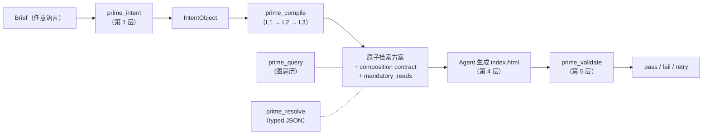

<p align="center">
  
</p>

# prime-corpus-frontend-design

> **建在 Skill Wiki 上的前端设计参考语料库与参考应用。**
> 899 个原子、31 个 persona、14 个关系动词、100% 可达性 —— 看一眼一个真实的 Skill Wiki 在生产里长什么样。

[English](./README.md) · [中文](#中文)

---

## 中文

### 这个仓库是什么

这个仓库是一个**完整、可运行的 Skill Wiki 应用**，针对一个具体领域：前端
设计。它包含：

1. **前端设计语料库** —— 899 个有类型的原子，跨 9 个领域（前端设计、可
   访问性、安全、UX、动效、字体、配色、内容、性能、……），31 个设计
   persona，约 3,500 条声明的边。
2. **参考应用** —— 5 个领域专属的 MCP 工具（`prime_compile`、
   `prime_query`、`prime_intent`、`prime_validate`、`prime_resolve`），
   一个 6 轴检索算法，一个 composition-contract 合并器，一个 HTML 输出
   校验器，30 份任务类型 YAML 分类。
3. **`prime-decompose` Claude Code Skill** —— 一个写作助手，它把任意
   markdown 文档转成可用的 `.prime` 原子草稿。
4. **A/B 基准测试 harness** —— 20 个固定任务的 fixture，加上
   sonnet/haiku × prime/skill 矩阵的运行器，原始输出可复现。

如果说系统仓库是一个**通用**的知识协议（lexer、parser、compiler、
runtime、registry —— 全部领域无关的），这个仓库就是回答**"那对一个真实
领域来讲是什么样的？"**。它的目的是被人**读、fork、改造**为你自己的领
域。

> Skill Wiki —— 类型化原子、关系图、惰性投影。像 Wikipedia，但是为 AI agent 写的。

### 为什么要单独有个语料库仓库

系统仓库刻意是领域盲的。它能编译任何 `.prime` 文件，不管那条知识是什
么 —— 安全规则、ML 训练流程、文案 voice，都行。

但只要你想**做点有用的事**，就需要一个语料库 + 它周围的领域专属粘合
剂：任务分类、知道"这个 brief 该返回哪些原子"的检索打分器、知道你领域
里"什么叫好"的输出校验器、把对的原子塞给你 agent 的 MCP 适配器。

这个仓库就是那一层粘合剂，针对前端设计这一例。完全相同的仓库形状，
就是你为 `prime-corpus-security`、`prime-corpus-clinical-trials`、
`prime-corpus-game-design` 要建的样子。

### 数字（2026-05-08 冻结版）

| 指标 | 数值 |
|---|---|
| 编译后的原子数 | **899** |
| 涉及的领域数 | **9**（frontend-design、accessibility、security、ux、motion、typography、color、content、performance……）|
| Persona 数 | **31**（10 个 `@impeccable` + 21 个 `@community`）|
| 主动使用的 atom kind | 28 类声明，约 14 类有量 |
| 主动使用的 edge verb | 14 个声明，11 个有非 0 边 |
| 总边数 | 约 3,500 |
| MCP 工具数 | **5**（compile、query、intent、validate、resolve）|
| 任务分类条目 | **30** 个 YAML，覆盖 5 个任务族 |
| 任意 persona 到 mandatory-reads 的可达性 | **100%** |
| `.prime` 源码体量 | 899 个文件，约 165 KB |

原子分布在 5 个 scope 下：

| Scope | 原子数 | 含义 |
|---|---|---|
| `@community` | 826 | 公共领域作者写的原子（rule / pattern / fact / …） |
| `@impeccable` | 40 | 独特 persona school + 它们的动效 template |
| `@anthropic-impeccable` | 26 | 派生自 anthropics/skills 的原子（MIT，已注明） |
| `@nielsen` | 2 | Nielsen 10 启发式 taxonomy + 来源 |
| `@w3c` | 5 | WCAG 2.2 success-criterion fact + 来源 |

> 系统仓库的 spec 谈的是"知识即程序"。这个仓库展示的就是 899 个程序声
> 明在一个领域里长什么样。直接看 `primes-v3/sources/` 即可。

### 5 个 MCP 工具一眼看懂

前端设计 pipeline 有 5 层 —— 每一层都是一个对 IntentObject + 原子语
料库的纯函数，每层一个 MCP 工具（`prime_compile` 把 L1 → L3 一次合并
完成）。



5 个工具的完整说明在 [docs/mcp-tools.md](docs/mcp-tools.md)。决策树
"该调哪个工具":

| 你想 | 调用 |
|---|---|
| 把 brief 转成结构化 intent（1 次 LLM 调用）| `prime_intent` |
| 拿到完整检索方案 + mandatory-reads + contract | `prime_compile` |
| 拿到 typed JSON 设计规格（字体名、hex、duration），可以直接塞进 CSS | `prime_resolve` |
| 按关键词搜原子，或从一个原子图遍历 | `prime_query` |
| 校验一份 `index.html` 是否符合 composition contract | `prime_validate` |

### 60 秒上手

```bash
# 进入此仓库
cd /path/to/prime-corpus-frontend-design

# 用冻结的语料库启动 MCP 服务器
PRIME_BACKEND=v3 \
PRIME_DIR=$(pwd)/compiled-v3-final \
  node --experimental-transform-types mcp-server/index.ts

# 接到 Claude Code（.mcp.json）
{
  "mcpServers": {
    "prime-wiki": {
      "command": "node",
      "args": ["--experimental-transform-types", "mcp-server/index.ts"],
      "env": {
        "PRIME_BACKEND": "v3",
        "PRIME_DIR": "/abs/path/to/compiled-v3-final"
      }
    }
  }
}
```

试一个 brief：

```
你: 邮件订阅页, 简单就行

Agent（调 prime_intent）:
  → IntentObject {
      task_type: "marketing-landing",
      sub_type: "waitlist",
      register_candidates: ["warm-institutional", "magazine-editorial", "notion-warm"],
      density: "loose",
      motion_priority: "low",
      domain: "consumer-saas"
    }

Agent（调 prime_compile）:
  → axes: { register: warm-institutional, pattern: hero-with-demo,
            motion: fade-in-on-load, typography: 18-20px serif body, ... }
  → mandatory_reads: [pattern-hero-with-demo, pattern-trust-signal-components,
                      rule-single-primary-action-per-screen,
                      pattern-inline-validation]
  → composition_contract: warm-institutional 的 must-include + must-avoid

Agent（依次 Read 每份 mandatory full.md，然后写）:
  index.html  →  奶油背景、Fraunces 衬线大标题、首屏唯一 email 表单
                 CTA、社会证明徽章、OKLCH 色阶。

Agent（调 prime_validate）:
  → L1 结构: pass · L2 美学: 跳过（无 LLM key）
  → L3 contract: pass（5 个 must-include 全满足，0 个 must-avoid 被违反）
```

整个流程在 [`benchmarks/tasks/01-waitlist/`](benchmarks/tasks/) 可复现 ——
A/B 套件里每个任务跑的就是上面这套 pipeline。

### 仓库结构

```
prime-corpus-frontend-design/
├── README.md / README.zh-CN.md         本文件
├── LICENSE / NOTICE                    Apache-2.0 + 第三方致谢
├── CONTRIBUTING.md                     针对本语料库的原子编写指南
├── CHANGELOG.md                        wave 维度变更日志（W1–W13）
├── ROADMAP.md                          路线图
├── MANIFEST.md                         哪部分来自哪
├── docs/
│   ├── overview.md                     899 个原子按 domain / kind / persona school 三种切片
│   ├── personas.md                     31 个 persona 的 catalog（用例 + 各自带哪些原子）
│   ├── taxonomy.md                     30 份任务类型 yaml（waitlist / blog / pricing / …）
│   ├── retrieval.md                    6 轴检索算法 + 打分函数
│   ├── composition-contract.md         must-include / must-avoid / typography_required / …
│   ├── validator-html.md               L1（regex） · L2（LLM） · L3（signature grep）
│   ├── mcp-tools.md                    5 个工具，I/O 签名 + 决策树
│   ├── benchmarks.md                   诚实的 A/B 历史，含 Skill Space-Grotesk 收敛事件
│   ├── atom-authoring.md               哪一类设计知识用哪一种 kind
│   ├── extending.md                    新增 persona / pattern / domain
│   └── faq.md                          15 个语料库专属问题
├── benchmarks/                         A/B harness（原 test-framework/）
│   ├── README.md
│   ├── tasks/                          20 个任务 fixture
│   ├── conditions/                     raw / prime / skill-koomook scaffold
│   └── results/                        近期跑出来的样本
├── prime-decompose/                    原子写作 Skill（Claude Code）
│   ├── SKILL.md
│   ├── reference/                      kinds + DSL syntax + verb 速查
│   └── scripts/validate-output.ts
└── （指向系统仓库的符号链接，原子文件 + packages 在那）
```

### 阅读顺序，按受众

**如果你是设计师在找灵感**:
[`docs/personas.md`](docs/personas.md) → [`docs/taxonomy.md`](docs/taxonomy.md) →
随便打开一个 `persona-*.prime` 看源文件。

**如果你是前端 agent 作者**（你想让你的 agent 用这套）:
[`docs/mcp-tools.md`](docs/mcp-tools.md) → [`docs/retrieval.md`](docs/retrieval.md) →
[`docs/composition-contract.md`](docs/composition-contract.md)。

**如果你想 fork 一份用在自己的领域**:
[`docs/atom-authoring.md`](docs/atom-authoring.md) →
[`prime-decompose/SKILL.md`](prime-decompose/SKILL.md) →
[`docs/extending.md`](docs/extending.md)。

**如果你怀疑这套，想看数据**:
[`docs/benchmarks.md`](docs/benchmarks.md) —— 读"诚实"那一节就够。

### A/B 故事（数据证明了什么、没证明什么）

我们三个月里跑了 6 轮基准测试。压缩后的真相是：

| 基准 | 时间 | 测什么 | 结论 |
|---|---|---|---|
| Phase 2（4 任务 × 4 条件）| 2026-04-15 | Prime vs Skill 成本+耗时 | Prime 便宜 26%、快 1.76×、output 少 47% |
| Wave 6（12 任务 × 2 条件）| 2026-05-03 | Prime vs Skill 质量 | "12/12 全胜" 是过度声明 —— 每条件 N=1 |
| Wave 7 协议收尾 | 2026-05-05 | 架构审计 | 找到 4 个 P0 bug（已修） |
| Wave 12 诚实复盘 | 2026-05-07 | 重新审视 | 架构对齐 ~70%，不是 85% |
| 12 任务 sonnet+haiku × prime/skill（`/tmp/ab-2026-05-08`）| 2026-05-08 | 美学分布 | **Prime 6 个 persona / Skill 5/6 任务都收敛到 Space Grotesk** |
| `run-noise.sh` N≥3 | 待跑 | 鲁棒胜率 | harness 已落地；全量未跑 |

最有意思的发现是最后一项。6 个复杂动效 UI brief（粒子 hero、视差时间
轴、终端模拟、音乐波形、3D 卡画廊、计票大屏）同时给两个条件：

- **Skill 6 个任务里 5 个选了 Space Grotesk**。4–5 个用赛博朋克
  （粉/青/金）palette。brief 内容**几乎没影响输出** —— Skill 把它的
  "distinctive frontend recipe" 一刀切地套上来了。
- **Prime 给 6 个不同 brief 选了 6 个不同 persona**（Vercel、
  magazine-editorial、Warp、Spotify、Airbnb、Linear-precise）。wiki 把
  每个任务路由到了正确的 register。

这不是"Prime 质量更好" —— 两边输出都合格。这是"Prime 在**变化的 brief
下美学分布更广**"，而那正是 31 个 persona 的语料库要做的事。完整报告
在 [`docs/benchmarks.md`](docs/benchmarks.md)。

这件事**没**证明：哪边更好看、能不能推广到复杂动效 UI 之外、N=3 下胜率
还成不成立。我们在文档里明说了。

### Skill Wiki 哲学，一段话

Skill Wiki 与 Wikipedia 同形：一张可以浏览的、有类型的条目图，每个
条目都被**为单一受众类型 —— LLM agent —— 写作**。和 Wikipedia 一样，
原子有版本、有出处、互相链接；和 Wikipedia 不同的是，原子是**类型化**
的（`rule` / `pattern` / `persona` / …），且**三层投影**（summary /
core / full），让 agent 的 context 预算只花在 brief 真正需要的东西
上。你正在读的这个仓库就是一份 Skill Wiki —— 前端设计领域的那份。

### 跟 Tailwind preset / shadcn template 的差别

Tailwind config 是**单一固定品味**。shadcn copy 是**单一组件实现**。
这套语料库是 agent 根据 brief 来挑的**选择图**：

- 31 个 persona 让 agent 选（vs 一个默认主题）
- 14 种 edge verb 把 persona 跟 required 模式 + 禁止模式连起来（vs 没
  有关系结构）
- 一份 composition contract，agent 必须遵守（vs 没有强制）
- 一个 validator 检查输出是否匹配所选 persona（vs 没有反馈环）

这套语料库还**对实质设计内容采用 MIT/CC 等价许可**，第三方致谢完整放
在 `NOTICE` 里。

### 安装与启动

需要系统仓库提供 parser/compiler/runtime。一旦那边搭好：

```bash
# 1. 先克隆系统仓库
git clone https://github.com/skill-wiki/prime.git ../prime-system
cd ../prime-system && bun install && bun run build

# 2. 紧挨着克隆此语料库仓库
cd .. && git clone https://github.com/skill-wiki/prime-corpus-frontend-design.git
cd prime-corpus-frontend-design

# 3. 编译语料库（也可直接用冻结产物）
node --experimental-transform-types \
  ../prime-system/scripts/build-atom-dirs.ts \
  --src primes-v3/sources \
  --out compiled-v3-final
# → 编译 899 个原子

# 4. 启动 MCP server
PRIME_BACKEND=v3 \
PRIME_DIR=$(pwd)/compiled-v3-final \
  node --experimental-transform-types mcp-server/index.ts
```

> `compiled-v3-final/` 里的冻结产物每次 commit 由 CI 重新生成；你可以
> 直接用，不需要重编译，立即可启动。

### 与系统仓库的交叉引用

凡是涉及协议层的事，本仓库的文档都引到系统仓库。看到 "see system
repo docs/X.md" 即指：

| 主题 | 在哪 |
|---|---|
| `.prime` DSL 语法 | 系统仓库 `docs/dsl-quickref.md` |
| L1/L2/L3 编译期 checker | 系统仓库 `packages/compiler/src/` + spec |
| 28 种 atom kind 与 schema | 系统仓库 `PRIME-SPEC-v1.md` §1.2 |
| 14 种 edge verb | 系统仓库 `PRIME-SPEC-v1.md` §2 |
| 投影模型（summary/core/full）| 系统仓库 `PRIME-SPEC-v1.md` §5 |
| Registry 协议（publish/install）| 系统仓库 `packages/registry/` |

本仓库文档覆盖**前端设计专属**的部分：6 轴检索、31 persona catalog、
30 任务分类、composition-contract 语义、HTML validator 的签名库、A/B
基准方法。

### 贡献

原子写作请用 [`prime-decompose`](prime-decompose/SKILL.md) Claude
Code Skill —— 把它指向任意 markdown 设计文档，得到一组候选 `.prime`
原子。

硬规则（[`CONTRIBUTING.md`](CONTRIBUTING.md)）：

- 从 28 种声明的 kind 里挑 —— 不要改写成新词。
- 每个原子至少 3 条 `related:` 边；至少 1 条 {extends, derived-from,
  requires, enhances, specializes}。
- 品牌名 persona（`persona-stripe`、`persona-linear`）描写的是**可观察
  的公开设计特征**。它们引用，不再分发。
- 引 WCAG / Nielsen / 来源材料一律走 `derived-from: @w3c/...` 或
  `derived-from: @nielsen/...` —— 严禁不署名地改写。

### License

代码与语料库走 Apache License 2.0。见 [LICENSE](LICENSE)。

第三方致谢在 [NOTICE](NOTICE)（Apache §4(d) 要求 fork 时保留）：

- `@anthropic-impeccable/` 下 26 个原子派生自
  [anthropics/skills](https://github.com/anthropics/skills)（MIT, 2025）。
- WCAG 2.2 / Nielsen Norman 启发式相关原子**引用**（不分发）W3C 与
  Nielsen Norman Group 的材料，用 `derived-from` 边标注。
- 品牌名 persona（Stripe、Linear、Vercel、Notion、Apple、Airbnb、
  Spotify、……）描写的是**可观察的公开设计特征**，用于教育目的。引用，
  不背书。商标归属各自原所有人。

### 真实样例：从 brief 到 mandatory-reads

举一个具体例子，看 wiki 是怎么把抽象概念落到具体动作的。

Brief: `"博客单篇文章页, 排版要讲究"`

`prime_intent` 把它分类成 `task_type=blog-article`、
`sub_type=blog-article`、`density=loose`、`motion_priority=low`。从
`taxonomy/content/blog-article.yaml` 的 `default_register_pool` 拿到候
选 register: `magazine-editorial 0.55 / notion-warm 0.25 /
warm-institutional 0.20`。

`prime_compile` 在 6 个轴上分别打分，最终落出来：

| 轴 | 选中 | 备选 |
|---|---|---|
| register | `@impeccable/persona-magazine-editorial` | `@community/persona-notion`, `@impeccable/persona-warm-institutional` |
| pattern | `@community/pattern-blog-article-layout` | `@community/pattern-table-of-contents-sticky` |
| motion | `@community/pattern-fade-in-on-load` | `@community/pattern-scroll-reveal` |
| typography | `@community/principle-typography-hierarchy` + `@community/rule-line-length-optimal` | `@community/fact-type-scale-modular` |
| color | `@community/rule-single-accent-color` | `@community/constraint-no-pure-white-bg` |
| rules | `@community/rule-line-length-optimal`, `@community/rule-backgrounds-atmospheric` | … |

加上 `magazine-editorial` 的 composition contract:

- `must-include`: `@community/principle-vertical-rhythm`、
  `@community/principle-typography-hierarchy`、
  `@community/fact-type-scale-modular`。
- `must-avoid`: `@impeccable/persona-dense-pragmatist`、
  `@impeccable/persona-brutalist`。
- `typography-required`: display 用高对比衬线（GT Sectra | Tiempos
  Headline | Canela）、body 用 transitional/old-style 衬线 18-20 px、
  display 字号 96-160 px。
- `color-required`: background `#f8f6f1` 或 `#fbf9f4`、palette per-article
  accent。

`mandatory_reads` 限到 3 个（content 任务 cap = 3）。agent 读完这 3
份 full.md 就**停止研究、立刻动笔**。这就是为什么 Wave 6 把博客任务
费用从 $1.29 砍到 $0.75 —— 不是模型变了，是检索方案变了。

### 状态

| | |
|---|---|
| Spec 版本 | v1（已冻结）|
| 语料库版本 | 1.13（Wave 13）|
| 最近一次编译验证 | 899 / 899 全部解析通过，registry pass 100% |
| 最近一次 A/B | 2026-05-08（12 任务、2 模型、prime + skill）|
| 已知未决 | 49 条 broken ref 待补；14 个稀疏 kind |
| 可达性检查 | 任意 persona 到 mandatory-reads = 100% |

工程检查点版本见系统仓库的
[STATUS-2026-05-07.md](https://github.com/skill-wiki/prime/blob/main/STATUS-2026-05-07.md)。

---

899 原子是一波一波堆起来的。历史（以及对每一波到底交付了什么的诚实
说法）在 [CHANGELOG.md](CHANGELOG.md)。前进路线在 [ROADMAP.md](ROADMAP.md)。
基准方法和原始数据在 [docs/benchmarks.md](docs/benchmarks.md)。

> "Skill 是说明书，Prime 是零件库。"
> —— 系统仓库 `PHILOSOPHY.md`

如果你团队的设计 spec 写在 markdown 里，这个语料库就是它们被重新组织成
agent 真能在上面导航的图后长什么样。fork 它、curate 它、出一份属于
你们领域的 Skill Wiki。
