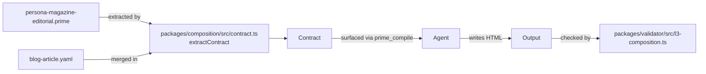
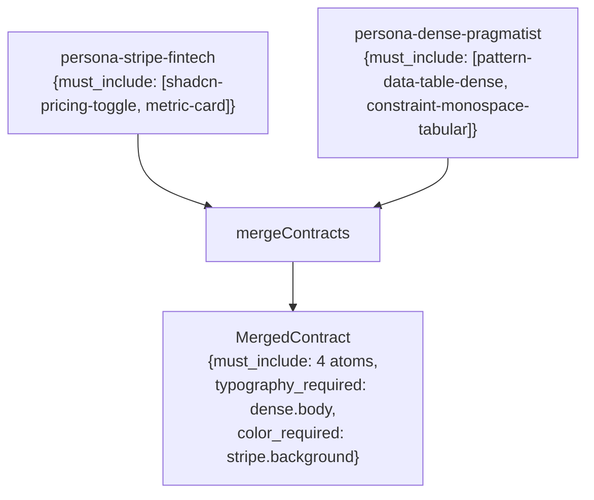

# Composition contract — must-include / must-avoid / typography_required / color_required / motion_prescriptions

The composition contract is **what a persona forces on the agent**.
When `prime_compile` returns a retrieval plan, the
`composition_contract` field is the structured promise the agent must
keep when writing HTML. The L3 validator checks output against it.

This page documents the contract's six fields, how they're authored,
and how the merger handles multiple personas.

---

## Where contracts live

A contract is the `composition: { ... }` block on a `persona` atom.
Some patterns have lighter contracts too (e.g. `pattern-toast-stack`
has `must-include` for motion templates), but personas are the primary
contract authors.



The contract has six fields. Each is documented below with a real
example pulled verbatim from `persona-magazine-editorial.prime`.

---

## Field 1 · `must_include`

```
must-include: [
  @community/principle-vertical-rhythm,
  @community/principle-typography-hierarchy,
  @community/fact-type-scale-modular,
]
```

These atom IDs must be **read** by the agent (their full.md is loaded
into context) and **honored** in the output. The L3 validator checks
each ID against its signature library:

- If the atom has a signature mapping (e.g.
  `principle-typography-hierarchy` → "presence of `<h1>` followed by
  `<h2>`"), validator marks `honored` / `violated` / `unverifiable`.
- Atoms without a mapping fall back to noun-keyword presence in the
  HTML. If even that's ambiguous, status is `unverifiable` (no false
  positives).

Limit `must-include` to 3–6 atoms. More than 6 over-constrains
output and bloats agent context.

---

## Field 2 · `must_avoid`

```
must-avoid: [
  @impeccable/persona-dense-pragmatist,
  @impeccable/persona-brutalist,
]
```

These atoms must NOT appear in the retrieval result for this brief.
If the merger detects an avoid that is also someone else's `include`,
that's a **conflict** (see §"Conflict resolution" below).

The L3 validator also checks `must_avoid` against output: if the HTML
contains a signature attributable to a forbidden atom (e.g. brutalist
typography fingerprint when `magazine-editorial` was selected), it's a
violation.

---

## Field 3 · `typography_required`

```
typography-required: {
  display: "high-contrast display serif (GT Sectra | Tiempos Headline | Canela)"
  body: "transitional or old-style serif, 18-20px"
  display-size: "96-160px"
}
```

This is **prose, not atom IDs**. The agent reads it directly and
applies it. Common keys: `display`, `body`, `monospace`, `body-size`,
`display-size`, `line-height`, `letter-spacing`.

The validator's L1 structure check looks for `font-family:` declarations
in the output's CSS. If the persona prescribes "GT Sectra | Tiempos
Headline | Canela" but the output uses default Georgia, the agent has
ignored the contract.

---

## Field 4 · `color_required`

```
color-required: {
  background: "#f8f6f1 or #fbf9f4 (warm magazine paper)"
  palette: "per-article accent (issue-specific, not global)"
}
```

Same shape as `typography_required` — prose values keyed by named
field. Common keys: `background`, `palette`, `accent`, `dark-mode`,
`text`.

---

## Field 5 · `motion_prescriptions`

```
motion-prescriptions: [
  @community/principle-vertical-rhythm,
]
```

Atom IDs (typically `template` or `pattern` atoms) the output's
animation should reference. Unlike `must_include`, motion prescriptions
are about CSS-level fingerprints (presence of `cubic-bezier`,
`@keyframes`, `prefers-reduced-motion`).

Personas with strong motion identities (toast-demo, magazine-editorial
transitions, framer-style page transitions) populate this field.
Static personas (warm-institutional, swiss-modernist) leave it empty.

---

## Field 6 · `quality_thresholds`

```
quality-thresholds: {
  min-keyframes: 4
  requires-cubic-bezier: true
  requires-reduced-motion-fallback: true
  min-stagger-steps: 5
  min-toast-variants: 5
}
```

Numeric / boolean thresholds the L3 validator checks via regex against
the output. Keys are persona-/pattern-specific. Some common ones:

| Threshold | Verifies |
|---|---|
| `min-keyframes` | Count of `@keyframes` rules |
| `requires-cubic-bezier` | Presence of `cubic-bezier(...)` |
| `requires-reduced-motion-fallback` | Presence of `@media (prefers-reduced-motion: reduce)` |
| `min-stagger-steps` | Count of `:nth-child(n)` or `animation-delay` rules |
| `min-toast-variants` | Count of `data-tone="(success|error|warning|info|loading)"` |
| `min-rows` | Count of `<tr>` for table-pattern atoms |

This is the most pattern-specific field in the contract. Generic
personas mostly leave it empty; interaction-pattern atoms
(toast-stack, modal, command-palette) lean on it heavily.

---

## Multi-persona merge

When a brief blends two personas (e.g. `stripe-fintech + dense-
pragmatist` for a B2B-pricing-with-data-table brief), the merger
unions the fields:

```ts
function mergeContracts(contracts: CompositionContract[]): MergedContract {
  const must_include = new Set<string>();
  const must_avoid = new Set<string>();
  const motion_prescriptions = new Set<string>();
  const typography_required: Record<string, string> = {};
  const color_required: Record<string, string> = {};

  for (const c of contracts) {
    for (const id of c.must_include) must_include.add(id);
    for (const id of c.must_avoid) must_avoid.add(id);
    for (const id of c.motion_prescriptions) motion_prescriptions.add(id);

    Object.assign(typography_required, c.typography_required);
    Object.assign(color_required, c.color_required);
  }
  // ... conflict detection follows ...
}
```

- **Set fields** (must_include / must_avoid / motion_prescriptions)
  union.
- **Record fields** (typography_required / color_required) merge by
  key, **last-persona-wins** for conflicting keys.



---

## Conflict resolution

A conflict happens when an atom appears in one persona's `must_include`
AND another's `must_avoid`. Example: persona-A includes
`pattern-toast-stack`, persona-B avoids it.

The merger reports conflicts as structured records:

```ts
conflicts: [
  {
    atom: "@community/pattern-toast-stack",
    includers: ["@impeccable/persona-vercel-clean"],
    avoiders: ["@impeccable/persona-magazine-editorial"],
    resolution: "exclude" // or "include" or "manual"
  }
]
```

Resolution defaults: `must_avoid` wins (atom is excluded). If the
caller wants `must_include` to win (rare), they can override per
conflict.

The conflict-resolver also handles the simpler typography/color
key-collision (e.g. both personas declare `body:` but with different
values): the **last persona in the contracts list wins**, with the
loss reported as a soft warning.

---

## How the agent consumes a contract

`prime_compile`'s output includes the merged contract:

```json
{
  "composition_contract": {
    "source_atoms": ["@impeccable/persona-magazine-editorial"],
    "must_include": [
      "@community/principle-vertical-rhythm",
      "@community/principle-typography-hierarchy",
      "@community/fact-type-scale-modular"
    ],
    "must_avoid": [
      "@impeccable/persona-dense-pragmatist",
      "@impeccable/persona-brutalist"
    ],
    "typography_required": {
      "display": "high-contrast display serif (GT Sectra | Tiempos Headline | Canela)",
      "body": "transitional or old-style serif, 18-20px",
      "display-size": "96-160px"
    },
    "color_required": {
      "background": "#f8f6f1 or #fbf9f4 (warm magazine paper)",
      "palette": "per-article accent (issue-specific, not global)"
    },
    "motion_prescriptions": ["@community/principle-vertical-rhythm"],
    "conflicts": []
  }
}
```

The agent's `Step 1-7` instructions in the response say:

```
Step 1: Read the picked persona's full.md
Step 2: MANDATORY — Read full.md of each atom in mandatory_reads
Step 3: <turn_budget_hint>
Step 4: Honor composition_contract.quality_thresholds
Step 5: Honor task_yaml.quality_checks — every check must be observable in HTML
Step 6: Avoid composition_contract.must_avoid + task_yaml.forbidden_atoms
Step 7: Synthesize HTML using prescribed typography / color / motion. Stop researching — start writing.
```

The contract is the **single source of truth** for what "honor the
persona" means. The validator (`validator-html.md`) closes the loop
by checking output against the same contract.

---

## Authoring tips for personas

- **3–6 must_include atoms**, no more. The cap is empirical: more
  atoms make the agent over-load context and slows the run.
- **Be specific in typography/color**: don't say `"a serif font"` —
  say `"GT Sectra | Tiempos Headline | Canela"`. Specificity is what
  Skill misses (see `benchmarks.md`'s Space-Grotesk-collapse story).
- **`motion_prescriptions` for static personas should be empty**. Don't
  invent motion just because the field exists.
- **`quality_thresholds` is for patterns more than personas**. Most
  personas leave it empty.
- **Test by writing one HTML against the contract by hand**. If your
  contract can't produce the persona's signature look in 100 lines of
  HTML, the contract is missing something.

---

## Source files

- `packages/composition/src/contract.ts` — `extractContract(primePath)`.
- `packages/composition/src/merge.ts` — `mergeContracts(contracts)`.
- `packages/composition/src/conflict-resolver.ts` — conflict policies.
- `packages/composition/src/types.ts` — `CompositionContract` and
  `MergedContract` shapes.

For the validator side: `validator-html.md`. For the persona authoring
side: `personas.md` § "How a persona becomes a contract".
