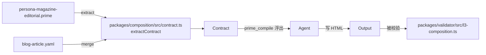
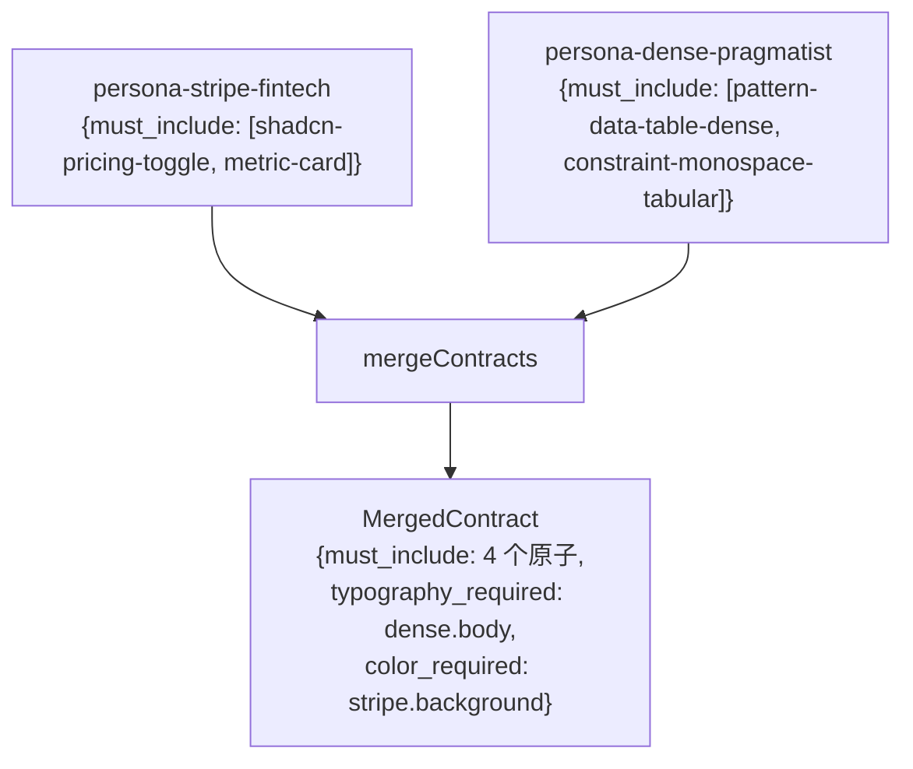

# Composition contract — must-include / must-avoid / typography_required / color_required / motion_prescriptions

Composition contract 就是 **persona 强加给 agent 的契约**。
`prime_compile` 返回检索方案时，`composition_contract` 字段是 agent
写 HTML 时必须遵守的结构化承诺。L3 validator 按它校验输出。

本页讲契约 6 个字段、怎么写、合并器如何处理多 persona。

---

## 契约住在哪

契约就是 `persona` 原子上的 `composition: { ... }` 块。某些
pattern 也带轻量契约（如 `pattern-toast-stack` 有 motion
template 的 `must-include`），但 persona 是契约的主要作者。



契约 6 个字段。每个用 `persona-magazine-editorial.prime` 的真实例子
说明。

---

## 字段 1 · `must_include`

```
must-include: [
  @community/principle-vertical-rhythm,
  @community/principle-typography-hierarchy,
  @community/fact-type-scale-modular,
]
```

这些原子 ID 必须被 agent **读**（full.md 进 context）且**遵守**到
输出里。L3 validator 用签名库逐一检查：

- 有签名映射的（如 `principle-typography-hierarchy` → "存在
  `<h1>` 紧跟 `<h2>`"），validator 标记 honored / violated /
  unverifiable。
- 没映射的回退到名词关键字在 HTML 里的出现；连这都模糊则标
  unverifiable（不会假阳）。

`must_include` 控制在 3–6 个。超过 6 会过度约束输出 + 撑大
agent context。

---

## 字段 2 · `must_avoid`

```
must-avoid: [
  @impeccable/persona-dense-pragmatist,
  @impeccable/persona-brutalist,
]
```

这些原子**不许**出现在该 brief 的检索结果里。如果合并器发现某个
must_avoid 同时是另一个 persona 的 `must_include`，那是**冲突**
（见下文"冲突解决"）。

L3 validator 也对 `must_avoid` 校验输出：HTML 含可归因到禁止原子的
签名（如选 `magazine-editorial` 时输出却现 brutalist 排版指纹），
就是违反。

---

## 字段 3 · `typography_required`

```
typography-required: {
  display: "high-contrast display serif (GT Sectra | Tiempos Headline | Canela)"
  body: "transitional or old-style serif, 18-20px"
  display-size: "96-160px"
}
```

是**散文，不是原子 ID**。agent 直接读直接用。常见 key:
`display`、`body`、`monospace`、`body-size`、`display-size`、
`line-height`、`letter-spacing`。

validator L1 结构检查会查 CSS 中的 `font-family:` 声明。如果
persona 写明 "GT Sectra | Tiempos Headline | Canela" 而输出用了默
认 Georgia，agent 就忽略了契约。

---

## 字段 4 · `color_required`

```
color-required: {
  background: "#f8f6f1 or #fbf9f4 (warm magazine paper)"
  palette: "per-article accent (issue-specific, not global)"
}
```

形状同 `typography_required` —— 散文值，按命名 key 索引。常见 key:
`background`、`palette`、`accent`、`dark-mode`、`text`。

---

## 字段 5 · `motion_prescriptions`

```
motion-prescriptions: [
  @community/principle-vertical-rhythm,
]
```

输出动画该引用的原子 ID（一般是 `template` 或 `pattern`）。和
`must_include` 不同，motion prescription 关注 CSS 级别的指纹（出
现 `cubic-bezier`、`@keyframes`、`prefers-reduced-motion`）。

带强烈动效身份的 persona（toast-demo、magazine-editorial 转场、
framer 风格页面切换）会写这个字段。静态 persona
（warm-institutional、swiss-modernist）留空。

---

## 字段 6 · `quality_thresholds`

```
quality-thresholds: {
  min-keyframes: 4
  requires-cubic-bezier: true
  requires-reduced-motion-fallback: true
  min-stagger-steps: 5
  min-toast-variants: 5
}
```

L3 validator 用正则对输出做的数值/布尔阈值。key 是 persona/pattern
专属。常见：

| 阈值 | 验证 |
|---|---|
| `min-keyframes` | `@keyframes` 规则数 |
| `requires-cubic-bezier` | 是否含 `cubic-bezier(...)` |
| `requires-reduced-motion-fallback` | 是否含 `@media (prefers-reduced-motion: reduce)` |
| `min-stagger-steps` | `:nth-child(n)` 或 `animation-delay` 规则数 |
| `min-toast-variants` | `data-tone="(success\|error\|warning\|info\|loading)"` 数量 |
| `min-rows` | table-pattern 原子的 `<tr>` 数 |

这是契约里最 pattern-专属的字段。通用 persona 大多留空；交互
pattern（toast-stack、modal、command-palette）会重度依赖。

---

## 多 persona 合并

当 brief 混合两个 persona（如 B2B-pricing 带 data-table 的
`stripe-fintech + dense-pragmatist`），合并器并集字段：

```ts
function mergeContracts(contracts: CompositionContract[]): MergedContract {
  const must_include = new Set<string>();
  const must_avoid = new Set<string>();
  const motion_prescriptions = new Set<string>();
  const typography_required: Record<string, string> = {};
  const color_required: Record<string, string> = {};

  for (const c of contracts) {
    for (const id of c.must_include) must_include.add(id);
    for (const id of c.must_avoid) must_avoid.add(id);
    for (const id of c.motion_prescriptions) motion_prescriptions.add(id);

    Object.assign(typography_required, c.typography_required);
    Object.assign(color_required, c.color_required);
  }
  // ... 后面是冲突检测 ...
}
```

- **集合字段**（must_include / must_avoid / motion_prescriptions）
  并集。
- **记录字段**（typography_required / color_required）按 key 合并，
  冲突时 **后来者胜**。



---

## 冲突解决

冲突 = 某原子既在一个 persona 的 `must_include`，又在另一个的
`must_avoid`。例：persona-A 含 `pattern-toast-stack`，persona-B 避它。

合并器把冲突报为结构化记录：

```ts
conflicts: [
  {
    atom: "@community/pattern-toast-stack",
    includers: ["@impeccable/persona-vercel-clean"],
    avoiders: ["@impeccable/persona-magazine-editorial"],
    resolution: "exclude" // 或 "include"、"manual"
  }
]
```

默认解决：`must_avoid` 胜（原子被排除）。调用方想 `must_include`
胜（罕见）可以逐冲突覆盖。

冲突解决器还处理简单的 typography/color key 冲突（两个 persona 都
声明 `body:` 但值不同）：**contracts 列表里最后一个 persona 胜**，
丢失部分作为软警告报出。

---

## agent 怎么消费契约

`prime_compile` 输出含合并后的契约：

```json
{
  "composition_contract": {
    "source_atoms": ["@impeccable/persona-magazine-editorial"],
    "must_include": [
      "@community/principle-vertical-rhythm",
      "@community/principle-typography-hierarchy",
      "@community/fact-type-scale-modular"
    ],
    "must_avoid": [
      "@impeccable/persona-dense-pragmatist",
      "@impeccable/persona-brutalist"
    ],
    "typography_required": {
      "display": "high-contrast display serif (GT Sectra | Tiempos Headline | Canela)",
      "body": "transitional or old-style serif, 18-20px",
      "display-size": "96-160px"
    },
    "color_required": {
      "background": "#f8f6f1 or #fbf9f4 (warm magazine paper)",
      "palette": "per-article accent (issue-specific, not global)"
    },
    "motion_prescriptions": ["@community/principle-vertical-rhythm"],
    "conflicts": []
  }
}
```

agent 拿到的 `Step 1-7` 指令：

```
Step 1: Read 选中 persona 的 full.md
Step 2: MANDATORY — Read mandatory_reads 中每个原子的 full.md
Step 3: <turn_budget_hint>
Step 4: 遵守 composition_contract.quality_thresholds
Step 5: 遵守 task_yaml.quality_checks —— 每条都得在 HTML 里可观察
Step 6: 避开 composition_contract.must_avoid + task_yaml.forbidden_atoms
Step 7: 用规定的 typography / color / motion 写 HTML。停止研究 —— 开始动笔。
```

契约是"遵守 persona"含义的**唯一真相**。validator
（`validator-html.md`）按同一份契约校验输出，闭环。

---

## persona 写作建议

- **3–6 个 must_include**，不要更多。这是经验值：更多原子让 agent
  context 过载、跑得慢。
- **typography/color 要具体**：不要写 `"一种衬线字体"` —— 写
  `"GT Sectra | Tiempos Headline | Canela"`。具体性正是 Skill 漏掉
  的（见 `benchmarks.md` 的 Space-Grotesk-collapse 故事）。
- **静态 persona 的 `motion_prescriptions` 该留空**。别因为字段在
  就硬编动效。
- **`quality_thresholds` 偏 pattern 而非 persona**。多数 persona
  留空。
- **手写一个 HTML 测一遍契约**。如果你的契约 100 行 HTML 内做不出
  persona 的标志性外观，契约就缺东西。

---

## 源文件

- `packages/composition/src/contract.ts` —— `extractContract(primePath)`。
- `packages/composition/src/merge.ts` —— `mergeContracts(contracts)`。
- `packages/composition/src/conflict-resolver.ts` —— 冲突策略。
- `packages/composition/src/types.ts` —— `CompositionContract` /
  `MergedContract` 形状。

validator 侧见 `validator-html.md`。persona 写作侧见 `personas.md`
"persona 怎么变成契约" 节。
