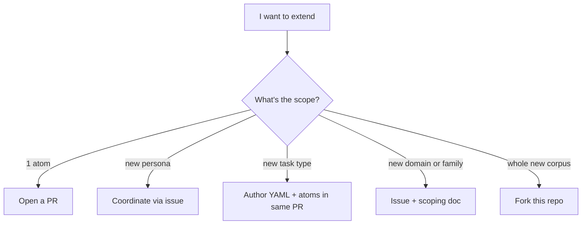

# Extending — adding a new persona / pattern / task type / domain

This page is the **playbook for growing the corpus**. Everything from
"add one new pattern atom" to "fork the repo for a new domain
entirely".

For the existing-corpus shape, see `overview.md`. For atom mechanics,
see `CONTRIBUTING.md` and `atom-authoring.md`. This page is the
forward-looking version.

---

## Decision: how big is your contribution?



| Size | Workflow |
|---|---|
| 1 atom | PR directly |
| 5–10 atoms (new pattern + supporting) | PR directly |
| New persona | Issue first ("scoping doc"); coordinate naming + brand-attribution |
| New task type | PR with YAML + any new atoms in one drop |
| New domain (e.g. game-design) | Issue + scoping; expect ≥30 atoms before merge |
| Whole new corpus | Fork the repo, customize, publish your own under `prime-corpus-<domain>` |

---

## Adding one pattern atom

This is the simplest case. Steps:

1. Pick the kind: `pattern` (with optional `template` if you have a
   code skeleton).
2. Author the `.prime` file at
   `primes-v3/sources/@community/pattern-<kebab-name>.prime`.
3. Required fields: `id`, `version`, `description`, `domain`,
   `related: [≥3 entries]`, ≥1 of {`extends`, `derived-from`,
   `requires`, `enhances`, `specializes`}.
4. If your pattern has a structural example, include `structure: """
   ... """`.
5. Run `bun run prime check primes-v3/sources/@community/<your-atom>.prime`
   to verify parse + edges.
6. Run `bun run prime check --registry` to verify no new broken refs.
7. Open PR. Label `corpus-pattern`.

If the new pattern conflicts with or `enhances` an existing pattern,
edit the existing atom too (add the reverse edge).

---

## Adding a new persona

A persona ships with ~6 atoms typically:

- The persona itself
- 3–6 `must_include` atoms in its composition (some may already exist
  in the corpus; only author the new ones)
- 1–2 `template` or `pattern` atoms specific to the persona's
  signature moves (e.g. `template-magazine-drop-cap` for
  `magazine-editorial`)

### Scoping doc — open before authoring

For a new persona, write a 1-page scoping doc in your issue:

```
Persona name: <e.g. cookpad-clean>
School ID: <kebab-case slug>
Brand references (≥3, public-web): <urls + dates>
What register does it occupy?
  - Visual identity: <color, typography, density>
  - Brand pose: <restrained / opinionated / academic / etc.>
What does it conflict with? <list 2-3 existing personas it doesn't pair with>
What does it compatible with? <list 2-3 existing personas>
must-include atoms (estimate): <list 3-6, mark new ones>
example-brands list: <the 1 brand this persona references, plus public web pages>
Why we don't already have it: <which existing persona was this previously routed to?>
```

Maintainers review the scoping doc; if approved, you author the PR.
Without the scoping doc, persona PRs are usually rejected as
"register-collision with existing persona".

### Brand-attribution rules (if your persona is brand-named)

- The atom describes **observable public design characteristics
  only**. Don't paraphrase brand voice copy. Don't reproduce logos /
  proprietary assets / proprietary code.
- Add `notes:` entries with public URLs.
- Add a top-level entry in `NOTICE` if your persona references a
  brand whose materials are under a non-permissive license (most
  brands are observed-only — no NOTICE entry needed).
- Use `@community/persona-<brand>` namespace, NOT `@<brand>/`.

---

## Adding a new task type

A new task type is a YAML in `primes-v3/taxonomy/<family>/<task-id>.yaml`
plus any new atoms it references.

### Steps

1. Pick the family (`marketing-landing`, `product-ui`, `content`,
   `interaction`, `dev-tool`). If your task doesn't fit any family,
   that's a new-family discussion (see below).
2. Author the YAML following the schema in `taxonomy.md`.
3. `default_register_pool` references must be existing personas (or
   you author the new ones in the same PR).
4. `required_atoms` references must be existing atoms (or you author
   the new ones in the same PR).
5. `forbidden_atoms` references existing personas or atoms.
6. Author 8–15 `quality_checks` — observable criteria the validator
   and LLM judge use.
7. Add the task to `_index.yaml`.
8. (Optional) add a fixture under `benchmarks/tasks/<NN-name>/` that
   exercises the new YAML.

### Trigger keywords

The `prime_intent` classifier picks up new YAMLs via
`trigger_keywords`. Make them bilingual (EN + 中文):

```yaml
trigger_keywords:
  - "podcast episode"
  - "podcast page"
  - "播客单集"
  - "播客详情"
  - "show notes"
```

---

## Adding a new domain

A new domain is a tagging decision (`domain: <new-domain>` on N
atoms) plus DomainRegistry registration in
`mcp-server/index.ts`. The corpus repo currently has 9 domains; ROADMAP
§ 7 plans full namespace isolation.

### When a new domain is justified

- You're authoring ≥10 atoms with a coherent shared `domain:`.
- The atoms have meaningfully different retrieval semantics (a
  security brief shouldn't pull frontend atoms; an i18n brief
  shouldn't pull a11y atoms unless they're cross-listed).
- You're prepared to own the domain's atom growth across multiple
  releases.

### What the contribution looks like

1. Open an issue tagged `corpus-domain` proposing the new domain
   name + your seed atom plan (≥10 atoms).
2. Maintainers review for overlap with existing domains.
3. PR with the seed atoms + DomainRegistry registration in
   `mcp-server/index.ts`.

The Wave 12/13 cross-domain expansion (i18n, performance, api-design,
testing, data-engineering, machine-learning, legal-compliance,
infrastructure, ops-observability) followed this exact pattern.

---

## Adding a new task family

This is the largest extension type short of forking. A new family
(e.g. `agentic-cli-ui`, `embedded-display`, `voice-ui`) requires:

- ~30 atoms in the new family's space
- 4–6 task-type YAMLs covering the family's main task types
- A `mandatory_reads_cap` value added to `mcp-server/index.ts`'s
  `taskTypeBudgets` table
- A `turn_budget_hint` added to the same table
- (Often) ≥1 new persona school the family routes to

Don't open a PR cold for this. Open an issue tagged
`corpus-family-proposal` first; expect 2–4 weeks of discussion.

---

## Forking the repo for your own corpus

If your domain genuinely doesn't fit (game-design, financial-modeling,
clinical-trials), the right move is **fork**.

### Fork checklist

1. Fork `prime-corpus-frontend-design` to
   `prime-corpus-<your-domain>`.
2. Replace the corpus name in:
   - `README.md` (`prime-corpus-frontend-design` → `prime-corpus-<x>`)
   - `package.json`
   - `MANIFEST.md`
3. Decide what to keep:
   - System repo dependency: KEEP. The parser/compiler/runtime is
     domain-blind.
   - `@community/persona-*`: REPLACE with your domain's design schools.
   - `primes-v3/taxonomy/`: REPLACE with your domain's task types.
   - `packages/intent/`: KEEP the structure; replace
     `VALID_SCHOOLS` and the keyword-classifier rules with your
     domain's.
   - `packages/retrieval/multi-axis.ts`: REPLACE the 6 axes with
     your domain's axes.
   - `packages/composition/`: KEEP. The contract semantics are
     domain-blind.
   - `packages/validator/`: REPLACE the L1 (HTML structure regex)
     and L3 (signature library) with your domain's artifact format.
   - `mcp-server/`: KEEP the 5 tools' shape; replace the bodies.
4. Update `NOTICE`: keep the Apache §4(d) prelude; remove
   frontend-design specific entries; add your own attributions.
5. Re-author `README` for your domain.
6. Publish at your registry / GitHub.

The fork should explicitly cite this corpus repo in `MANIFEST.md` as
its template origin. Apache requires it; we like seeing it.

---

## What you should NOT do

- **Don't add new atom kinds.** The 28 are spec-frozen. If you need a
  shape that doesn't fit, propose it as a system-repo spec change
  (PRIME-SPEC v2 conversation).
- **Don't add new edge verbs.** The 14 are spec-frozen. Same as
  above.
- **Don't bypass `prime check`.** Atoms with broken refs or missing
  required fields will fail registry. Fix at PR time, not later.
- **Don't author atoms outside an existing scope** without authorization.
  `@community` is the public-domain space; `@impeccable` is gated
  ("school" claims need scoping); `@<yourteam>` is what you should
  use for private-team work; everything else is reserved.

---

## Where to ask

- **Atom authoring questions**: open an issue tagged
  `atom-question`.
- **Persona / task-type proposals**: open an issue tagged
  `corpus-proposal`.
- **DSL grammar / parser questions**: belongs to system repo
  (`prime` issues), not here.
- **Bug reports** (broken refs, validator false-positives, retrieval
  surprises): tag `corpus-bug`.

---

For the existing-corpus tour: `overview.md`.
For atom mechanics: `atom-authoring.md`.
For task taxonomy: `taxonomy.md`.
For benchmarks methodology: `benchmarks.md`.
