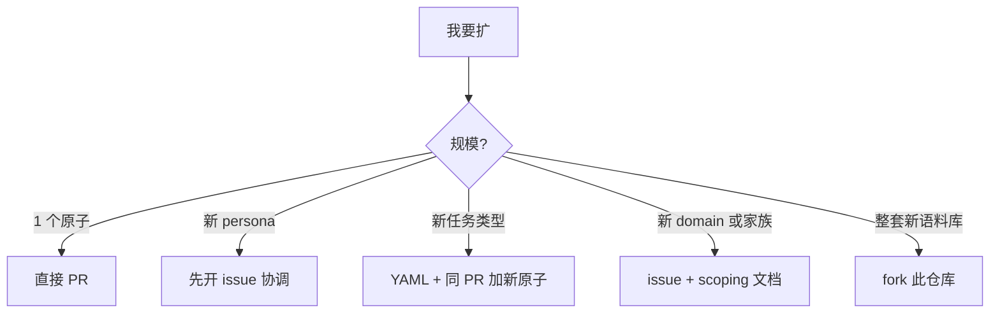

# 扩展 — 添加新 persona / pattern / task type / domain

本页是**语料库扩张手册**。从"加一个新 pattern 原子"到"整体 fork
新建一个领域语料库"全部覆盖。

现有语料库形态见 `overview.md`。原子机械见 `CONTRIBUTING.md` 与
`atom-authoring.md`。本页前向版。

---

## 决策：你的贡献多大



| 规模 | 流程 |
|---|---|
| 1 原子 | 直接 PR |
| 5–10 原子（新 pattern + 配套）| 直接 PR |
| 新 persona | 先开 issue（"scoping doc"）；协调命名 + 品牌归属 |
| 新任务类型 | 一次 PR 含 YAML + 任何新原子 |
| 新 domain（如 game-design）| issue + scoping；合并前预期 ≥30 原子 |
| 整套新语料库 | fork 此仓库，定制，自己以 `prime-corpus-<domain>` 发布 |

---

## 加一个 pattern 原子

最简单的情况。步骤：

1. 选 kind: `pattern`（如有代码骨架可附 `template`）。
2. 写 `.prime` 文件到
   `primes-v3/sources/@community/pattern-<kebab-name>.prime`。
3. 必填字段: `id`、`version`、`description`、`domain`、
   `related: [≥3 条]`、≥1 条 {`extends`、`derived-from`、`requires`、
   `enhances`、`specializes`}。
4. 如果 pattern 有结构示例，加 `structure: """ ... """`。
5. 跑 `bun run prime check primes-v3/sources/@community/<your-atom>.prime`
   验证 parse + 边。
6. 跑 `bun run prime check --registry` 验证没有新 broken ref。
7. 提 PR。打标签 `corpus-pattern`。

如果新 pattern 与已有 pattern 冲突或 `enhances`，把已有原子也改了
（加反向边）。

---

## 加一个 persona

一个 persona 通常带约 6 个原子:

- persona 自身
- composition 里的 3–6 个 `must_include` 原子（有些可能已存在；只
  写新的）
- 1–2 个 persona 标志性动作专用的 `template` 或 `pattern` 原子
  （如 `magazine-editorial` 的 `template-magazine-drop-cap`）

### Scoping 文档 — 写之前先开

新 persona 在 issue 里写一页 scoping doc:

```
Persona 名: <如 cookpad-clean>
School ID: <kebab-case slug>
品牌引用（≥3 个，公网）: <urls + 日期>
它占什么 register?
  - 视觉身份: <颜色、字体、密度>
  - 品牌姿态: <克制 / 有立场 / 学院 / 等>
冲突: <列 2-3 个不配的现有 persona>
兼容: <列 2-3 个现有 persona>
must-include 原子（估）: <列 3-6，标新的>
example-brands 列表: <这一 persona 引的 1 个品牌 + 公网页面>
为什么我们目前没有: <这之前路由到哪个现有 persona?>
```

维护者审 scoping doc；通过后你再写 PR。没 scoping doc 的 persona PR
通常被以"和现有 persona register 重叠"为由驳回。

### 品牌归属规则（如果你的 persona 是品牌名）

- 原子描写**仅**可观察的公开设计特征。不要改写品牌 voice copy。
  不要复制 logo / 专有素材 / 专有代码。
- `notes:` 加公网 URL。
- 如果你引用的品牌素材在非许可证下，在 `NOTICE` 加顶层条目（多数
  品牌只是被观察 —— 不需要 NOTICE 条目）。
- 用 `@community/persona-<brand>` 命名空间，不要用 `@<brand>/`。

---

## 加一个新任务类型

新任务类型 = `primes-v3/taxonomy/<family>/<task-id>.yaml` + 它引的
任何新原子。

### 步骤

1. 选家族（`marketing-landing`、`product-ui`、`content`、
   `interaction`、`dev-tool`）。如果都不合，那是新家族讨论（见下）。
2. 按 `taxonomy.md` 的 schema 写 YAML。
3. `default_register_pool` 引用必须是已有 persona（或同 PR 把新的
   写了）。
4. `required_atoms` 引用必须是已有原子（或同 PR 把新的写了）。
5. `forbidden_atoms` 引用已有 persona 或原子。
6. 写 8–15 条 `quality_checks` —— validator 与 LLM judge 评分依据。
7. 把任务加到 `_index.yaml`。
8. （可选）在 `benchmarks/tasks/<NN-name>/` 加 fixture 跑这个新
   YAML。

### 触发关键词

`prime_intent` 分类器靠 `trigger_keywords` 识别新 YAML。做成双语
（EN + 中文）:

```yaml
trigger_keywords:
  - "podcast episode"
  - "podcast page"
  - "播客单集"
  - "播客详情"
  - "show notes"
```

---

## 加一个新 domain

新 domain 是给 N 个原子打 `domain: <new-domain>` 标签 + 在
`mcp-server/index.ts` 注册 DomainRegistry。语料库目前 9 个 domain；
ROADMAP § 7 计划完整 namespace 隔离。

### 何时新 domain 合理

- 你在写 ≥10 个有共同 `domain:` 的原子。
- 这些原子有显著不同的检索语义（安全 brief 不该拉前端原子；i18n
  brief 不该拉 a11y 原子，除非它们交叉列出）。
- 你愿意跨多个版本带这个 domain 的原子增长。

### 贡献长什么样

1. 用 `corpus-domain` 标签开 issue，提议新 domain 名 + 种子原子计
   划（≥10 个）。
2. 维护者审是否与现有 domain 重叠。
3. 提 PR，含种子原子 + `mcp-server/index.ts` 的 DomainRegistry 注
   册。

Wave 12/13 跨域扩张（i18n、performance、api-design、testing、
data-engineering、ML、legal-compliance、infrastructure、
ops-observability）走的就是这条路。

---

## 加一个新任务家族

这是仅次于 fork 的最大扩张。新家族（如 `agentic-cli-ui`、
`embedded-display`、`voice-ui`）需要:

- 约 30 个新家族空间里的原子
- 4–6 份任务类型 YAML 覆盖家族主流任务
- `mcp-server/index.ts` `taskTypeBudgets` 表加 `mandatory_reads_cap`
  值
- 同表加 `turn_budget_hint`
- （常常）≥1 个家族要路由到的新 persona school

不要冷开 PR。先用 `corpus-family-proposal` 标签开 issue；预期 2–4
周讨论。

---

## fork 仓库做自己的语料库

如果你的领域确实不合（game-design、金融建模、临床试验），正确做法
是 **fork**。

### Fork 清单

1. fork `prime-corpus-frontend-design` 为 `prime-corpus-<your-domain>`。
2. 替换语料库名在：
   - `README.md`（`prime-corpus-frontend-design` → `prime-corpus-<x>`）
   - `package.json`
   - `MANIFEST.md`
3. 决定保留什么：
   - 系统仓库依赖：保留。parser/compiler/runtime 是领域无关的。
   - `@community/persona-*`：替换为你领域的设计 school。
   - `primes-v3/taxonomy/`：替换为你领域的任务类型。
   - `packages/intent/`：保留结构；替换 `VALID_SCHOOLS` 与关键词
     分类规则为你领域的。
   - `packages/retrieval/multi-axis.ts`：替换 6 轴为你领域的。
   - `packages/composition/`：保留。契约语义是领域无关的。
   - `packages/validator/`：替换 L1（HTML 结构正则）与 L3（签名库）
     为你领域的产物格式。
   - `mcp-server/`：保留 5 工具形状；替换函数体。
4. 更新 `NOTICE`：保留 Apache §4(d) 序言；去掉前端设计专属条目；
   加自己的归属。
5. 给你的领域重写 `README`。
6. 在你的 registry / GitHub 发布。

fork 该在 `MANIFEST.md` 显式引用此仓库为 template 来源。Apache 要
求；我们也喜欢看见。

---

## 不要做的事

- **不要新加 atom kind**。28 类 spec 冻结。需要新形状就向系统仓库
  提 spec 变更（PRIME-SPEC v2 讨论）。
- **不要新加 edge verb**。14 个 spec 冻结。同上。
- **不要绕过 `prime check`**。带 broken ref 或缺必填的原子会通不过
  registry。提 PR 时修，别拖。
- **不要在已有 scope 之外**未授权写原子。`@community` 是公共域；
  `@impeccable` 受控（"school"主张需要 scoping）；`@<yourteam>` 给
  你私团队；其余保留。

---

## 去哪问

- **原子写作问题**：用 `atom-question` 标签开 issue。
- **persona / 任务类型提案**：用 `corpus-proposal` 标签开 issue。
- **DSL 语法 / parser 问题**：归系统仓库（`prime` issues），不在
  这里。
- **bug 报告**（broken ref、validator 假阳、检索意外）：标
  `corpus-bug`。

---

现有语料库走读: `overview.md`。
原子机械: `atom-authoring.md`。
任务分类: `taxonomy.md`。
基准方法: `benchmarks.md`。
