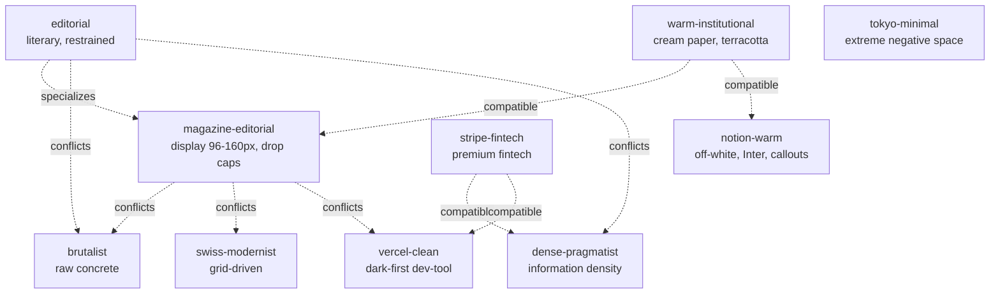

# Personas — the 31-persona catalog

This corpus's most expressive atom kind is **persona**. Each persona
captures a coherent design language as typed visual choices the agent
can adopt wholesale. There are 31 in this corpus, split across two
namespaces:

- `@impeccable/` — 10 **distinctive** personas (each a unique school).
- `@community/` — 21 **brand-reference** personas (each describes a
  named SaaS / consumer brand by its observable public design).

A persona declares:

- `school:` — its short ID (e.g. `magazine-editorial`)
- `implies:` — visual choices: font, color, density, layout, imagery,
  motion (this is the part the retrieval algorithm hands back to the
  agent on the `register` axis)
- `compatible:` / `conflicts:` — which other personas it pairs with
  or excludes
- `composition:` — `must-include` / `must-avoid` /
  `typography-required` / `color-required` / `motion-prescriptions` /
  `quality-thresholds` (the contract the agent must honor)
- `example-brands:` — the public brands the persona references
- `notes:` — usage caveats / disambiguation from related personas

This page surveys all 31. Sections are organized so you can find the
right persona for the brief at hand.

---

## Inheritance + relationship graph



Every persona has an explicit `conflicts:` list. The composition
contract uses these to refuse incompatible blends — you can't have
`brutalist` + `editorial` selected for the same page.

---

## The 10 distinctive personas (`@impeccable/`)

Each of these is a unique aesthetic school, not a brand reference.
Authored from primary observation across multiple representative
products.

### `persona-editorial`

> An aesthetic persona derived from high-quality editorial publishing:
> newspapers, literary magazines, annual reports. Characterized by
> deliberate whitespace, serif display type, restrained color use, and
> strong typographic hierarchy.

- **Reference brands**: NYT, The Atlantic, The Verge feature pieces,
  longform.
- **When to pick**: blog articles, longform documentation,
  documentation-as-prose, "排版要讲究" briefs (literally "typography
  must be careful").
- **Conflicts with**: `brutalist`, `dense-pragmatist`,
  `swiss-modernist`.
- **Source**: `primes-v3/sources/@impeccable/persona-editorial.prime`.

### `persona-magazine-editorial`

> The web translation of Wired, NYT Magazine, and Pitchfork: oversized
> display serifs at 96-160px, drop caps, asymmetric multi-column flow,
> full-bleed photo essays, small-caps section heads, byline-dateline-
> photo-credit typography, dramatic scale contrast between display
> and body.

- **Reference brands**: Wired, The Atlantic, NYT Magazine, Pitchfork
  reviews, Aeon, The New Yorker longform.
- **`specializes` editorial**: this is the dramatic version. If your
  H1 is under 64px you've drifted back to plain `editorial`.
- **`must-include`**: vertical-rhythm principle, typography hierarchy
  principle, type-scale-modular fact.
- **`must-avoid`**: dense-pragmatist, brutalist.
- **`typography-required`**: high-contrast display serif (GT Sectra |
  Tiempos Headline | Canela), body 18-20px transitional/old-style
  serif, display-size 96-160px.
- **`color-required`**: background #f8f6f1 or #fbf9f4 (warm magazine
  paper), per-article accent (issue-specific, not global).
- **Source**: `persona-magazine-editorial.prime`.

### `persona-warm-institutional`

> The visual language of public libraries, university presses, and
> museum websites: serif body text on cream paper, sans display,
> terracotta and forest accents, generous block padding, footer
> columns thick with credits and copyright. Authoritative without
> being corporate.

- **When to pick**: waitlist landings (cream + Fraunces serif feel
  trustworthy without B2B cynicism), about pages, university-y SaaS,
  social-good products.
- **Plays well with**: magazine-editorial, notion-warm.

### `persona-notion-warm`

> Friendly productivity-tool aesthetic: off-white #fbfaf9 paper
> background, soft warm-grey borders, Inter or SF Pro Display,
> callout cards with emoji, generous block spacing, hover states that
> feel tactile. Reads as "a notebook your friend designed" rather than
> "enterprise software".

- **When to pick**: documentation, internal tools that want to feel
  human, blog-style content with structured blocks.

### `persona-swiss-modernist`

> Müller-Brockmann on the web: mathematical baseline grids,
> neo-grotesque display set tight, ruled horizontal lines, asymmetric
> typographic compositions, one accent color in a sea of neutral.
> Form follows function follows grid.

- **When to pick**: portfolio sites, design-conscious agencies, type
  foundries, data-viz that earns its grid.

### `persona-tokyo-minimal`

> Japanese minimalism translated to web: extreme negative space (ma),
> hairline rules, soft greys on warm off-white, mixed-script
> typography (Noto Sans JP + Inter), tatami-grid spatial logic. The
> page breathes like a tea ceremony — every element earned its place.

- **When to pick**: meditation / wellness apps, restaurant /
  hospitality, ambient products.

### `persona-vercel-clean`

> Dark-first developer-tool aesthetic: Geist Sans on near-black OKLCH
> neutrals, generous whitespace, monochrome surfaces lifted by subtle
> radial gradients, one neon accent (cyan/magenta/lime), and crisp
> 1px borders on glass-like cards.

- **When to pick**: dev-tool landings, AI infrastructure SaaS, "feels
  like Vercel" briefs.
- **Conflicts with**: warm-institutional, magazine-editorial (cool vs
  warm registers).

### `persona-stripe-fintech`

> Fintech trustworthiness made aspirational: brand-color OKLCH systems
> with a single hue variable, animated gradient hero backgrounds,
> dense API-doc tables, rounded 12px cards with crisp 1px hairline
> borders, dark-mode toggle as first-class.

- **Distinct from `@community/persona-stripe`**: this is the *generic
  premium fintech school*; persona-stripe is the actual stripe.com
  brand.
- **When to pick**: B2B fintech / payments / compliance products.

### `persona-dense-pragmatist`

> An aesthetic persona derived from professional-grade data tools:
> Bloomberg Terminal, trading dashboards, IDE UIs, analytics
> platforms. Optimized for information density, expert-user
> efficiency, and zero decorative overhead.

- **When to pick**: log viewers, data tables (especially with
  filtering/sorting), B2B dashboards, expert tools.
- **`composition.quality-thresholds`** prescribes row-height 1.30–1.35
  (added in Wave 5c after a log-viewer task came back too tight).

### `persona-brutalist`

> Raw concrete made digital: exposed structure, monospaced
> everywhere, harsh hierarchy, default browser blue links,
> intentionally awkward layouts that refuse polish.

- **When to pick**: experimental / cultural sites, art portfolios,
  consciously-anti-SaaS products.
- **Conflicts with**: pretty much everything that isn't itself.

---

## The 21 brand-reference personas (`@community/`)

Each describes a **specific named brand** by observable public design
characteristics. They reference, not redistribute. (Trademarks remain
with the respective owners; see `NOTICE`.)

Use a brand persona when the brief references the brand directly
("Stripe-style B2B pricing"), or when the brief's category clearly
matches a brand's design language. Otherwise pick a distinctive
persona from the `@impeccable/` set.

| Persona | Brand | Defining detail |
|---|---|---|
| `persona-stripe` | Stripe | sohne-var weight 300, deep navy #061b31 headings, blue-tinted multi-layer shadows, ruby→magenta hero gradient |
| `persona-linear` | Linear | Inter Variable weight 510 (cv01/ss03), near-black #08090a, indigo #5e6ad2 single accent, translucent borders |
| `persona-apple` | Apple | SF Pro Display optical sizing, pure-black #000000 + cool-gray #f5f5f7 binary cuts, Apple Blue #0071e3 as sole accent, universal negative tracking |
| `persona-notion` | Notion | NotionInter on pure white, warm-undertone gray scale, Notion Blue #0075de single accent, whisper borders, multi-layer micro-shadows |
| `persona-vercel` | Vercel | Geist Sans -2.4 to -2.88px tracking, near-white canvas, shadow-as-border, grayscale-only chrome with workflow accents reserved to pipeline contexts |
| `persona-spotify` | Spotify | Cocoon #121212, album art is the only color source, SpotifyMixUI bold/regular binary, Spotify Green #1ed760 reserved for play controls |
| `persona-figma` | Figma | figmaSans (320–700 weight stops), strict black/white shell, explosively colorful hero output, pill+circle button geometry, dashed focus outlines |
| `persona-framer` | Framer | GT Walsheim 500 with -5.5px tracking at 110px, void-black #000000, Framer Blue #0099ff sole accent, Inter Variable with 6+ OpenType features |
| `persona-airbnb` | Airbnb | Cereal VF 500-700, Rausch Red #ff385c sole accent, 20-32px radius, three-layer shadow elevation |
| `persona-coinbase` | Coinbase | Proprietary 4-font stack, Coinbase Blue #0052ff sole accent, 56px pill CTAs, 1.00 line-height display density |
| `persona-toss` | Toss | Pretendard on #FAFAFA, near-ink #3C3C3C text, #721FE5 reserved for active/selected, 48px/24px hero metric ratio, rgba(0,0,0,0.04) card shadows |
| `persona-warp` | Warp | Matter Regular 400 even on headlines, warm-dark canvas with earthy warm-gray undertones, parchment text, terminal+nature photography |
| `persona-superhuman` | Superhuman | Super Sans VF 540 / 0.96 line-height, pure white with cinematic hero in Mysteria Purple #1b1938, warm cream #e9e5dd CTAs, lavender #cbb7fb sole accent |
| `persona-raycast` | Raycast | Near-black blue-tinted void #07080a, Inter + GeistMono, layered inset shadows simulating pressed glass, Raycast Red #FF6363 reserved for diagonal hero stripe |
| `persona-sentry` | Sentry | Warm purple-black #1f1633, bioluminescent inset-shadow buttons, Dammit Sans hero / Rubik UI workhorse, lime green #c2ef4e high-visibility pop |
| `persona-sanity` | Sanity | Pure-achromatic gray ramp on near-black #0b0b0b, waldenburgNormal -4.48px tracking 112px display, coral #f36458 CTAs, electric #0052ef universal hover |
| `persona-mintlify` | Mintlify | Inter on white, atmospheric green-to-white gradient hero, brand green #18E299 reserved for interactive states, full-pill 9999px buttons, 5%-opacity borders |
| `persona-posthog` | PostHog | IBM Plex Sans 700/800 on sage-tinted parchment #fdfdf8, PostHog Orange #F54E00 hidden until hover, hand-drawn hedgehogs replacing stock photography |
| `persona-replicate` | Replicate | rb-freigeist-neue 700 at 128px manifesto scale, white canvas, orange #ea2804 → magenta hero gradient, 9999px pill radius universally |
| `persona-intercom` | Intercom | Saans on cream-white #faf9f6, Fin Orange #ff5600 as singular AI accent, near-rectangular 4px button radius |
| `persona-supabase` | Supabase | Circular weight 400 at 1.00 line-height on near-black #171717, PostgreSQL green #3ecf8e identity-only accent, depth built from border-color stepping not shadows |

Every brand persona's source `.prime` file lists `notes:` with the
public-web references it draws from. No proprietary asset is
reproduced; only observable characteristics (font, color, density,
motion) are restated.

---

## How a persona becomes a contract

When an agent picks `persona-magazine-editorial` (e.g. for a blog
brief), the contract that lands in `prime_compile`'s output is:

```yaml
composition_contract:
  source_atom: "@impeccable/persona-magazine-editorial"
  must_include:
    - "@community/principle-vertical-rhythm"
    - "@community/principle-typography-hierarchy"
    - "@community/fact-type-scale-modular"
  must_avoid:
    - "@impeccable/persona-dense-pragmatist"
    - "@impeccable/persona-brutalist"
  typography_required:
    display: "high-contrast display serif (GT Sectra | Tiempos Headline | Canela)"
    body: "transitional or old-style serif, 18-20px"
    display-size: "96-160px"
  color_required:
    background: "#f8f6f1 or #fbf9f4 (warm magazine paper)"
    palette: "per-article accent (issue-specific, not global)"
  motion_prescriptions:
    - "@community/principle-vertical-rhythm"
```

The agent reads the contract before writing HTML. The `prime_validate`
tool checks the output against it (L3 contract verification).

For full validator semantics see [`validator-html.md`](validator-html.md).
For composition-merge semantics see [`composition-contract.md`](composition-contract.md).

---

## Picking a persona — decision tree

```
Brief mentions blog / article / longform / "讲究排版"
  → editorial · magazine-editorial · warm-institutional

Brief mentions B2B / pricing / compliance
  → stripe-fintech · stripe · dense-pragmatist

Brief mentions dev-tool / AI infra / dashboard
  → vercel-clean · vercel · linear · raycast · framer

Brief mentions consumer-social / mobile-app
  → airbnb · spotify · notion-warm · warm-institutional

Brief explicitly references a brand
  → @community/persona-<brand>

Brief mentions "experimental / weird / anti-SaaS"
  → brutalist · posthog (for warmer experimental)

No clear signal
  → notion-warm (safe default for content-heavy)
  → vercel-clean (safe default for product-ui)
```

This logic is encoded in the retrieval algorithm — see
[`retrieval.md`](retrieval.md) §"Register axis".

---

## When a persona is wrong

Personas are opinionated. Sometimes the right answer is "none of
them". Signs the corpus's persona set isn't covering your brief:

- The required brand has a defining feature unlike anything in the
  table above.
- The brief blends two registers in an uncommon way (e.g. "we're
  Stripe but for art collectors").
- You're in a regional market with its own design conventions
  (Japanese SaaS, Brazilian e-commerce, etc.).

In those cases: author a new persona. See `CONTRIBUTING.md` § 4 for
the persona authoring guide, and `ROADMAP.md` § 5 for the planned
expansion to ~60 personas covering currently-uncovered regions and
genres.

---

For the source files: `primes-v3/sources/@impeccable/persona-*.prime`
and `@community/persona-*.prime`. Each is 80–250 lines. Read 2–3 to
internalize the persona shape before authoring your own.
