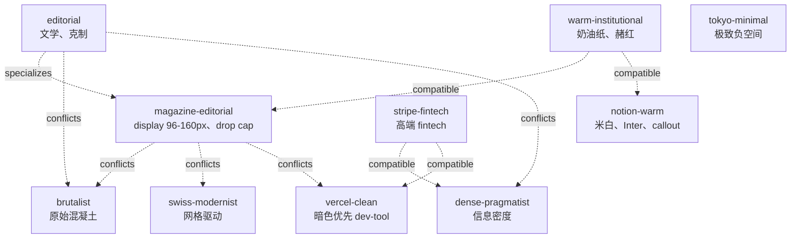

# Persona — 31 个 persona 的目录

本语料库表达力最强的 atom kind 就是 **persona**。每个 persona 把一致
的设计语言以类型化的视觉决策固化下来，agent 可以**整体**采用一个。
本语料库 31 个，分两个 namespace：

- `@impeccable/` —— 10 个**独特**的 persona（每个一个独立 school）。
- `@community/` —— 21 个**品牌引用** persona（每个描写一个具名 SaaS /
  消费品牌可观察的公开设计）。

一个 persona 声明：

- `school:` —— 短 ID（如 `magazine-editorial`）
- `implies:` —— 视觉决策：font / color / density / layout / imagery /
  motion（这是检索算法在 `register` 轴上交回 agent 的部分）
- `compatible:` / `conflicts:` —— 跟谁配对、跟谁互斥
- `composition:` —— `must-include` / `must-avoid` /
  `typography-required` / `color-required` / `motion-prescriptions` /
  `quality-thresholds`（agent 必须遵守的契约）
- `example-brands:` —— persona 引用的公开品牌
- `notes:` —— 用法注意 / 跟相关 persona 的区分

本页过完全部 31 个，按"用什么 persona 解决什么 brief"的视角组织。

---

## 继承 + 关系图



每个 persona 有显式的 `conflicts:` 列表。Composition contract 用这些
拒绝不兼容混搭 —— `brutalist` + `editorial` 不能同页选用。

---

## 10 个独特 persona（`@impeccable/`）

每个都是独特的美学 school，不是品牌引用。从多个代表产品的一手观察中
归纳得出。

### `persona-editorial`

> 派生自高品质编辑出版：报纸、文学杂志、年报。特征是刻意的留白、衬线
> display、克制的色彩、强烈的字体层级。

- **代表品牌**：NYT、The Atlantic、The Verge feature、longform。
- **何时选**：博客文章、长 doc、prose 文档、"排版要讲究"。
- **冲突**：`brutalist`、`dense-pragmatist`、`swiss-modernist`。
- **源**：`primes-v3/sources/@impeccable/persona-editorial.prime`。

### `persona-magazine-editorial`

> Wired、NYT Magazine、Pitchfork 的网页化：96-160px 巨型 display
> serif、drop cap、非对称多列流、全幅图集、small-caps section、署名-
> 日期-图片信用排版、display 与 body 的剧烈对比尺度。

- **代表品牌**：Wired、The Atlantic、NYT Magazine、Pitchfork
  reviews、Aeon、The New Yorker longform。
- **`specializes` editorial**：这是戏剧化版本。如果你的 H1 不到 64px，
  你已经退化成普通 `editorial` 了。
- **`must-include`**：vertical-rhythm、typography-hierarchy、
  type-scale-modular。
- **`must-avoid`**：dense-pragmatist、brutalist。
- **`typography-required`**：高对比 display serif（GT Sectra |
  Tiempos Headline | Canela），body 18-20px transitional/old-style
  serif，display-size 96-160px。
- **`color-required`**：background `#f8f6f1` 或 `#fbf9f4`（warm
  magazine paper）、palette per-article accent（按文/期，非全局）。
- **源**：`persona-magazine-editorial.prime`。

### `persona-warm-institutional`

> 公共图书馆、大学出版社、博物馆站点的视觉语言：奶油纸上衬线 body、
> sans display、赭红与森林色 accent、宽松块 padding、底部多列堆满版
> 权信息。权威而不企业。

- **何时选**：waitlist landing（奶油 + Fraunces serif 给信任感而不
  显 B2B 油腻）、关于页、大学风 SaaS、社会公益产品。
- **配得很好**：magazine-editorial、notion-warm。

### `persona-notion-warm`

> 友好生产力工具美学：米白 #fbfaf9 纸面背景、柔和暖灰边、Inter 或
> SF Pro Display、emoji callout 卡片、宽松块距、可触感 hover。读起来
> 像"朋友设计的笔记本"，不是"企业软件"。

- **何时选**：文档、想要人性化的内部工具、结构化块的博客内容。

### `persona-swiss-modernist`

> 网页上的 Müller-Brockmann：数学化基线网格、紧排 neo-grotesque
> display、规矩水平线、非对称排版构图、一抹 accent 色置于中性海。
> Form follows function follows grid。

- **何时选**：portfolio 站点、设计意识强的 agency、字体厂、对得起
  网格的数据可视化。

### `persona-tokyo-minimal`

> 日式极简的网页化：极致负空间（间）、发丝线、暖米色上柔灰、混合脚
> 本字体（Noto Sans JP + Inter）、tatami 网格空间逻辑。页面像茶道
> 一样呼吸 —— 每个元素都赢得了它的位置。

- **何时选**：冥想 / 健康 app、餐饮 / 酒店、ambient 产品。

### `persona-vercel-clean`

> 暗色优先的开发者工具美学：Geist Sans 在 OKLCH 近黑中性色上、宽松
> 留白、单色面被微妙径向渐变托起、单一霓虹 accent
> （青/品红/酸橙）、玻璃感卡片上的 1px 边。

- **何时选**：dev-tool 落地、AI 基础设施 SaaS、"想要 Vercel 那个
  感觉"。
- **冲突**：warm-institutional、magazine-editorial（冷 vs 暖）。

### `persona-stripe-fintech`

> 让 fintech 可信变成令人向往：单 hue 变量的 OKLCH 品牌色系统、动画
> 渐变 hero 背景、紧凑 API doc 表、12px 圆角卡 + 1px hairline 边、
> 头等的暗色模式切换。

- **跟 `@community/persona-stripe` 区别**：这是**通用高端 fintech
  school**；persona-stripe 是真正的 stripe.com 品牌。
- **何时选**：B2B fintech / 支付 / 合规产品。

### `persona-dense-pragmatist`

> 派生自专业级数据工具：彭博终端、交易仪表板、IDE UI、分析平台。
> 为信息密度、专家用户效率、零装饰开销而优化。

- **何时选**：日志查看器、数据表（特别是带筛选/排序）、B2B 仪表
  板、专家工具。
- **`composition.quality-thresholds`** 规定 row-height 1.30–1.35
  （Wave 5c 加，因为之前 log-viewer 出来太挤了）。

### `persona-brutalist`

> 原始混凝土的数字版：暴露结构、到处 monospace、粗暴层级、默认浏览
> 器蓝链接、刻意笨拙的版式拒绝光滑。

- **何时选**：实验 / 文化站点、艺术 portfolio、自觉反 SaaS 的产品。
- **冲突**：几乎一切非自身。

---

## 21 个品牌引用 persona（`@community/`）

每个描写一个**具名品牌**可观察的公开设计特征。它们引用，不分发。
（商标归各原所有人；见 `NOTICE`。）

需要品牌 persona 时机：brief 直接引品牌（"Stripe 风格的 B2B
pricing"），或者 brief 的品类显然匹配某品牌设计语言。其它情况选
`@impeccable/` 里的独特 persona。

| Persona | 品牌 | 标志性细节 |
|---|---|---|
| `persona-stripe` | Stripe | sohne-var 300 重量、深海军 #061b31 标题、蓝调多层阴影、ruby→magenta hero 渐变 |
| `persona-linear` | Linear | Inter Variable 510（cv01/ss03）、近黑 #08090a、靛蓝 #5e6ad2 单一 accent、半透明边 |
| `persona-apple` | Apple | SF Pro Display 光学尺寸、纯黑 #000000 + 冷灰 #f5f5f7 二元剪辑、Apple Blue #0071e3 唯一 accent、各尺寸普遍负 tracking |
| `persona-notion` | Notion | NotionInter 在纯白上、暖底色灰阶、Notion Blue #0075de 单一 accent、whisper 边、多层微阴影 |
| `persona-vercel` | Vercel | Geist Sans -2.4 至 -2.88px tracking、近白底、shadow-as-border、灰度 chrome + workflow accent 仅供 pipeline 上下文 |
| `persona-spotify` | Spotify | Cocoon #121212、专辑封面是唯一色源、SpotifyMixUI bold/regular 二元、Spotify Green #1ed760 仅播放控件 |
| `persona-figma` | Figma | figmaSans（320–700 重量档）、严格黑/白外壳、爆炸彩色 hero 输出、pill+圆按钮几何、虚线 focus 轮廓 |
| `persona-framer` | Framer | GT Walsheim 500、110px 上 -5.5px tracking、虚黑 #000000、Framer Blue #0099ff 唯一 accent、Inter Variable 6+ OpenType 特性 |
| `persona-airbnb` | Airbnb | Cereal VF 500-700、Rausch Red #ff385c 唯一 accent、20-32px 圆角、三层阴影抬升 |
| `persona-coinbase` | Coinbase | 专有 4 字族、Coinbase Blue #0052ff 唯一 accent、56px pill CTA、1.00 line-height 显示密度 |
| `persona-toss` | Toss | Pretendard 在 #FAFAFA、近墨 #3C3C3C 文本、#721FE5 仅用于 active/selected、48px/24px hero 度量比、rgba(0,0,0,0.04) 卡阴影 |
| `persona-warp` | Warp | Matter Regular 400 连标题也 400、暖深色面 + 土暖灰底色、parchment 文本、终端+自然摄影 |
| `persona-superhuman` | Superhuman | Super Sans VF 540 / 0.96 line-height、纯白上 Mysteria Purple #1b1938 cinematic hero、暖奶油 #e9e5dd CTA、薰衣草 #cbb7fb 唯一 accent |
| `persona-raycast` | Raycast | 蓝调近黑 #07080a、Inter + GeistMono、模拟压玻璃的多层 inset 阴影、Raycast Red #FF6363 仅供斜条纹 hero |
| `persona-sentry` | Sentry | 暖紫黑 #1f1633 面、生物发光 inset 阴影按钮、Dammit Sans hero / Rubik UI workhorse、酸橙 #c2ef4e 罕见高可见度突出 |
| `persona-sanity` | Sanity | 近黑 #0b0b0b 上纯无彩灰阶、waldenburgNormal -4.48px tracking 112px display、coral #f36458 CTA、电光 #0052ef 通用 hover |
| `persona-mintlify` | Mintlify | Inter 在白上、绿色到白的氛围渐变 hero、品牌绿 #18E299 仅用于交互态、9999px 全圆按钮、5%-透明度边 |
| `persona-posthog` | PostHog | IBM Plex Sans 700/800 在 sage-tinted 米色 #fdfdf8、PostHog Orange #F54E00 hover 才出现、手绘刺猬替代库存图、橄榄绿 palette 刻意拒绝 SaaS 惯例 |
| `persona-replicate` | Replicate | rb-freigeist-neue 700 在 128px 宣言级、白底、橘 #ea2804 → 品红 hero 渐变、9999px pill 圆角全局应用 |
| `persona-intercom` | Intercom | Saans 在奶白 #faf9f6、Fin Orange #ff5600 唯一 AI accent、近矩形 4px 按钮圆角 |
| `persona-supabase` | Supabase | Circular 400 重量 1.00 line-height 在近黑 #171717、PostgreSQL 绿 #3ecf8e 标识专属 accent、深度由边色阶梯而非阴影构造 |

每个品牌 persona 的源 `.prime` 文件 `notes:` 列出公网引用。无专有
素材复制，只复述可观察特征（字体、颜色、密度、动效）。

---

## persona 怎么变成契约

agent 选了 `persona-magazine-editorial`（如博客 brief）后，
`prime_compile` 输出里落出来的契约：

```yaml
composition_contract:
  source_atom: "@impeccable/persona-magazine-editorial"
  must_include:
    - "@community/principle-vertical-rhythm"
    - "@community/principle-typography-hierarchy"
    - "@community/fact-type-scale-modular"
  must_avoid:
    - "@impeccable/persona-dense-pragmatist"
    - "@impeccable/persona-brutalist"
  typography_required:
    display: "high-contrast display serif (GT Sectra | Tiempos Headline | Canela)"
    body: "transitional or old-style serif, 18-20px"
    display-size: "96-160px"
  color_required:
    background: "#f8f6f1 or #fbf9f4 (warm magazine paper)"
    palette: "per-article accent (issue-specific, not global)"
  motion_prescriptions:
    - "@community/principle-vertical-rhythm"
```

agent 在写 HTML 之前读契约。`prime_validate` 工具按契约 L3 校验输
出。完整 validator 语义见 [`validator-html.md`](validator-html.md)；
合并语义见 [`composition-contract.md`](composition-contract.md)。

---

## 选 persona — 决策树

```
brief 提到 blog / article / longform / "讲究排版"
  → editorial · magazine-editorial · warm-institutional

brief 提到 B2B / pricing / 合规
  → stripe-fintech · stripe · dense-pragmatist

brief 提到 dev-tool / AI infra / dashboard
  → vercel-clean · vercel · linear · raycast · framer

brief 提到 consumer-social / mobile-app
  → airbnb · spotify · notion-warm · warm-institutional

brief 显式引品牌
  → @community/persona-<brand>

brief 提到"实验 / 怪 / 反 SaaS"
  → brutalist · posthog（更暖的实验感）

无明显信号
  → notion-warm（content-heavy 安全默认）
  → vercel-clean（product-ui 安全默认）
```

这套逻辑编码在检索算法里 —— 见 [`retrieval.md`](retrieval.md)
"Register 轴"节。

---

## persona 不合适时

persona 是有立场的。有时候正确答案是"哪个都不对"。语料库 persona
集没覆盖你 brief 的迹象：

- 需要的品牌有上表里都没有的标志性特征。
- brief 不寻常地混搭两个 register（如"我们是 Stripe 但服务艺术
  收藏家"）。
- 你在一个有自己设计惯例的区域市场（日系 SaaS、巴西电商等）。

这些情况：写新 persona。`CONTRIBUTING.md` § 4 有写作指南，
`ROADMAP.md` § 5 有把 persona 扩到约 60 覆盖目前缺失区域 / 类型的
计划。

---

源文件: `primes-v3/sources/@impeccable/persona-*.prime` 与
`@community/persona-*.prime`。每个 80–250 行。先读 2–3 个把
persona 形状装进脑子再写自己的。
