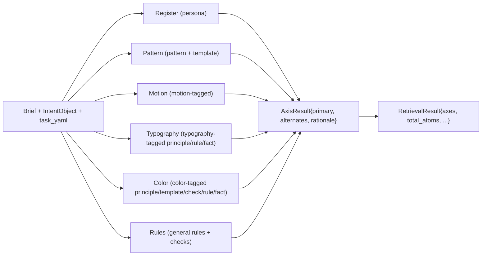

# Retrieval — the 6-axis algorithm

When `prime_compile` runs, it doesn't just dump 30 atoms into the
agent's context. It builds a structured **retrieval plan** with one
result per **axis**. There are six axes: register, pattern, motion,
typography, color, rules.

This page documents the algorithm that produces that plan. The code
lives in `packages/retrieval/src/multi-axis.ts`; here we explain what
the code does, why each axis exists, and how to reason about its
output.

This algorithm is **frontend-design-specific**. A
`prime-corpus-security` would use different axes (e.g. threat-model,
control-family, attack-stage, mitigation-class). The number 6 is not
universal — it's what worked for design.

---

## Why 6 axes (and not 1 big "search")

Single-keyword search collapses on briefs like "blog article, careful
typography". The literal word "blog" matches `anti-pattern-blog-popup`
(an a11y warning, irrelevant). The literal word "typography" matches
`check-paragraph-spacing` (a checklist item, not a design language).
The thing actually worth returning — `persona-magazine-editorial` —
contains neither word.

Splitting retrieval into axes solves this:

- The **register axis** asks: "which persona school?" — matches
  schools, not literal keywords.
- The **pattern axis** asks: "which structural patterns?" — matches
  patterns/templates with kind boost.
- The **motion axis** asks: "which motion craft?" — only motion-tagged
  atoms compete here.

Each axis uses a different scoring function tuned to its kind set. No
atom can win an axis it doesn't belong to.

---

## The 6 axes



Each axis returns:

```ts
{
  axis: "register" | "pattern" | "motion" | "typography" | "color" | "rules",
  primary: AtomRef,         // top-1 result for this axis
  alternates: AtomRef[],    // up to budget-1 next results
  rationale: string,        // human-readable why
}
```

The `budget` for each axis comes from
`taxonomy/<task>.yaml::max_atoms_per_axis`. Default 3 if unspecified.

---

## Axis 1 · Register (the persona)

**Purpose**: pick the design school for the page.

**Candidate set**: all atoms with `kind: persona`.

**Scoring** (verbatim from `multi-axis.ts`):

```ts
const schoolWeights = new Map(
  intent.register_candidates.map((c) => [c.school, c.weight]),
);

const scored = allowed.map((atom) => {
  let score = 0;
  for (const [school, weight] of schoolWeights) {
    const targetId = SCHOOL_TO_PERSONA[school];
    if (targetId && atom.id === targetId) score += weight * 10;
    if (atom.id.includes(school.replace(/[^a-z]/g, "-"))) score += weight * 5;
  }
  return { atom, score };
});
```

The `intent.register_candidates` come from the task taxonomy YAML's
`default_register_pool` (e.g. for blog tasks: magazine-editorial 0.55,
notion-warm 0.25, warm-institutional 0.20). The weight × 10 = 5.5 for
exact-id match, 2.75 for partial slug. Forbidden atoms (from
`forbidden_atoms`) are filtered before scoring.

**Budget**: `register: 1` is the default for most task types — one
persona per page. Higher budget would surface alternates the agent can
substitute.

**Why it ranks**: register decides everything else. Pick wrong here,
the typography axis returns warm serif when the task wants OKLCH
neutrals, and the agent must fight the contract instead of follow it.

---

## Axis 2 · Pattern

**Purpose**: pick the structural patterns the page needs (hero,
toast, data-table, etc.).

**Candidate set**: all atoms with `kind: pattern` or
`kind: template`.

**Scoring** (in priority order):

1. **Required atoms from taxonomy** — atoms in `task_yaml.required_atoms`
   that are also patterns/templates jump to the top regardless of
   keyword match.
2. **Keyword score** for the rest: count of `intent.task_type`,
   `intent.sub_type`, `intent.domain`, `intent.vibe[*]` words found in
   `atom.id + atom.description + atom.cluster`.

```ts
const requiredIds = new Set(
  (taskYaml?.required_atoms ?? []).filter((id) => id.includes("pattern"))
);
const required = allowed.filter((a) => requiredIds.has(a.id));
const rest = allowed.filter((a) => !requiredIds.has(a.id));

const scored = rest
  .map((a) => ({ meta: a, score: keywordScore(a, keywords) }))
  .sort((a, b) => b.score - a.score);

const candidates = [...required, ...scored.map((s) => s.meta)];
```

**Budget**: typically `pattern: 2..4`. Pricing-b2b is 2 (the table is
the pattern); toast-demo is 2 (most weight goes to motion).

---

## Axis 3 · Motion

**Purpose**: pick motion-craft atoms (spring configs, easing curves,
fade-stagger templates, scroll-reveal patterns).

**Candidate set**: atoms whose `cluster === "motion"` OR whose id
contains `motion / animation / fade / spring / easing / scroll-reveal /
stagger`.

**Scoring** (priority order):

1. `taxonomy.recommended_motion` ids first (in YAML order).
2. If `intent.motion_priority === "high"`, include all motion-tagged
   patterns/templates.
3. The remaining motion atoms come last.

Dedup; pick top-1 as primary.

**Budget**: typically `motion: 1..2`. **Toast-demo is 5** — motion
atoms ARE the value of that task type.

**Fallback**: `@impeccable/template-easing-curves` if nothing matches.
This means even content tasks (which would otherwise have no motion
atom) still get a sensible default.

---

## Axis 4 · Typography

**Purpose**: pick the typography rules that govern body / heading
sizing, line-length, hierarchy.

**Candidate set**: atoms with `kind ∈ {principle, rule, fact, check}`
whose id/description matches typography keywords (`typograph / font /
line-length / readab / letter-spacing / body-text / heading`) or whose
cluster is `typography`.

**Scoring**: order by kind preference: principle > rule > fact >
check.

**Budget**: typically `typography: 1..3`. Blog-article is 3 (typography
is the brief's whole point).

**Fallback**: `@community/principle-typography-hierarchy`.

---

## Axis 5 · Color

**Purpose**: pick the color-system rules and palettes.

**Candidate set**: atoms with `kind ∈ {principle, template, check,
rule, fact}` whose id/description matches `color / colour / palette /
contrast / hue / theme / dark-mode / accent`.

**Scoring**: keyword count, kind-preferred (templates score higher).

**Budget**: typically `color: 1..2`.

---

## Axis 6 · Rules

**Purpose**: pick the highest-leverage general rules / checks for the
brief that aren't captured by the prior axes.

**Candidate set**: atoms with `kind ∈ {rule, check}` not already
returned by other axes.

**Scoring**: keyword overlap with `intent` fields, kind-preferred
(rule > check), persona-school boost.

**Budget**: typically `rules: 2..3`.

---

## End-to-end example

Brief: `"博客单篇文章页, 排版要讲究"`

`prime_intent` returns:

```json
{
  "task_type": "blog-article",
  "sub_type": "blog-article",
  "register_candidates": [
    {"school": "magazine-editorial", "weight": 0.55},
    {"school": "notion-warm", "weight": 0.25},
    {"school": "warm-institutional", "weight": 0.20}
  ],
  "vibe": ["editorial", "longform", "typography"],
  "motion_priority": "low",
  "density": "loose",
  "domain": "publishing"
}
```

`multiAxisRetrieve` runs the 6 axes:

| Axis | primary | alternates | rationale |
|---|---|---|---|
| register | `@impeccable/persona-magazine-editorial` (5.5) | `@community/persona-notion` (1.25), `@impeccable/persona-warm-institutional` (1.0) | Matched magazine-editorial weight 0.55 to persona atom |
| pattern | `@community/pattern-blog-article-layout` (required) | `@community/pattern-table-of-contents-sticky` (kw: 0) | 1 required from taxonomy + sorted rest |
| motion | `@community/pattern-fade-in-on-load` (recommended) | `@community/pattern-scroll-reveal` | motion_priority=low; 2 recommended from taxonomy |
| typography | `@community/principle-typography-hierarchy` (kind=principle, kw=2) | `@community/rule-line-length-optimal`, `@community/fact-type-scale-modular` | principle-first ordering; 3 atoms |
| color | `@community/rule-single-accent-color` | `@community/constraint-no-pure-white-bg` | warm magazine palette |
| rules | `@community/rule-line-length-optimal` | `@community/rule-backgrounds-atmospheric` | rule > check; longform-relevant |

Plus the `mandatory_reads` list from
`taxonomy.required_atoms`:

```
@community/pattern-blog-article-layout
@community/principle-typography-hierarchy
@community/rule-line-length-optimal
```

Cap to 3 (content-family budget). Agent reads each `full.md`, then
writes index.html.

---

## Things the algorithm explicitly avoids

- **Embedding similarity**. RAG-style cosine search is opaque,
  unconfigurable, and entangles "kind" with "topic". The frontend
  retrieval is structured + explainable; every score is decomposable.
- **Top-K dumping**. K=10 atoms in one bucket is what `skip_intent=true`
  legacy mode does. The 6-axis path uses per-axis budgets so each axis
  always gets representation.
- **Picking everything that matches**. Forbidden_atoms hard-filter; the
  taxonomy's `forbidden_atoms` list is enforced before scoring.
- **Treating all kinds equally**. Each axis fixes a kind set;
  `pattern-toast-stack` cannot win the typography axis no matter how
  much its description mentions fonts.

---

## Tuning the algorithm

If you fork the corpus and want to change retrieval behavior:

- **Add a new axis**: edit `multi-axis.ts`'s `allAxes` list and
  implement `retrieve<NewAxis>()`. Add `<axis>: <budget>` defaults to
  every taxonomy YAML.
- **Change a kind's allowed axes**: edit the per-axis `byKind(...)`
  call and the keyword-filter regex.
- **Change ranking weights**: the `weight * 10` and `weight * 5`
  constants in `retrieveRegister` are calibrated for the current
  31-persona corpus. With ~60 personas (per ROADMAP § 5) consider
  recalibrating.
- **Add a new fallback**: every axis has a fallback for "no candidates
  matched" — extend / change those defaults.

---

## Source files

- `packages/retrieval/src/multi-axis.ts` — the 6-axis dispatcher +
  per-axis retrieve fns.
- `packages/retrieval/src/load-index.ts` — atom-meta loader (consumes
  `compiled-v3-final/_index.xml`).
- `packages/retrieval/src/load-taxonomy.ts` — YAML loader.
- `packages/retrieval/src/ranker-v2.ts` — scoring helpers used across
  axes.
- `packages/retrieval/src/resolver.ts` — typed-JSON resolver
  (`prime_resolve` backend).

The MCP-server invocation site is `mcp-server/index.ts:534-780` (the
`prime_compile` tool's v2 path).

---

## Bug history (for context)

The retrieval algorithm has been bug-prone. Two notable fixes:

- **2026-04-22**: deriveKind bug collapsed all kinds to "knowledge",
  defeating the kind-boost system. Symptom: typography brief returned
  all a11y atoms (`contrast` / `rule` / `check` are all literal
  matches when kind boost is dead). Fix: reading `kind:` from
  `atom.yaml` instead of inferring from id prefix.
- **2026-04-15**: chunker bug truncated persona / template / voice
  atoms' `implies` / `palette` / `prohibitions` fields out of `full.md`.
  Symptom: blog tasks returned 0 OKLCH and default Georgia even though
  `persona-magazine-editorial` declared GT Sectra. Fix: catch-all in
  `buildFull` that emits all kind-specific body fields.

Both fixes were diagnosed via output-quality regression, not unit
tests. The lesson: **the retrieval is only as good as what the
projection delivers**. See `validator-html.md` for the L3 contract
checks that close the loop.
