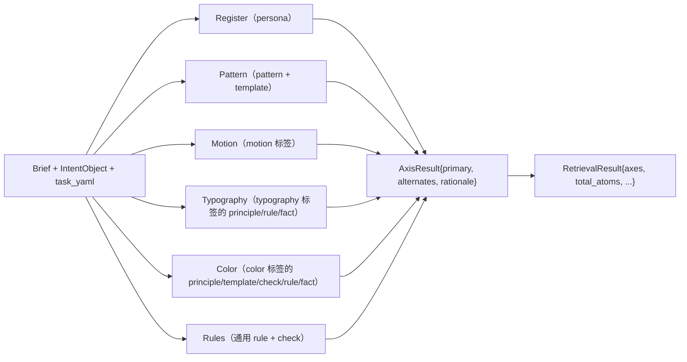

# 检索 — 6 轴算法

`prime_compile` 跑起来不是把 30 个原子塞进 agent context。它造一份
结构化**检索方案**，每一**轴**给一个结果。共 6 轴：register、
pattern、motion、typography、color、rules。

本页讲算法。代码在 `packages/retrieval/src/multi-axis.ts`；本文解释
代码在做什么、每条轴为什么存在、怎么读输出。

这套算法**前端设计专属**。`prime-corpus-security` 会用不同的轴
（如 threat-model、control-family、attack-stage、mitigation-class）。
6 不是普世数 —— 是设计领域恰好合适。

---

## 为什么 6 轴而不是单一大搜

单关键字搜在 brief "博客单篇文章页, 排版要讲究" 上会塌缩。"博客"字
面命中 `anti-pattern-blog-popup`（a11y 警告，无关）；"排版"字面命中
`check-paragraph-spacing`（清单项，不是设计语言）；真正该返回的
`persona-magazine-editorial` 一个字都不命中。

切成轴解决这个：

- **register 轴**问："哪个 persona school？" —— 匹配 school，不是
  字面词。
- **pattern 轴**问："哪些结构 pattern？" —— 匹配 pattern/template，
  带 kind boost。
- **motion 轴**问："哪些动效手艺？" —— 只有 motion 标签的原子能
  在此竞争。

每个轴用各自调好的打分函数。原子不能在不属于它的轴上获胜。

---

## 6 轴



每个轴返回:

```ts
{
  axis: "register" | "pattern" | "motion" | "typography" | "color" | "rules",
  primary: AtomRef,         // 该轴 top-1
  alternates: AtomRef[],    // 至多 budget-1 个候选
  rationale: string,        // 人类可读的理由
}
```

`budget` 来自 `taxonomy/<task>.yaml::max_atoms_per_axis`。未指定时
默认 3。

---

## 轴 1 · Register（persona）

**目的**：选页面的设计 school。

**候选集**：所有 `kind: persona` 的原子。

**打分**（取自 `multi-axis.ts`）:

```ts
const schoolWeights = new Map(
  intent.register_candidates.map((c) => [c.school, c.weight]),
);

const scored = allowed.map((atom) => {
  let score = 0;
  for (const [school, weight] of schoolWeights) {
    const targetId = SCHOOL_TO_PERSONA[school];
    if (targetId && atom.id === targetId) score += weight * 10;
    if (atom.id.includes(school.replace(/[^a-z]/g, "-"))) score += weight * 5;
  }
  return { atom, score };
});
```

`intent.register_candidates` 来自任务 YAML 的
`default_register_pool`（如博客任务: magazine-editorial 0.55、
notion-warm 0.25、warm-institutional 0.20）。weight × 10 = 5.5
是精确 ID 匹配，2.75 是部分 slug 匹配。`forbidden_atoms` 在打分
前过滤。

**预算**：多数任务 `register: 1` —— 一页一个 persona。预算更高时会
返回 alternates 供 agent 替换。

**为什么排第一**：register 决定其它一切。这里选错，typography 轴
返回的暖衬线就跟任务想要的 OKLCH 中性色对不上，agent 就要跟契约
打架。

---

## 轴 2 · Pattern

**目的**：选页面需要的结构性 pattern（hero、toast、data-table 等）。

**候选集**：`kind: pattern` 或 `kind: template`。

**打分**（按优先级）:

1. **YAML 必选** —— `task_yaml.required_atoms` 中既属 pattern/template
   的，无视关键词分直接顶到最前。
2. **关键词分**：剩下的看 `intent.task_type`、`intent.sub_type`、
   `intent.domain`、`intent.vibe[*]` 在 `atom.id + atom.description
   + atom.cluster` 中命中数。

```ts
const requiredIds = new Set(
  (taskYaml?.required_atoms ?? []).filter((id) => id.includes("pattern"))
);
const required = allowed.filter((a) => requiredIds.has(a.id));
const rest = allowed.filter((a) => !requiredIds.has(a.id));

const scored = rest
  .map((a) => ({ meta: a, score: keywordScore(a, keywords) }))
  .sort((a, b) => b.score - a.score);

const candidates = [...required, ...scored.map((s) => s.meta)];
```

**预算**：常见 `pattern: 2..4`。pricing-b2b 是 2（表格就是 pattern）；
toast-demo 是 2（重头戏在 motion）。

---

## 轴 3 · Motion

**目的**：选动效手艺原子（spring config、easing curve、fade-stagger
template、scroll-reveal pattern）。

**候选集**：`cluster === "motion"` 或 id 含 `motion / animation /
fade / spring / easing / scroll-reveal / stagger`。

**打分**（按优先级）:

1. `taxonomy.recommended_motion` 排第一（按 YAML 顺序）。
2. 若 `intent.motion_priority === "high"`，把所有 motion 标签的
   pattern/template 全包含。
3. 剩下的 motion 原子排在最后。

去重，取 top-1 为 primary。

**预算**：常见 `motion: 1..2`。**toast-demo 是 5** —— 动效原子就是
那类任务的价值所在。

**Fallback**：`@impeccable/template-easing-curves`，没匹配也兜底。
意味着 content 任务（本来不会有 motion 原子）也能拿到合理默认。

---

## 轴 4 · Typography

**目的**：选管 body/标题字号、行长、层级的原子。

**候选集**：`kind ∈ {principle, rule, fact, check}` 且 id/description
匹配 typography 关键词（`typograph / font / line-length / readab /
letter-spacing / body-text / heading`）或 cluster 是 `typography`。

**打分**：按 kind 偏好：principle > rule > fact > check。

**预算**：常见 `typography: 1..3`。blog-article 是 3（typography 是
brief 的全部重点）。

**Fallback**：`@community/principle-typography-hierarchy`。

---

## 轴 5 · Color

**目的**：选色彩系统规则与色板。

**候选集**：`kind ∈ {principle, template, check, rule, fact}` 且
id/description 匹配 `color / colour / palette / contrast / hue /
theme / dark-mode / accent`。

**打分**：关键字命中数，kind 偏好（template 较高）。

**预算**：常见 `color: 1..2`。

---

## 轴 6 · Rules

**目的**：选其它轴没覆盖的、跟 brief 高杠杆的通用 rule / check。

**候选集**：`kind ∈ {rule, check}` 且未被其它轴返回。

**打分**：与 `intent` 字段的关键字重叠、kind 偏好（rule > check）、
persona-school 加权。

**预算**：常见 `rules: 2..3`。

---

## 端到端例

Brief: `"博客单篇文章页, 排版要讲究"`

`prime_intent` 返回:

```json
{
  "task_type": "blog-article",
  "sub_type": "blog-article",
  "register_candidates": [
    {"school": "magazine-editorial", "weight": 0.55},
    {"school": "notion-warm", "weight": 0.25},
    {"school": "warm-institutional", "weight": 0.20}
  ],
  "vibe": ["editorial", "longform", "typography"],
  "motion_priority": "low",
  "density": "loose",
  "domain": "publishing"
}
```

`multiAxisRetrieve` 跑 6 轴:

| 轴 | primary | alternates | 理由 |
|---|---|---|---|
| register | `@impeccable/persona-magazine-editorial`（5.5）| `@community/persona-notion`（1.25）、`@impeccable/persona-warm-institutional`（1.0）| 匹配 magazine-editorial weight 0.55 |
| pattern | `@community/pattern-blog-article-layout`（必选）| `@community/pattern-table-of-contents-sticky`（kw: 0）| 1 个 YAML 必选 + 关键词排序 |
| motion | `@community/pattern-fade-in-on-load`（推荐）| `@community/pattern-scroll-reveal` | motion_priority=low；YAML 推荐 2 |
| typography | `@community/principle-typography-hierarchy`（kind=principle, kw=2）| `@community/rule-line-length-optimal`、`@community/fact-type-scale-modular` | principle 优先；3 个原子 |
| color | `@community/rule-single-accent-color` | `@community/constraint-no-pure-white-bg` | 暖磁色板 |
| rules | `@community/rule-line-length-optimal` | `@community/rule-backgrounds-atmospheric` | rule > check；长文相关 |

外加来自 `taxonomy.required_atoms` 的 `mandatory_reads`:

```
@community/pattern-blog-article-layout
@community/principle-typography-hierarchy
@community/rule-line-length-optimal
```

按 content 家族 cap=3 限制。agent 各读一份 `full.md`，开写
index.html。

---

## 算法刻意避免做的事

- **embedding 相似度**。RAG 风格的 cosine 搜不可解释、不可调，把
  "kind"和"topic"混在一起。前端检索是结构化、可解释的；每个分都可
  分解。
- **Top-K dumping**。K=10 单桶是 `skip_intent=true` legacy 模式干的
  事。6 轴路径用 per-axis 预算，让每个轴都有代表。
- **匹配就要**。`forbidden_atoms` 是硬过滤；YAML 的
  `forbidden_atoms` 在打分前生效。
- **kind 一视同仁**。每条轴固定 kind 集；不论
  `pattern-toast-stack` 的 description 多么强调字体，它都赢不了
  typography 轴。

---

## 调算法

fork 语料库后想改检索行为：

- **加新轴**：编辑 `multi-axis.ts` 的 `allAxes` 列表 + 实现
  `retrieve<NewAxis>()`。给所有 taxonomy YAML 加 `<axis>: <budget>`
  默认。
- **改 kind 的允许轴**：编辑各轴的 `byKind(...)` 调用与关键字过滤
  正则。
- **改打分权重**：`retrieveRegister` 里 `weight * 10` / `* 5` 是给
  当前 31 persona 校准的。扩到 ~60 persona（ROADMAP § 5）需重新
  校准。
- **加新 fallback**：每条轴在"没匹配"时有 fallback —— 扩或改默认。

---

## 源文件

- `packages/retrieval/src/multi-axis.ts` —— 6 轴分发 + 各轴 retrieve
  函数。
- `packages/retrieval/src/load-index.ts` —— atom-meta 加载器（消费
  `compiled-v3-final/_index.xml`）。
- `packages/retrieval/src/load-taxonomy.ts` —— YAML 加载器。
- `packages/retrieval/src/ranker-v2.ts` —— 跨轴打分 helper。
- `packages/retrieval/src/resolver.ts` —— typed-JSON 解析器
  （`prime_resolve` 后端）。

MCP server 调用点是 `mcp-server/index.ts:534-780`（`prime_compile`
工具的 v2 路径）。

---

## bug 历史（背景）

检索算法历史上 bug 连连。两个值得说的修复：

- **2026-04-22**：deriveKind bug 把所有 kind 塌缩成 "knowledge"，
  让 kind-boost 系统失效。表征：typography brief 返回全是 a11y 原子
  （`contrast` / `rule` / `check` 字面命中，因为 kind boost 失活）。
  修：从 `atom.yaml` 读 `kind:` 而不是从 id 前缀推。
- **2026-04-15**：chunker bug 把 persona / template / voice 原子
  的 `implies` / `palette` / `prohibitions` 字段从 `full.md` 里默
  默砍掉。表征：博客任务的输出 0 OKLCH、默认 Georgia，尽管
  `persona-magazine-editorial` 明明声明了 GT Sectra。修：在
  `buildFull` 加 catch-all，把所有 kind 专属 body 字段 emit 到
  full。

两个修复都是从输出质量回归发现，不是单元测试。教训：**检索的好坏
取决于投影交付了什么**。`validator-html.md` 讲闭环的 L3 契约校验。
