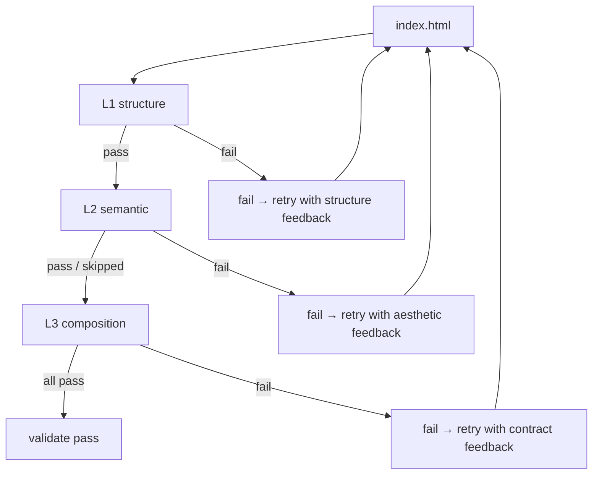

# Validator — HTML output validation (L1 / L2 / L3)

After the agent writes `index.html`, `prime_validate` checks it
against the original brief + composition contract. The validator runs
three layers:

| Layer | What it checks | Cost | Skipped when |
|---|---|---|---|
| **L1 Structure** | HTML has required tags, valid a11y basics (alt, labels, viewport, etc.) | Free (regex) | Never — always runs |
| **L2 Semantic** | Aesthetic match between output and intended register (DeepSeek/Haiku judges) | ~$0.001/run | No LLM API key configured |
| **L3 Composition** | Composition contract honored — must_include / must_avoid / quality_thresholds | Free (signature library + regex) | Never — always runs |

The validator can return `{pass: false, feedback: ...}` triggering an
agent retry. Maximum 2 retries by default.

This page documents what each layer does and shows pass/fail samples.

---

## L1 · Structure

**Code**: `packages/validator/src/l1-structure.ts`.

**Purpose**: catch the obviously-broken-HTML cases. Pure regex over
the rendered file. Cheap and deterministic.

### What it checks

```ts
// Required:
if (!/<html[^>]*>/i.test(html)) issues.push("missing <html> tag");
if (!/<title>/i.test(html))      issues.push("missing <title>");
if (!/<meta[^>]*viewport/i.test(html)) issues.push("missing viewport meta");
if (!/<meta[^>]*charset/i.test(html))  issues.push("missing charset meta");

// Headings:
if (!/<h1/i.test(html)) issues.push("missing h1");

// a11y — Images should have alt
const imgs = html.matchAll(/]*>/gi);
let altMissing = 0;
for (const m of imgs) {
  if (!/alt\s*=/i.test(m[0])) altMissing++;
}
if (altMissing > 0) issues.push(`${altMissing}  missing alt`);

// Form labels (etc.)
```

### Pass

```html
<!DOCTYPE html>
<html lang="en">
  <head>
    <meta charset="utf-8" />
    <meta name="viewport" content="width=device-width, initial-scale=1" />
    <title>Magazine Article — How Cities Breathe</title>
  </head>
  <body>
    <h1>How Cities Breathe</h1>
    <p>...</p>
    
  </body>
</html>
```

L1 verdict: `pass: true, issues: []`.

### Fail

```html
<html>
<body>
<h2>Article</h2>

<input type="text">
</body>
</html>
```

L1 verdict:
```
pass: false
issues:
  - "missing <title>"
  - "missing viewport meta"
  - "missing charset meta"
  - "missing h1"
  - "1/1  missing alt"
```

L1 is a tripwire. Most outputs pass; the ones that fail are usually
stub HTML the agent wrote when it couldn't decide.

---

## L2 · Semantic (LLM aesthetic check)

**Code**: `packages/validator/src/l2-semantic.ts`.

**Purpose**: an LLM judge reads the output and rates how well it
matches the intended persona's aesthetic.

### How it works

1. The validator loads the output HTML.
2. It re-classifies the brief through `prime_intent` to recover the
   register (e.g. "magazine-editorial").
3. It calls a small/cheap LLM (Haiku or DeepSeek) with a prompt like:
   "Here is an HTML file. The intended aesthetic is
   `magazine-editorial` with display serif at 96-160px. Does the HTML
   match? Return alignment_score 0..1 and any issues."
4. Returns `{pass: alignment_score ≥ 0.8, alignment_score, issues}`.

### Skipped path (the P0 bug history)

Pre-Wave-10, L2 returned `{pass: false}` when no LLM API key was
configured. This caused the 12-log-viewer turn=15 incident: the agent
retried 12 times trying to "fix" a check that couldn't actually run.

After Wave 10:

```ts
function hasAnyLLMKey(): boolean {
  const env = process.env;
  return Boolean(
    env.ANTHROPIC_API_KEY || env.DEEPSEEK_API_KEY ||
    env.OPENAI_API_KEY || env.GOOGLE_API_KEY || env.GEMINI_API_KEY
  );
}

if (!hasAnyLLMKey()) {
  return { pass: true, alignment_score: 1.0, skipped: true };
}
```

L2 is **opt-in by API key presence**. Without a key it skips cleanly
(pass:true, skipped:true) — no retry loop.

### Pass / fail samples

**Pass**: agent picks magazine-editorial, output uses `font-family:
"GT Sectra", "Tiempos Headline", serif;`, body 18px, display 110px,
warm `#f8f6f1` background, single per-article accent. L2 returns
`alignment_score: 0.92, issues: []`.

**Fail**: agent picks magazine-editorial, output uses `font-family:
Georgia, serif;`, body 14px, display 32px, white #ffffff background,
multiple accent colors. L2 returns `alignment_score: 0.42, issues:
[font generic Georgia not from prescribed set, display under 64px,
pure white violates persona, multiple accents without article context]`.

### Cost

Each L2 run is one LLM call with ~2k input tokens + ~500 output. With
DeepSeek that's ~$0.0008/run. Cheap enough to run on every output once
ROADMAP § 8 lands and L2 becomes default.

---

## L3 · Composition (signature library)

**Code**: `packages/validator/src/l3-composition.ts`.

**Purpose**: check the composition contract's `must_include` /
`must_avoid` / `quality_thresholds` against the output via a 14-pattern
signature library + noun-keyword fallback.

### The signature library

The current 14-pattern library covers the high-leverage cases.
Excerpt:

```ts
const ATOM_SIGNATURES: Array<{ match: RegExp; signatures: Array<string | RegExp> }> = [
  // Toast / notification
  { match: /pattern-toast/i,
    signatures: [/role=["']?(alert|status)["']?/i, /class=["'][^"']*toast/i, /aria-live=["'](polite|assertive)["']/i] },

  // Data table
  { match: /pattern-data-table/i,
    signatures: [/<table\b/i, /role=["']table["']/i, /class=["'][^"']*data-table/i] },

  // Modal / dialog
  { match: /pattern-modal|method-modal|pattern-dialog/i,
    signatures: [/role=["']dialog["']/i, /aria-modal/i, /class=["'][^"']*modal/i] },

  // Hero
  { match: /pattern-hero/i,
    signatures: [/<section[^>]+(hero|banner)/i, /class=["'][^"']*hero/i] },

  // Skeleton / shimmer
  { match: /pattern-skeleton|pattern-shimmer/i,
    signatures: [/class=["'][^"']*(skeleton|shimmer)/i, /@keyframes\s+(skeleton|shimmer)/i] },

  // Fade / scroll-reveal motion
  { match: /pattern-fade|pattern-scroll-reveal|pattern-stagger/i,
    signatures: [/@keyframes\s+(fadeIn|fade-in|reveal|stagger)/i, /opacity\s*:\s*0/i, /IntersectionObserver/i] },

  // Typography hierarchy
  { match: /principle-typography-hierarchy|rule-line-length/i,
    signatures: [/<h1\b[\s\S]*<h2\b/i, /max-width:\s*\d+(ch|rem|px)/i] },

  // Monospace usage
  { match: /fact-monospace|constraint-monospace/i,
    signatures: [/font-family:[^;]*(mono|JetBrains|Menlo|Consolas|Geist Mono|IBM Plex Mono)/i] },
];
```

The validator iterates `must_include` atoms; each goes through:

1. **Signature lookup**: does any rule match the atom's id?
2. **If match**: does any signature appear in the HTML? → `honored`.
   None match? → `violated`.
3. **If no signature mapping**: noun-keyword fallback. Strip kind
   prefix from id (`pattern-toast-stack` → `toast-stack`), split on
   `-`, keep words ≥4 chars. If at least half appear in HTML →
   `honored`. Else → `unverifiable`.

### Three verdict states

| State | Meaning | Counts as |
|---|---|---|
| `honored` | The atom's signature appeared in the output | Pass |
| `violated` | A signature exists for the atom but none matched the output | Fail |
| `unverifiable` | No signature exists, AND noun-keyword check is ambiguous | Pass (we don't know) |

The deliberate choice is **bias toward false negatives over false
positives** — better to miss a fail than to fail a passing build. The
P0 history (Wave 10) had the L3 validator returning false fails
which triggered retries; the fix moved to "unverifiable means pass".

### Pass / fail samples

**Pass — toast-demo task, output has motion craft**:

```html
<div class="toast-stack" aria-live="polite">
  <div class="toast" role="alert" data-tone="success">...</div>
</div>
<style>
  @keyframes toast-in { from { transform: translateY(20px); opacity: 0 } to { transform: translateY(0); opacity: 1 } }
  @keyframes drain { from { width: 100% } to { width: 0 } }
  .toast { animation: toast-in 280ms cubic-bezier(0.34, 1.56, 0.64, 1); }
  @media (prefers-reduced-motion: reduce) { .toast { animation: none } }
</style>
```

L3 verdict on `must_include = [pattern-toast-stack,
template-spring-config, pattern-stagger-reveal, template-fade-stagger,
fact-stagger-feel-organic]`:

```
honored: 4 atoms (toast role + class + aria-live, @keyframes,
                  cubic-bezier, prefers-reduced-motion match)
unverifiable: 1 atom (fact-stagger-feel-organic — no signature)
violated: 0
quality_thresholds:
  min-keyframes (≥4): 2 found — VIOLATED
  requires-cubic-bezier: present — honored
  requires-reduced-motion-fallback: present — honored
  min-toast-variants (≥5): 1 found — VIOLATED
pass: false (2 quality_thresholds violations)
```

The agent gets feedback like: "Add 2 more @keyframes (drain-progress
and slide-out are common; you have 2/4); add 4 more toast variants
(error/warning/info/loading; you have 1/5)".

**Fail — blog-article output uses dense-pragmatist aesthetic**:

L3 verdict on `must_avoid = [persona-dense-pragmatist, persona-brutalist]`:

```
must_avoid violations:
  - persona-dense-pragmatist: HTML has `font-family: Inter` + small
    line-height — strong dense-pragmatist signature against
    magazine-editorial contract.
pass: false
```

Agent retries with prescribed serif typography.

---

## Putting it together



Validator returns:

```json
{
  "pass": true,
  "l1": { "pass": true, "issues": [] },
  "l2": { "pass": true, "alignment_score": 0.92, "skipped": false, "issues": [] },
  "l3": {
    "pass": true,
    "honored": ["pattern-toast-stack", "template-spring-config", ...],
    "violated": [],
    "unverifiable": ["fact-stagger-feel-organic"]
  },
  "feedback": ""
}
```

Or with feedback (when one layer fails):

```json
{
  "pass": false,
  "l1": { "pass": true, ... },
  "l2": { "pass": false, "alignment_score": 0.52, "issues": [...] },
  "l3": { "pass": true, ... },
  "feedback": "Aesthetic alignment is 0.52, below 0.8 threshold. Issues: font Georgia is generic; persona requires GT Sectra / Tiempos Headline. Fix: change body to ...; change display to ..."
}
```

---

## Source files

- `packages/validator/src/l1-structure.ts` — L1 regex checks.
- `packages/validator/src/l2-semantic.ts` — L2 LLM judge + skip path.
- `packages/validator/src/l3-composition.ts` — L3 signature library +
  noun-keyword fallback + quality_thresholds checks.
- `packages/validator/src/feedback-builder.ts` — turn validator
  output into actionable retry feedback.
- `packages/validator/src/index.ts` — top-level `validate()` entry.

The MCP server invocation is `mcp-server/index.ts:932-982`
(`prime_validate` tool).

---

## Limitations

- **Signature library is small (14 patterns)**. ROADMAP § 6 plans
  expansion to ~60.
- **L1 regex doesn't parse HTML**. False positives on edge cases
  (e.g. commented-out tags). Acceptable; we don't ship a real parser
  here.
- **L3 false-negative bias**. Many `principle-*` atoms can't be
  verified from HTML — they're about the way code is structured, not
  what nouns appear. Those mark `unverifiable`. The cost is some real
  contract violations slip through; the alternative (false-positive
  fails) was worse.
- **No browser-render check**. The HTML may declare `font-family: GT
  Sectra` but render Times New Roman if Sectra wasn't loaded. ROADMAP
  § 10 covers this.
