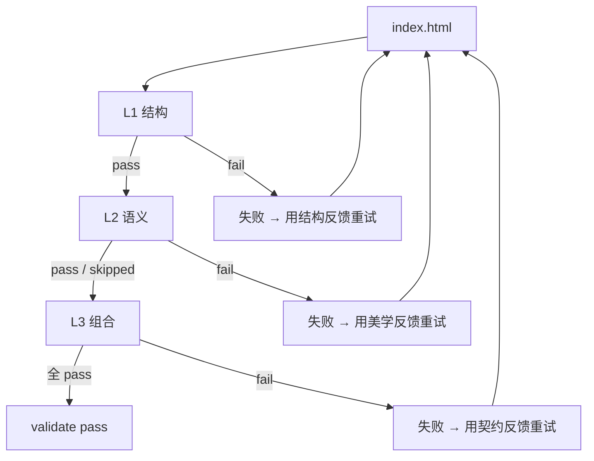

# Validator — HTML 输出校验（L1 / L2 / L3）

agent 写完 `index.html` 后，`prime_validate` 按原 brief + 合并契约
校验它。validator 跑三层：

| 层 | 验什么 | 成本 | 何时跳过 |
|---|---|---|---|
| **L1 结构** | HTML 必备标签、a11y 基本（alt、label、viewport 等） | 免费（regex） | 永不跳 |
| **L2 语义** | 输出与目标 register 的美学匹配（DeepSeek/Haiku 评判） | 约 $0.001/次 | 没 LLM API key 时跳 |
| **L3 组合** | composition contract 是否被遵守 —— must_include / must_avoid / quality_thresholds | 免费（签名库 + regex） | 永不跳 |

validator 可以返回 `{pass: false, feedback: ...}` 触发 agent 重试。
默认最多 2 次重试。

本页讲每层在做什么 + 给 pass/fail 样例。

---

## L1 · 结构

**代码**: `packages/validator/src/l1-structure.ts`。

**目的**：抓显然坏的 HTML。纯正则扫文件。便宜确定。

### 检查内容

```ts
// 必备:
if (!/<html[^>]*>/i.test(html)) issues.push("缺 <html>");
if (!/<title>/i.test(html))      issues.push("缺 <title>");
if (!/<meta[^>]*viewport/i.test(html)) issues.push("缺 viewport meta");
if (!/<meta[^>]*charset/i.test(html))  issues.push("缺 charset meta");

// 标题:
if (!/<h1/i.test(html)) issues.push("缺 h1");

// a11y — 图片要有 alt
const imgs = html.matchAll(/]*>/gi);
let altMissing = 0;
for (const m of imgs) {
  if (!/alt\s*=/i.test(m[0])) altMissing++;
}
if (altMissing > 0) issues.push(`${altMissing} 张  缺 alt`);

// Form label 等
```

### Pass

```html
<!DOCTYPE html>
<html lang="en">
  <head>
    <meta charset="utf-8" />
    <meta name="viewport" content="width=device-width, initial-scale=1" />
    <title>Magazine Article — How Cities Breathe</title>
  </head>
  <body>
    <h1>How Cities Breathe</h1>
    <p>...</p>
    
  </body>
</html>
```

L1 verdict: `pass: true, issues: []`。

### Fail

```html
<html>
<body>
<h2>Article</h2>

<input type="text">
</body>
</html>
```

L1 verdict:
```
pass: false
issues:
  - "缺 <title>"
  - "缺 viewport meta"
  - "缺 charset meta"
  - "缺 h1"
  - "1/1  缺 alt"
```

L1 是绊线。多数输出都过；过不去的多半是 agent 不知所措写出的桩
HTML。

---

## L2 · 语义（LLM 美学检查）

**代码**: `packages/validator/src/l2-semantic.ts`。

**目的**：LLM judge 读输出，给"匹配目标 persona 美学"打分。

### 怎么工作

1. validator 加载输出 HTML。
2. 用 `prime_intent` 重新分类 brief 拿回 register（如
   "magazine-editorial"）。
3. 调小 / 便宜的 LLM（Haiku 或 DeepSeek），prompt 大致：
   "这是一份 HTML。目标美学是 `magazine-editorial`，display serif
   96-160px。是否匹配？返回 alignment_score 0..1 与 issues。"
4. 返回 `{pass: alignment_score ≥ 0.8, alignment_score, issues}`。

### 跳过路径（P0 bug 历史）

Wave 10 之前，L2 在没 LLM API key 时返回 `{pass: false}`。这是
12-log-viewer 跑了 15 轮的祸根：agent 反复重试一个根本跑不了的
检查。

Wave 10 之后:

```ts
function hasAnyLLMKey(): boolean {
  const env = process.env;
  return Boolean(
    env.ANTHROPIC_API_KEY || env.DEEPSEEK_API_KEY ||
    env.OPENAI_API_KEY || env.GOOGLE_API_KEY || env.GEMINI_API_KEY
  );
}

if (!hasAnyLLMKey()) {
  return { pass: true, alignment_score: 1.0, skipped: true };
}
```

L2 **按 API key 是否在场**决定开关。没 key 干净跳过
（pass:true, skipped:true），不重试循环。

### Pass / fail 样例

**Pass**: agent 选 magazine-editorial，输出用 `font-family:
"GT Sectra", "Tiempos Headline", serif;`、body 18px、display
110px、暖 `#f8f6f1` 背景、单一 per-article accent。L2 返回
`alignment_score: 0.92, issues: []`。

**Fail**: agent 选 magazine-editorial，输出用 `font-family:
Georgia, serif;`、body 14px、display 32px、纯白背景、多个 accent
色。L2 返回 `alignment_score: 0.42, issues:
[字体 Georgia 太通用，不在规定集合中；display 不到 64px；纯白
违反 persona；多 accent 没文章上下文]`。

### 成本

L2 每次调用约 2k 输入 + 500 输出 tokens。DeepSeek 大约
$0.0008/次。便宜到 ROADMAP § 8 落地后 L2 成默认时也跑得起。

---

## L3 · 组合（签名库）

**代码**: `packages/validator/src/l3-composition.ts`。

**目的**：用 14 个 pattern 的签名库 + 名词关键字回退，对输出查
契约的 `must_include` / `must_avoid` / `quality_thresholds`。

### 签名库

当前 14 pattern 库覆盖高杠杆案例。摘录:

```ts
const ATOM_SIGNATURES: Array<{ match: RegExp; signatures: Array<string | RegExp> }> = [
  // Toast / 通知
  { match: /pattern-toast/i,
    signatures: [/role=["']?(alert|status)["']?/i, /class=["'][^"']*toast/i, /aria-live=["'](polite|assertive)["']/i] },

  // Data table
  { match: /pattern-data-table/i,
    signatures: [/<table\b/i, /role=["']table["']/i, /class=["'][^"']*data-table/i] },

  // Modal / dialog
  { match: /pattern-modal|method-modal|pattern-dialog/i,
    signatures: [/role=["']dialog["']/i, /aria-modal/i, /class=["'][^"']*modal/i] },

  // Hero
  { match: /pattern-hero/i,
    signatures: [/<section[^>]+(hero|banner)/i, /class=["'][^"']*hero/i] },

  // Skeleton / shimmer
  { match: /pattern-skeleton|pattern-shimmer/i,
    signatures: [/class=["'][^"']*(skeleton|shimmer)/i, /@keyframes\s+(skeleton|shimmer)/i] },

  // Fade / scroll-reveal motion
  { match: /pattern-fade|pattern-scroll-reveal|pattern-stagger/i,
    signatures: [/@keyframes\s+(fadeIn|fade-in|reveal|stagger)/i, /opacity\s*:\s*0/i, /IntersectionObserver/i] },

  // Typography hierarchy
  { match: /principle-typography-hierarchy|rule-line-length/i,
    signatures: [/<h1\b[\s\S]*<h2\b/i, /max-width:\s*\d+(ch|rem|px)/i] },

  // Monospace 用法
  { match: /fact-monospace|constraint-monospace/i,
    signatures: [/font-family:[^;]*(mono|JetBrains|Menlo|Consolas|Geist Mono|IBM Plex Mono)/i] },
];
```

validator 遍历 `must_include` 原子，每个走：

1. **签名查找**：是否任一规则匹配该原子 id？
2. **匹配则**：HTML 中是否出现任一签名？→ `honored`。
   全无匹配 → `violated`。
3. **未匹配规则**：名词关键字回退。从 id 去 kind 前缀
   （`pattern-toast-stack` → `toast-stack`）、按 `-` 切、保留长
   ≥4 的词。HTML 中至少出现一半 → `honored`。否则 → `unverifiable`。

### 三种判定

| 状态 | 含义 | 计入 |
|---|---|---|
| `honored` | 原子签名出现于输出 | Pass |
| `violated` | 原子有签名但都没在输出中匹配 | Fail |
| `unverifiable` | 无签名，且名词关键字回退也模糊 | Pass（不可知） |

刻意选择是**偏向假阴性而非假阳性** —— 漏报 fail 比让通过的构建挂
要好。P0 历史里（Wave 10），L3 假阳触发的重试就是事故根源；修法
是"unverifiable 即 pass"。

### Pass / fail 样例

**Pass — toast-demo 任务，输出有动效手艺**:

```html
<div class="toast-stack" aria-live="polite">
  <div class="toast" role="alert" data-tone="success">...</div>
</div>
<style>
  @keyframes toast-in { from { transform: translateY(20px); opacity: 0 } to { transform: translateY(0); opacity: 1 } }
  @keyframes drain { from { width: 100% } to { width: 0 } }
  .toast { animation: toast-in 280ms cubic-bezier(0.34, 1.56, 0.64, 1); }
  @media (prefers-reduced-motion: reduce) { .toast { animation: none } }
</style>
```

L3 对 `must_include = [pattern-toast-stack, template-spring-config,
pattern-stagger-reveal, template-fade-stagger,
fact-stagger-feel-organic]` 的判定:

```
honored: 4 atoms (toast role + class + aria-live、@keyframes、
                  cubic-bezier、prefers-reduced-motion 都有)
unverifiable: 1 atom (fact-stagger-feel-organic 无签名)
violated: 0
quality_thresholds:
  min-keyframes (≥4): 找到 2 个 — VIOLATED
  requires-cubic-bezier: 在 — honored
  requires-reduced-motion-fallback: 在 — honored
  min-toast-variants (≥5): 找到 1 — VIOLATED
pass: false (2 个 quality_thresholds 违反)
```

agent 收到的 feedback 像："多加 2 个 @keyframes（drain-progress 与
slide-out 是常见的；你现在 2/4）；多加 4 种 toast 变体
（error/warning/info/loading；你现在 1/5）"。

**Fail — blog-article 输出用 dense-pragmatist 美学**:

L3 对 `must_avoid = [persona-dense-pragmatist, persona-brutalist]`
的判定:

```
must_avoid 违反:
  - persona-dense-pragmatist: HTML 用 `font-family: Inter` + 紧
    line-height —— 强 dense-pragmatist 签名，违反 magazine-editorial
    契约。
pass: false
```

agent 用规定的衬线 typography 重写。

---

## 整合起来



validator 返回:

```json
{
  "pass": true,
  "l1": { "pass": true, "issues": [] },
  "l2": { "pass": true, "alignment_score": 0.92, "skipped": false, "issues": [] },
  "l3": {
    "pass": true,
    "honored": ["pattern-toast-stack", "template-spring-config", ...],
    "violated": [],
    "unverifiable": ["fact-stagger-feel-organic"]
  },
  "feedback": ""
}
```

或带 feedback（某层失败时）:

```json
{
  "pass": false,
  "l1": { "pass": true, ... },
  "l2": { "pass": false, "alignment_score": 0.52, "issues": [...] },
  "l3": { "pass": true, ... },
  "feedback": "美学对齐 0.52，低于 0.8 阈值。问题：字体 Georgia 太通用；persona 需要 GT Sectra / Tiempos Headline。修：把 body 改成 ...；display 改成 ..."
}
```

---

## 源文件

- `packages/validator/src/l1-structure.ts` — L1 正则检查。
- `packages/validator/src/l2-semantic.ts` — L2 LLM judge + 跳过
  路径。
- `packages/validator/src/l3-composition.ts` — L3 签名库 + 名词
  关键字回退 + quality_thresholds 检查。
- `packages/validator/src/feedback-builder.ts` — 把 validator 输出
  转成可执行的重试反馈。
- `packages/validator/src/index.ts` — 顶层 `validate()` 入口。

MCP server 调用点 `mcp-server/index.ts:932-982`（`prime_validate`
工具）。

---

## 局限

- **签名库小（14 pattern）**。ROADMAP § 6 计划扩到 ~60。
- **L1 正则不解析 HTML**。在边缘情况会假阳（如注释掉的标签）。可
  接受；这里不打算自带真 parser。
- **L3 偏假阴**。很多 `principle-*` 原子从 HTML 没法验 —— 它们关
  乎代码结构而非名词。这些标 `unverifiable`。代价是有真实契约违反
  漏过；替代方案（假阳 fail）更糟。
- **不做浏览器渲染检查**。HTML 可能写 `font-family: GT Sectra`
  但实际渲染 Times New Roman 因为 Sectra 没加载。ROADMAP § 10 覆
  盖这个。
