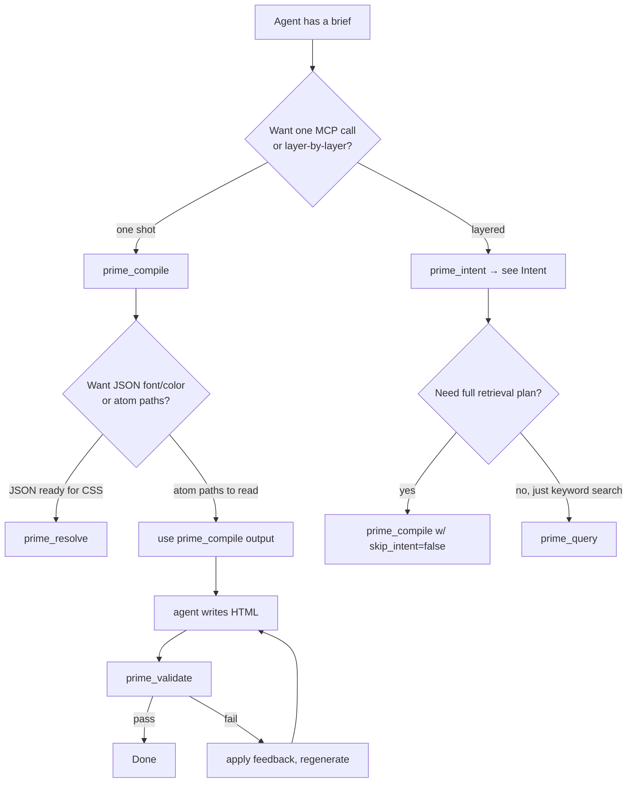

# MCP tools — the 5 frontend-design tools

The corpus repo's MCP server exposes **five tools** that map onto the
five layers of the frontend-design pipeline. Each is documented here
with its actual I/O signature (read from `mcp-server/index.ts`), the
decision-tree for "when should I call this", and a worked example.

| Tool | Layer | Purpose | Cost |
|---|---|---|---|
| `prime_intent` | 1 | Brief → IntentObject | 1 LLM call (~$0.001) |
| `prime_compile` | 1+2+3 | One-shot: intent + retrieval + contract | Same as above |
| `prime_query` | (any) | Graph traversal / keyword search / template fetch / scout | Free |
| `prime_validate` | 5 | Validate index.html against contract | L1+L3 free; L2 ~$0.001 if key |
| `prime_resolve` | (alt) | Brief → typed JSON design spec | 1 LLM call |

---

## Decision tree



---

## Tool 1 · `prime_compile`

**Source**: `mcp-server/index.ts:534-780`.

**Description** (from server registration):

> Compile a frontend brief into a structured atom retrieval plan.
> Returns 6 axes (register/pattern/motion/typography/color/rules),
> each with primary + alternates. Internally: classifies brief into
> Intent, runs multi-axis retrieval, applies composition contract.

### Input

```ts
{
  brief: string,                        // required: free-form brief
  mode?: "browse" | "push",             // default "browse"
  skip_intent?: boolean,                // default false; legacy keyword path
  // ── legacy fields (only used when skip_intent=true) ─────────────────
  task?: string,
  persona_school?: "editorial" | "dense-pragmatist" | "brutalist" |
                   "swiss-modernist" | "tokyo-minimal" | "warm-institutional" |
                   "notion" | "stripe" | "linear" | "toss" | "vercel",
  persona_flavor?: string[],
  persona_attitude?: "opinionated" | "restrained" | "provocative" | "academic",
  voice_tone?: "imperative" | "gentle" | "academic" | "casual" | "provocative",
  features?: string[],
  hue?: number,                         // 0..360
  chroma?: number,                      // 0..0.4
  include_references?: boolean,
  budget?: number,                      // 100..5000
  max_atoms?: number,                   // 1..50
}
```

### Output (intent path, default)

```ts
{
  mode: "browse",
  brief: string,
  intent: IntentObject,                 // task_type, sub_type, register_candidates, vibe, ...
  axes: AxisResult[],                   // 6 entries
  task_yaml: TaskTypeDefinition,
  composition_contract: MergedContract | null,
  total_atoms: number,
  mandatory_reads: { id: string; path: string }[],
  mandatory_reads_cap: number,          // family-specific (3..12)
  turn_budget_hint: string,             // family-specific advice
  instructions: string[],               // 7-step agent procedure
}
```

### When to call

- Default: when you have a brief and want everything in one shot.
- The `mode: "browse"` returns a path-based plan the agent loads
  selectively; `mode: "push"` (legacy) prepends content into context.

### Example (real bench-v2 result)

Brief: `"邮件订阅, 简单就行"` (waitlist task)

Output (abridged):

```json
{
  "intent": {
    "task_type": "marketing-landing",
    "sub_type": "waitlist",
    "register_candidates": [
      {"school": "warm-institutional", "weight": 0.4},
      {"school": "magazine-editorial", "weight": 0.3},
      {"school": "notion-warm", "weight": 0.3}
    ]
  },
  "axes": [
    {"axis": "register", "primary": {"id": "@impeccable/persona-warm-institutional"}, ...},
    {"axis": "pattern", "primary": {"id": "@community/pattern-hero-with-demo"}, ...},
    ...
  ],
  "mandatory_reads": [
    {"id": "@community/pattern-hero-with-demo", "path": "compiled-v3-final/.../full.md"},
    {"id": "@community/pattern-trust-signal-components", "path": "..."},
    {"id": "@community/rule-single-primary-action-per-screen", "path": "..."},
    {"id": "@community/pattern-inline-validation", "path": "..."}
  ],
  "mandatory_reads_cap": 5,
  "turn_budget_hint": "Aim for ≤8 turns — focused atom retrieval is enough.",
  "composition_contract": {
    "source_atoms": ["@impeccable/persona-warm-institutional"],
    "must_include": ["@community/pattern-hero-cta", "@community/pattern-email-form"],
    ...
  }
}
```

---

## Tool 2 · `prime_query`

**Source**: `mcp-server/index.ts:784-913`.

**Description**:

> Follow-up queries after prime_compile. scope picks what you want:
> 'atoms' (keyword search), 'related' (graph traversal from an atom
> id), 'template' (fetch a template atom), 'mandate' (all hard
> mandates), 'checklist' (pre-ship checklist for a task), 'gallery'
> (reference screenshots for a section), 'scout' (search 57k external
> design references).

### Input

```ts
{
  scope: "atoms" | "related" | "template" | "mandate" | "checklist" | "gallery" | "scout",
  query?: string,                       // for atoms / scout / gallery
  id?: string,                          // for related / template
  depth?: 1 | 2 | 3,                    // graph depth (default 1)
  task?: string,                        // for checklist
  section?: "hero" | "pricing" | "cta" | "features" | "footer" |
            "testimonial" | "full-landing" | "all",  // for gallery
  limit?: number,                       // 1..50
  variables?: Record<string, any>,      // for template substitution
}
```

### Output (varies by scope)

`scope: "atoms"` →

```json
{
  "results": [
    {"id": "@community/pattern-toast-stack", "kind": "pattern",
     "description": "...", "summary_path": "compiled-v3-final/.../summary.md"},
    ...
  ]
}
```

`scope: "related"` (graph traversal from a starting atom):

```json
{
  "starting_atom": "@impeccable/persona-magazine-editorial",
  "depth": 1,
  "edges": [
    {"verb": "compatible", "to": "@impeccable/persona-warm-institutional"},
    {"verb": "must-include", "to": "@community/principle-vertical-rhythm"},
    ...
  ]
}
```

### When to call

- After `prime_compile`, when the plan covers the basics but you want
  to look deeper into one atom's neighborhood.
- Search the corpus by keyword (`scope: "atoms"`).
- Fetch a template's parameterized output (`scope: "template",
  variables: {...}`).
- Get the pre-ship checklist for a task type (`scope: "checklist",
  task: "blog-article"`).

---

## Tool 3 · `prime_intent`

**Source**: `mcp-server/index.ts:915-928`.

**Description**:

> Classify a frontend task brief into structured Intent — register
> candidates, vibe, motion priority, density, domain. Use this BEFORE
> prime_compile to get smart atom retrieval.

### Input

```ts
{
  brief: string,                        // free-form, any language
}
```

### Output

```json
{
  "task_type": "blog-article",
  "sub_type": "blog-article",
  "register_candidates": [
    {"school": "magazine-editorial", "weight": 0.55},
    {"school": "notion-warm", "weight": 0.25},
    {"school": "warm-institutional", "weight": 0.20}
  ],
  "vibe": ["editorial", "longform", "typography"],
  "motion_priority": "low",
  "density": "loose",
  "domain": "publishing",
  "required_axes": ["*"]
}
```

### When to call

- Before `prime_compile` when you want to inspect the IntentObject
  separately (rare; `prime_compile` includes the intent in its
  output).
- For dry-run / debugging the intent classifier without running the
  full pipeline.

---

## Tool 4 · `prime_validate`

**Source**: `mcp-server/index.ts:932-982`.

**Description**:

> Validate a generated index.html against the design intent +
> composition contract. Returns pass/fail with structured feedback.
> Call this AFTER writing your HTML to verify it meets the spec; if
> it fails, fix the issues and re-validate.

### Input

```ts
{
  html_path: string,                    // absolute path to index.html
  brief: string,                        // original brief — re-classified to recover intent
}
```

### Output

```json
{
  "pass": true,
  "l1": { "pass": true, "issues": [] },
  "l2": { "pass": true, "alignment_score": 0.92, "skipped": false, "issues": [] },
  "l3": {
    "pass": true,
    "honored": ["@community/pattern-toast-stack", ...],
    "violated": [],
    "unverifiable": ["@community/fact-stagger-feel-organic"]
  },
  "quality_thresholds": {
    "min-keyframes": { "required": 4, "found": 5, "pass": true },
    "requires-cubic-bezier": { "required": true, "found": true, "pass": true },
    ...
  },
  "feedback": ""
}
```

### When to call

- After `agent writes index.html`, before declaring done.
- After applying retry feedback, to re-check.

See [`validator-html.md`](validator-html.md) for the full L1/L2/L3
semantics.

---

## Tool 5 · `prime_resolve`

**Source**: `mcp-server/index.ts:986-998`.

**Description**:

> Resolve a frontend brief into a typed design spec — concrete font
> names, hex colors, durations, sizes — ready to insert into CSS. Use
> this INSTEAD OF prime_compile when you want JSON values, not
> markdown paths.

### Input

```ts
{
  brief: string,                        // free-form
}
```

### Output (typed JSON, ready to interpolate into CSS)

```json
{
  "id": "@impeccable/persona-magazine-editorial",
  "kind": "persona",
  "school": "magazine-editorial",
  "implies": {
    "font": {
      "display": ["Fraunces", "GT Sectra", "Tiempos Headline"],
      "body": ["Tiempos Text", "Lyon Text", "Source Serif 4"],
      "accent": ["Söhne Schmal", "GT America Mono"]
    },
    "color": {
      "background": "#f8f6f1",
      "accent_options": ["#a4451c", "#8b2222", "#c08a3e", "#1e3a8a"],
      "text": "#1a1a1a"
    },
    "density": "loose",
    "display_size_px": [96, 160],
    "body_size_px": [18, 20],
    "line_height": { "display": 1.15, "body": 1.55 }
  },
  "conflicts": ["brutalist", "swiss-modernist", "vercel-clean", "stripe-fintech", "dense-pragmatist"],
  "must_include": [
    "@community/principle-vertical-rhythm",
    "@community/principle-typography-hierarchy",
    "@community/fact-type-scale-modular"
  ]
}
```

### When to call

- Use **instead of** `prime_compile` when you want to drop typed
  values directly into CSS. The agent doesn't have to read 6
  markdown files; it gets one JSON.
- Best for **simple briefs** with a clear single persona. For complex
  briefs needing axis-by-axis exploration, use `prime_compile`.

The Wave 7 protocol-layer commit promotes `prime_resolve` as the
"final interface" — markdown is the intermediate format; typed JSON is
how the agent should consume design knowledge in a v2 world.

---

## Authoring tip — when to call which

| Brief shape | Call |
|---|---|
| Single clear task ("waitlist") | `prime_compile`, then read mandatory_reads, write HTML, `prime_validate` |
| Need just the design tokens | `prime_resolve` |
| Want intent first to inspect classification | `prime_intent`, then `prime_compile` |
| Need to graph-traverse a known atom | `prime_query scope=related id=@.../...` |
| Need to find atoms by keyword | `prime_query scope=atoms query="..."` |
| Need to validate output | `prime_validate html_path=... brief=...` |

---

## Boot configuration

The 5 tools are registered when the server boots:

```bash
PRIME_BACKEND=v3 \
PRIME_DIR=/path/to/compiled-v3-final \
  node --experimental-transform-types mcp-server/index.ts
```

`.mcp.json`:

```json
{
  "mcpServers": {
    "prime-wiki": {
      "command": "node",
      "args": ["--experimental-transform-types", "mcp-server/index.ts"],
      "env": {
        "PRIME_BACKEND": "v3",
        "PRIME_DIR": "/abs/path/to/compiled-v3-final"
      }
    }
  }
}
```

Boot logs:

```
[prime-wiki] MCP server ready · 5 tools: prime_compile, prime_query,
  prime_intent, prime_validate, prime_resolve · backend=v3 ·
  mode=projection (v3)
```

---

## What the tools deliberately don't do

- **No tool dispatches the LLM**. The MCP server runs locally; LLM
  calls happen inside `prime_intent` and (optionally) `prime_validate`
  L2.
- **No tool has streaming output**. All tools return JSON in one
  response.
- **No tool dispatches Bash / file writes**. The agent writes
  index.html itself; the server only retrieves and validates.
- **No tool grows the corpus**. New atoms are authored via the
  `prime-decompose` Skill or by hand, then `prime check` enforces
  registry pass; `prime publish` (system repo) handles registry
  uploads.

---

## Source files

- `mcp-server/index.ts` — top-level MCP server, all 5 tools.
- `mcp-server/atom-helpers.ts` — atom-meta loaders.
- `mcp-server/compiler.ts` — legacy compileDSL path (only used when
  `skip_intent=true`).
- `mcp-server/data.ts` — atom + edge index loaders.
- `mcp-server/persona-resolver.ts` — school → persona-id mapping.
- `mcp-server/search.ts` — `prime_query scope=atoms` keyword search.
- `mcp-server/graph.ts` — `prime_query scope=related` graph
  traversal.
