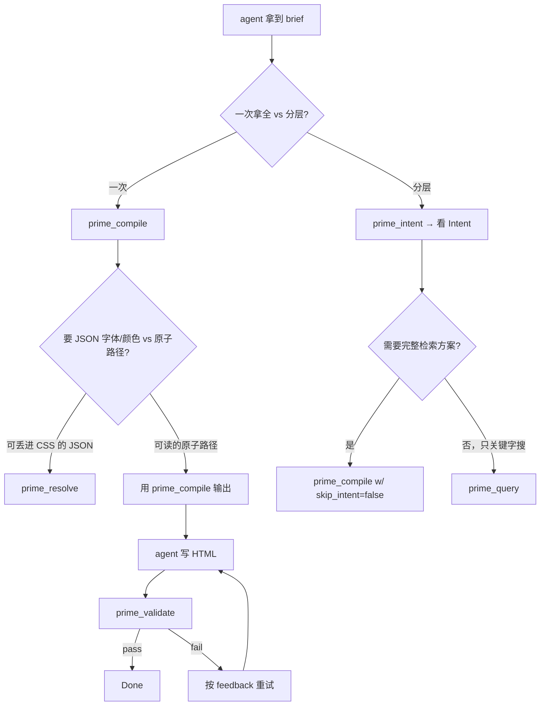

# MCP 工具 — 5 个前端设计工具

语料库仓库的 MCP server 暴露**5 个工具**，对应前端设计 pipeline 的
5 层。本页给每个工具的真实 I/O 签名（直接读 `mcp-server/index.ts`）、
"何时调"决策树、以及一个工作示例。

| 工具 | 层 | 目的 | 成本 |
|---|---|---|---|
| `prime_intent` | 1 | Brief → IntentObject | 1 次 LLM 调用（~$0.001）|
| `prime_compile` | 1+2+3 | 一次性: intent + 检索 + 契约 | 同上 |
| `prime_query` | (任意) | 图遍历 / 关键字搜 / template fetch / scout | 免费 |
| `prime_validate` | 5 | 用契约校验 index.html | L1+L3 免费；L2 ~$0.001 若有 key |
| `prime_resolve` | (替代) | Brief → typed JSON 设计规格 | 1 次 LLM 调用 |

---

## 决策树



---

## 工具 1 · `prime_compile`

**源**: `mcp-server/index.ts:534-780`。

**说明**（来自 server 注册）:

> 把前端 brief 编译成结构化原子检索方案。返回 6 个轴
> （register/pattern/motion/typography/color/rules），每轴含 primary
> + alternates。内部：分类 brief 为 Intent，跑 multi-axis 检索，应用
> composition contract。

### 输入

```ts
{
  brief: string,                        // 必：自由 brief
  mode?: "browse" | "push",             // 默认 "browse"
  skip_intent?: boolean,                // 默认 false；legacy 关键字路径
  // ── legacy 字段（仅 skip_intent=true 时用）─────────────────
  task?: string,
  persona_school?: "editorial" | "dense-pragmatist" | "brutalist" |
                   "swiss-modernist" | "tokyo-minimal" | "warm-institutional" |
                   "notion" | "stripe" | "linear" | "toss" | "vercel",
  persona_flavor?: string[],
  persona_attitude?: "opinionated" | "restrained" | "provocative" | "academic",
  voice_tone?: "imperative" | "gentle" | "academic" | "casual" | "provocative",
  features?: string[],
  hue?: number,                         // 0..360
  chroma?: number,                      // 0..0.4
  include_references?: boolean,
  budget?: number,                      // 100..5000
  max_atoms?: number,                   // 1..50
}
```

### 输出（intent 路径，默认）

```ts
{
  mode: "browse",
  brief: string,
  intent: IntentObject,                 // task_type, sub_type, register_candidates, vibe, ...
  axes: AxisResult[],                   // 6 项
  task_yaml: TaskTypeDefinition,
  composition_contract: MergedContract | null,
  total_atoms: number,
  mandatory_reads: { id: string; path: string }[],
  mandatory_reads_cap: number,          // 家族级（3..12）
  turn_budget_hint: string,             // 家族级建议
  instructions: string[],               // agent 7 步流程
}
```

### 何时调

- 默认：拿到 brief 想一次拿齐。
- `mode: "browse"` 返回基于路径的方案，agent 选读；`mode: "push"`
  （legacy）把内容预置进 context。

### 例（真实 bench-v2 输出）

Brief: `"邮件订阅, 简单就行"`（waitlist 任务）

输出（节选）:

```json
{
  "intent": {
    "task_type": "marketing-landing",
    "sub_type": "waitlist",
    "register_candidates": [
      {"school": "warm-institutional", "weight": 0.4},
      {"school": "magazine-editorial", "weight": 0.3},
      {"school": "notion-warm", "weight": 0.3}
    ]
  },
  "axes": [
    {"axis": "register", "primary": {"id": "@impeccable/persona-warm-institutional"}, ...},
    {"axis": "pattern", "primary": {"id": "@community/pattern-hero-with-demo"}, ...},
    ...
  ],
  "mandatory_reads": [
    {"id": "@community/pattern-hero-with-demo", "path": "compiled-v3-final/.../full.md"},
    {"id": "@community/pattern-trust-signal-components", "path": "..."},
    {"id": "@community/rule-single-primary-action-per-screen", "path": "..."},
    {"id": "@community/pattern-inline-validation", "path": "..."}
  ],
  "mandatory_reads_cap": 5,
  "turn_budget_hint": "目标 ≤8 轮 — 集中检索就够。",
  "composition_contract": {
    "source_atoms": ["@impeccable/persona-warm-institutional"],
    "must_include": ["@community/pattern-hero-cta", "@community/pattern-email-form"],
    ...
  }
}
```

---

## 工具 2 · `prime_query`

**源**: `mcp-server/index.ts:784-913`。

**说明**:

> prime_compile 之后的跟进查询。scope 选你要什么：
> 'atoms'（关键字搜）、'related'（从原子 id 图遍历）、
> 'template'（取 template 原子）、'mandate'（所有硬强制）、
> 'checklist'（任务的发布前清单）、'gallery'（章节参考截图）、
> 'scout'（搜 57k 外部设计参考）。

### 输入

```ts
{
  scope: "atoms" | "related" | "template" | "mandate" | "checklist" | "gallery" | "scout",
  query?: string,                       // atoms / scout / gallery 用
  id?: string,                          // related / template 用
  depth?: 1 | 2 | 3,                    // 图深度（默认 1）
  task?: string,                        // checklist 用
  section?: "hero" | "pricing" | "cta" | "features" | "footer" |
            "testimonial" | "full-landing" | "all",  // gallery 用
  limit?: number,                       // 1..50
  variables?: Record<string, any>,      // template 替换
}
```

### 输出（按 scope 不同）

`scope: "atoms"` →

```json
{
  "results": [
    {"id": "@community/pattern-toast-stack", "kind": "pattern",
     "description": "...", "summary_path": "compiled-v3-final/.../summary.md"},
    ...
  ]
}
```

`scope: "related"`（从起始原子图遍历）:

```json
{
  "starting_atom": "@impeccable/persona-magazine-editorial",
  "depth": 1,
  "edges": [
    {"verb": "compatible", "to": "@impeccable/persona-warm-institutional"},
    {"verb": "must-include", "to": "@community/principle-vertical-rhythm"},
    ...
  ]
}
```

### 何时调

- `prime_compile` 之后，方案覆盖了主要事但还想深挖某个原子周边。
- 按关键字搜语料库（`scope: "atoms"`）。
- 取参数化的 template 输出（`scope: "template", variables: {...}`）。
- 拿任务类型的发布前清单（`scope: "checklist", task:
  "blog-article"`）。

---

## 工具 3 · `prime_intent`

**源**: `mcp-server/index.ts:915-928`。

**说明**:

> 把前端任务 brief 分类成结构化 Intent —— register 候选、vibe、动效
> 优先级、密度、domain。在 prime_compile 之前调用以获得智能原子检索。

### 输入

```ts
{
  brief: string,                        // 任意语言自由文本
}
```

### 输出

```json
{
  "task_type": "blog-article",
  "sub_type": "blog-article",
  "register_candidates": [
    {"school": "magazine-editorial", "weight": 0.55},
    {"school": "notion-warm", "weight": 0.25},
    {"school": "warm-institutional", "weight": 0.20}
  ],
  "vibe": ["editorial", "longform", "typography"],
  "motion_priority": "low",
  "density": "loose",
  "domain": "publishing",
  "required_axes": ["*"]
}
```

### 何时调

- `prime_compile` 之前你想单独看 IntentObject（罕见；`prime_compile`
  本身就把 intent 含在输出里）。
- 干跑 / 调试 intent 分类器，不跑全 pipeline。

---

## 工具 4 · `prime_validate`

**源**: `mcp-server/index.ts:932-982`。

**说明**:

> 用设计意图 + composition contract 校验生成的 index.html。返回
> pass/fail + 结构化反馈。**写完 HTML 后**调，验证它符合规格；如果
> 失败，修问题再 validate。

### 输入

```ts
{
  html_path: string,                    // index.html 绝对路径
  brief: string,                        // 原 brief — 重新分类以恢复 intent
}
```

### 输出

```json
{
  "pass": true,
  "l1": { "pass": true, "issues": [] },
  "l2": { "pass": true, "alignment_score": 0.92, "skipped": false, "issues": [] },
  "l3": {
    "pass": true,
    "honored": ["@community/pattern-toast-stack", ...],
    "violated": [],
    "unverifiable": ["@community/fact-stagger-feel-organic"]
  },
  "quality_thresholds": {
    "min-keyframes": { "required": 4, "found": 5, "pass": true },
    "requires-cubic-bezier": { "required": true, "found": true, "pass": true },
    ...
  },
  "feedback": ""
}
```

### 何时调

- agent 写完 `index.html` 后、宣告完成前。
- 应用重试 feedback 后，再次校验。

完整 L1/L2/L3 语义见 [`validator-html.md`](validator-html.md)。

---

## 工具 5 · `prime_resolve`

**源**: `mcp-server/index.ts:986-998`。

**说明**:

> 把前端 brief 解析成 typed 设计规格 —— 具体字体名、hex、duration、
> 尺寸 —— 直接可丢进 CSS。要 JSON 值而非 markdown 路径时，**用它替
> 代** prime_compile。

### 输入

```ts
{
  brief: string,                        // 自由文本
}
```

### 输出（typed JSON，可直接代入 CSS）

```json
{
  "id": "@impeccable/persona-magazine-editorial",
  "kind": "persona",
  "school": "magazine-editorial",
  "implies": {
    "font": {
      "display": ["Fraunces", "GT Sectra", "Tiempos Headline"],
      "body": ["Tiempos Text", "Lyon Text", "Source Serif 4"],
      "accent": ["Söhne Schmal", "GT America Mono"]
    },
    "color": {
      "background": "#f8f6f1",
      "accent_options": ["#a4451c", "#8b2222", "#c08a3e", "#1e3a8a"],
      "text": "#1a1a1a"
    },
    "density": "loose",
    "display_size_px": [96, 160],
    "body_size_px": [18, 20],
    "line_height": { "display": 1.15, "body": 1.55 }
  },
  "conflicts": ["brutalist", "swiss-modernist", "vercel-clean", "stripe-fintech", "dense-pragmatist"],
  "must_include": [
    "@community/principle-vertical-rhythm",
    "@community/principle-typography-hierarchy",
    "@community/fact-type-scale-modular"
  ]
}
```

### 何时调

- 当你想把 typed 值直接丢进 CSS 时**替代** `prime_compile`。
  agent 不用读 6 份 markdown，拿一份 JSON 就行。
- 适合**简单 brief** + 单一明确 persona。复杂 brief 需要逐轴探索时
  用 `prime_compile`。

Wave 7 协议层 commit 把 `prime_resolve` 推为"最终接口" —— markdown
是中间格式；typed JSON 是 v2 世界 agent 该消费设计知识的方式。

---

## 写作建议 — 调哪个

| Brief 形态 | 调 |
|---|---|
| 单一明确任务（"waitlist"）| `prime_compile`，读 mandatory_reads，写 HTML，`prime_validate` |
| 只要设计 token | `prime_resolve` |
| 想先看 intent 检视分类 | `prime_intent`，再 `prime_compile` |
| 围绕已知原子图遍历 | `prime_query scope=related id=@.../...` |
| 按关键字找原子 | `prime_query scope=atoms query="..."` |
| 校验输出 | `prime_validate html_path=... brief=...` |

---

## 启动配置

5 个工具在 server 启动时注册:

```bash
PRIME_BACKEND=v3 \
PRIME_DIR=/path/to/compiled-v3-final \
  node --experimental-transform-types mcp-server/index.ts
```

`.mcp.json`:

```json
{
  "mcpServers": {
    "prime-wiki": {
      "command": "node",
      "args": ["--experimental-transform-types", "mcp-server/index.ts"],
      "env": {
        "PRIME_BACKEND": "v3",
        "PRIME_DIR": "/abs/path/to/compiled-v3-final"
      }
    }
  }
}
```

启动日志:

```
[prime-wiki] MCP server ready · 5 tools: prime_compile, prime_query,
  prime_intent, prime_validate, prime_resolve · backend=v3 ·
  mode=projection (v3)
```

---

## 工具刻意不做的事

- **没工具调度 LLM**。MCP server 本地跑；LLM 调用在 `prime_intent`
  里，以及（可选）`prime_validate` 的 L2。
- **没工具流式输出**。所有工具一次返回 JSON。
- **没工具调度 Bash / 写文件**。agent 自己写 index.html；server 只
  做检索 + 校验。
- **没工具增长语料库**。新原子通过 `prime-decompose` Skill 或手写
  产生，再走 `prime check` 强制 registry pass；`prime publish`
  （系统仓库）处理 registry 上传。

---

## 源文件

- `mcp-server/index.ts` — 顶层 MCP server，所有 5 个工具。
- `mcp-server/atom-helpers.ts` — atom-meta 加载器。
- `mcp-server/compiler.ts` — legacy compileDSL 路径（仅
  `skip_intent=true` 时用）。
- `mcp-server/data.ts` — atom + edge 索引加载器。
- `mcp-server/persona-resolver.ts` — school → persona-id 映射。
- `mcp-server/search.ts` — `prime_query scope=atoms` 关键字搜。
- `mcp-server/graph.ts` — `prime_query scope=related` 图遍历。
