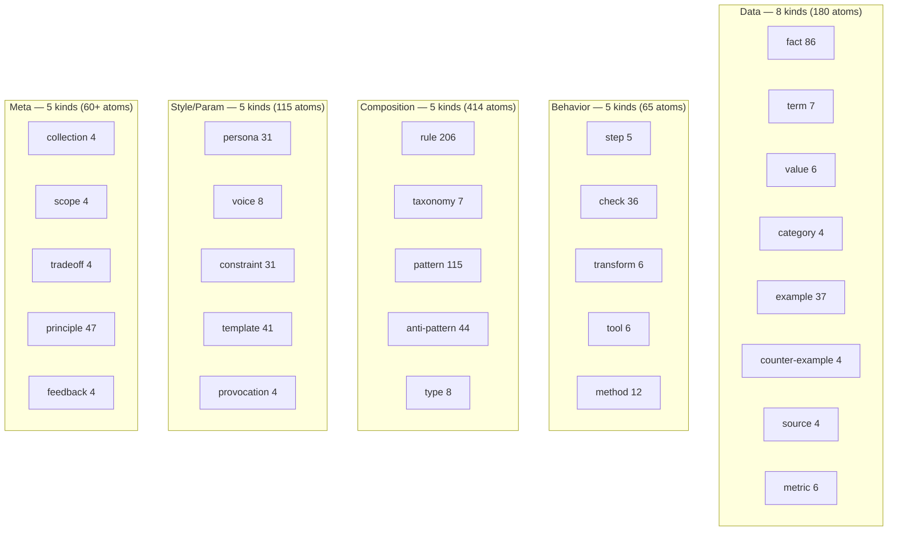

# Overview — what's in the 899-atom corpus

Three ways to slice the corpus: **by domain** (what the atom is
about), **by kind** (what shape the atom takes), and **by persona
school** (which design language the atom belongs to).

This page is the table of contents for design-savvy readers — browse
the slices that match how you think.

---

## By domain (9 domains)

The corpus is dominated by frontend-design (~58%), but covers 8
adjacent domains. The DomainRegistry uses these for retrieval-time
boosting.

| Domain | Atoms | Examples |
|---|---|---|
| `frontend-design` | 525 | All persona / template / motion / typography / layout / pattern atoms |
| `accessibility` | 70 | `rule-color-contrast`, `check-focus-visible`, `fact-aria-live-politeness`, `value-touch-target-min` |
| `visual-design` | 95 | `principle-vertical-rhythm`, `principle-typography-hierarchy`, `principle-color-system-foundation` |
| `ux-design` | 25 | `taxonomy-10-heuristics`, `method-heuristic-review`, `fact-visibility-system-status` |
| `security` | 32 | `rule-csp-no-unsafe-inline`, `rule-cookie-secure-flag`, `pattern-rate-limit`, `principle-defense-in-depth` |
| `i18n` | 5 | `rule-cjk-line-break`, `principle-no-string-concat`, `pattern-icu-message-format` |
| `performance` | 5 | `rule-cls-budget`, `pattern-image-lcp-priority`, `fact-rail-targets` |
| `api-design` | 5 | `rule-resource-not-action`, `pattern-cursor-pagination`, `fact-http-method-semantics` |
| `testing` | 5 | `rule-flaky-quarantine`, `principle-test-pyramid`, `pattern-snapshot-restraint` |
| (cross-domain expansion) | ~130 | Wave 12/13 added data-engineering, ML, legal-compliance, infrastructure, ops-observability — each with 5 atoms |

Open in source:

```
primes-v3/sources/@community/<kind>-<topic>-<...>.prime
```

The `domain:` field on every atom is the source of truth.

---

## By kind (28 declared, ~14 actively populated)

The 28 kinds are organized in 5 layers.



### Most-populated kinds (top 10)

| Kind | Count | What it encodes |
|---|---|---|
| `rule` | 206 | Directly actionable, binary pass/fail |
| `pattern` | 115 | Reusable structural recipe (toast, modal, hero, …) |
| `fact` | 86 | Empirical claim with citation/confidence |
| `principle` | 47 | High-level heuristic (informs rules) |
| `anti-pattern` | 44 | "Don't do this" with rationale |
| `template` | 41 | Concrete code skeleton (CSS / HTML / config) |
| `example` | 37 | Reference implementation citation |
| `check` | 36 | Pass/fail assertion against an artifact |
| `persona` | 31 | A coherent design school (visual aesthetic) |
| `constraint` | 31 | Hard limit (font blacklist, motion ceiling) |

### Rare kinds (post-Wave-13: each ≥4 atoms)

The Wave 13 sparse-kind fill brought every declared kind to ≥4
atoms. Pre-Wave-13 the cliff was harsher (some kinds had 1 atom).

`tradeoff`, `scope`, `feedback`, `collection`, `provocation`, `term`,
`value`, `type`, `transform`, `tool`, `taxonomy`, `step`, `metric`,
`category` — all 4–8 atoms. See `ROADMAP.md` § 4 for the
"keep-as-first-class or demote" decision.

---

## By persona school (4 schools, 31 personas)

Personas are the most expressive atom kind — they bundle visual
choices into a named aesthetic the agent can adopt wholesale. The 31
personas split into 4 schools by namespace + provenance:

```mermaid
flowchart TB
  Schools(("31 personas in 4 schools"))
  Schools --> Impeccable["@impeccable/<br/>10 schools<br/>(distinctive)"]
  Schools --> Anthropic["@anthropic-impeccable/<br/>(supporting atoms only)"]
  Schools --> Community["@community/<br/>21 brand-references"]

  Impeccable --> editorial[editorial]
  Impeccable --> magazineEd[magazine-editorial]
  Impeccable --> brutalist[brutalist]
  Impeccable --> swiss[swiss-modernist]
  Impeccable --> tokyoMin[tokyo-minimal]
  Impeccable --> warmInst[warm-institutional]
  Impeccable --> notionWarm[notion-warm]
  Impeccable --> stripeFin[stripe-fintech]
  Impeccable --> vercelClean[vercel-clean]
  Impeccable --> dense[dense-pragmatist]

  Community --> apple[apple]
  Community --> linear[linear]
  Community --> stripe[stripe]
  Community --> notion[notion]
  Community --> vercel[vercel]
  Community --> spotify[spotify]
  Community --> figma[figma]
  Community --> framer[framer]
  Community --> airbnb[airbnb]
  Community --> coinbase[coinbase]
  Community --> toss[toss]
  Community --> warp[warp]
  Community --> superhuman[superhuman]
  Community --> raycast[raycast]
  Community --> sentry[sentry]
  Community --> sanity[sanity]
  Community --> mintlify[mintlify]
  Community --> posthog[posthog]
  Community --> replicate[replicate]
  Community --> intercom[intercom]
  Community --> supabase[supabase]
```



### School categorization

| School type | Count | Examples | When the retrieval picks them |
|---|---|---|---|
| **Editorial / longform** | 4 | editorial, magazine-editorial, warm-institutional, notion-warm | Brief mentions blog / article / longform / typography craft |
| **Pragmatist / dense** | 3 | dense-pragmatist, swiss-modernist, linear | Brief mentions data-table / dashboard / B2B / settings / dense UI |
| **Modernist / clean** | 5 | vercel-clean, vercel, apple, tokyo-minimal, sanity | Brief mentions clean / minimal / dev-tool / SaaS landing |
| **Distinctive / opinionated** | 3 | brutalist, stripe-fintech, stripe | Brief explicitly opts in (or rejects via composition contract) |
| **Brand-named SaaS** | 16 | linear, stripe, notion, spotify, figma, framer, airbnb, coinbase, toss, warp, superhuman, raycast, sentry, sanity, mintlify, posthog, replicate, intercom, supabase | Brief names the brand or matches its category |

Full per-persona catalog (with brand references, `must-include`
contracts, and which atoms each pulls in): see
[`personas.md`](personas.md).

---

## By task family (5 families, 30 task types)

The taxonomy YAMLs route briefs to retrieval plans. 30 yamls in 5
families:

| Family | Tasks | What unites them |
|---|---|---|
| `marketing-landing` | waitlist · landing-saas · landing-creative · pricing-b2b · pricing-consumer · comparison · 404 · coming-soon | Conversion-focused; single primary CTA; trust signals |
| `product-ui` | dashboard · data-table · file-explorer · kanban-mobile · log-viewer · order-confirm · settings · signup-wizard | In-product surfaces; dense; keyboard navigable |
| `content` | blog-article · doc-page · about-page · changelog · podcast-episode | Prose-heavy; reading rhythm; longform typography |
| `interaction` | toast-demo · modal · command-palette · form-wizard · notification-center | Motion-heavy; transient; a11y-critical |
| `dev-tool` | api-explorer · llm-playground · prompt-editor · analytics-realtime | Engineer audience; mono fonts welcome; data-density OK |

Full taxonomy walk-through with `default_register_pool` /
`required_atoms` / `quality_checks` per task: see
[`taxonomy.md`](taxonomy.md).

---

## Edge graph at a glance

The 899 atoms are connected by ~3,500 edges across 14 declared verb
types. Per Wave 12, all 14 are now active (pre-Wave-12 only 5 had
non-zero count).

| Verb | Edge count | Semantic |
|---|---|---|
| `related` | 2,712 | catch-all peer reference |
| `compatible` | 199 | "works well together" |
| `conflicts` | 139 | "cannot load both" |
| `contradicts` | 62 | strong logical disagreement |
| `see-also` | 25 | loose pairing (rule↔check, etc.) |
| `validates-with` | 31 | rule whose pass/fail comes from a fact/spec |
| `includes` | 15 | composition / collection bundling |
| `relationships` | 10 | taxonomy / category membership |
| `enhances` | 4 | template strengthens pattern |
| `derived-from` | 4 | rule derived from fact/principle |
| `supplies-to` | 4 | data atom feeds consumer atom |
| `specializes` | 3 | sub-pattern of a parent |
| `requires` | 3 | hard dependency |
| `extends` | 1 | persona refinement |

The `requires` / `enhances` / `derived-from` numbers are still
single-digit — see `ROADMAP.md` for the verb-density expansion plan.

---

## What 899 atoms compile to

When `bun run build` runs against `primes-v3/sources/`:

```
compiled-v3-final/
├── _index.xml                           ~3 KB · L0 global index
└── @<scope>/<atom-id>/
    ├── atom.yaml                        full metadata + edges
    └── chunks/
        ├── summary.md                    ~30 token L1 description
        ├── core.md                       ~150 token L2 main fields
        └── full.md                       ~380 token L3 complete
```

This is the **projection model**. The agent always loads `_index.xml`
(one read per session), then selectively reads `chunks/<level>.md` for
the atoms the brief needs. See system repo's `PRIME-SPEC-v1.md` §5
for the formal projection model.

For this corpus specifically, the `_index.xml` is **3.1 KB** and
covers all 899 atoms. The largest `full.md` is `persona-stripe`
(2.4 KB); the smallest is several `term-*` atoms (~280 B).

---

## Quick links into the corpus

For specific exploration:

- **All personas**: `primes-v3/sources/@impeccable/persona-*.prime` +
  `@community/persona-*.prime`
- **All taxonomy yamls**: `primes-v3/taxonomy/*/`
- **All accessibility rules**: `grep -l "domain: accessibility"
  primes-v3/sources/@community/*.prime`
- **All security atoms**:
  `primes-v3/sources/@community/{rule,principle,pattern,anti-pattern}-*-{security,csp,xss,csrf,...}.prime`
- **The W3C / Nielsen citations**: `primes-v3/sources/@w3c/`,
  `primes-v3/sources/@nielsen/`
- **Anthropic-derivative atoms**:
  `primes-v3/sources/@anthropic-impeccable/`

---

For the human-narrative version of this overview (with the A/B
context), see [`benchmarks.md`](benchmarks.md).

For the design-walking-the-catalog version, see
[`personas.md`](personas.md).
