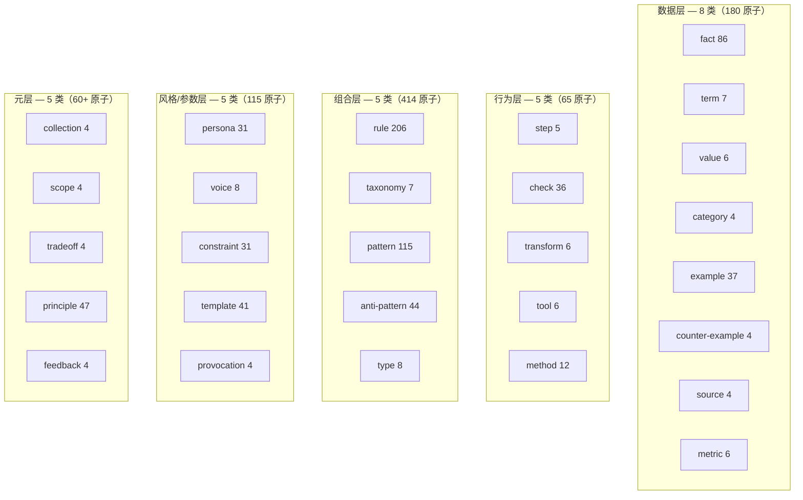
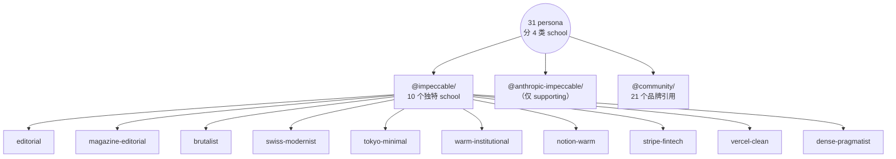

# 概览 — 899 原子语料库里有什么

三种切片：**按 domain**（原子讲什么）、**按 kind**（原子的形状）、
**按 persona school**（原子归哪个设计语言）。

本页是给"懂设计的读者"的目录 —— 按你思考的方式选切片。

---

## 按 domain（9 个）

语料库以 frontend-design 为主（约 58%），覆盖 8 个相邻领域。
DomainRegistry 用这些做检索时的同域加权。

| Domain | 原子数 | 例子 |
|---|---|---|
| `frontend-design` | 525 | 全部 persona / template / motion / typography / layout / pattern |
| `accessibility` | 70 | `rule-color-contrast`、`check-focus-visible`、`fact-aria-live-politeness`、`value-touch-target-min` |
| `visual-design` | 95 | `principle-vertical-rhythm`、`principle-typography-hierarchy`、`principle-color-system-foundation` |
| `ux-design` | 25 | `taxonomy-10-heuristics`、`method-heuristic-review`、`fact-visibility-system-status` |
| `security` | 32 | `rule-csp-no-unsafe-inline`、`rule-cookie-secure-flag`、`pattern-rate-limit`、`principle-defense-in-depth` |
| `i18n` | 5 | `rule-cjk-line-break`、`principle-no-string-concat`、`pattern-icu-message-format` |
| `performance` | 5 | `rule-cls-budget`、`pattern-image-lcp-priority`、`fact-rail-targets` |
| `api-design` | 5 | `rule-resource-not-action`、`pattern-cursor-pagination`、`fact-http-method-semantics` |
| `testing` | 5 | `rule-flaky-quarantine`、`principle-test-pyramid`、`pattern-snapshot-restraint` |
| (跨域扩张) | 约 130 | Wave 12/13 加了 data-engineering、ML、legal-compliance、infrastructure、ops-observability —— 每域 5 原子 |

源代码定位:

```
primes-v3/sources/@<scope>/<kind>-<topic>-<...>.prime
```

每个原子的 `domain:` 字段是 single source of truth。

---

## 按 kind（28 类声明，约 14 类常用）

28 类组织在 5 层。



### 主要 kind（前 10）

| Kind | 数量 | 编码什么 |
|---|---|---|
| `rule` | 206 | 直接可执行，二元 pass/fail |
| `pattern` | 115 | 可复用结构性配方（toast、modal、hero、……） |
| `fact` | 86 | 带引用 / 置信度的实证主张 |
| `principle` | 47 | 高层启发式（导出 rule） |
| `anti-pattern` | 44 | "别这么做" + 理由 |
| `template` | 41 | 具体代码骨架（CSS / HTML / config） |
| `example` | 37 | 实现引用 |
| `check` | 36 | 对工件的 pass/fail 断言 |
| `persona` | 31 | 一致的设计流派（视觉美学） |
| `constraint` | 31 | 硬限制（字体黑名单、动效上限） |

### 稀疏 kind（Wave 13 后每种 ≥4）

Wave 13 sparse-kind fill 把所有声明 kind 拉到 ≥4。Wave 13 之前的悬
崖更陡（有些 kind 只有 1 原子）。

`tradeoff`、`scope`、`feedback`、`collection`、`provocation`、
`term`、`value`、`type`、`transform`、`tool`、`taxonomy`、`step`、
`metric`、`category` —— 都 4–8 原子。"保留为一等公民还是降级"的决
策见 `ROADMAP.md` § 4。

---

## 按 persona school（4 类 school、31 persona）

Persona 是表达力最强的 atom kind —— 它把视觉决策捆绑成一个有名的、
agent 可整体采用的美学。31 persona 按 namespace + 出处分到 4 类
school：



### School 分组

| 流派类型 | 数量 | 例子 | 检索何时选中 |
|---|---|---|---|
| **Editorial / longform** | 4 | editorial、magazine-editorial、warm-institutional、notion-warm | brief 提到博客 / 文章 / longform / 排版讲究 |
| **Pragmatist / dense** | 3 | dense-pragmatist、swiss-modernist、linear | brief 提到 data-table / dashboard / B2B / settings / 高密度 UI |
| **Modernist / clean** | 5 | vercel-clean、vercel、apple、tokyo-minimal、sanity | brief 提到 clean / minimal / 开发工具 / SaaS landing |
| **Distinctive / opinionated** | 3 | brutalist、stripe-fintech、stripe | brief 显式选用（或经 composition contract 明确排除） |
| **品牌名 SaaS** | 16 | linear、stripe、notion、spotify、figma、framer、airbnb、coinbase、toss、warp、superhuman、raycast、sentry、sanity、mintlify、posthog、replicate、intercom、supabase | brief 命名品牌或匹配其品类 |

完整 per-persona catalog（含品牌引用、`must-include` 契约、各自带的
原子）见 [`personas.md`](personas.md)。

---

## 按任务族（5 族 30 任务类型）

任务分类 YAML 把 brief 路由到检索方案。30 份 YAML 分 5 族：

| 族 | 任务 | 共性 |
|---|---|---|
| `marketing-landing` | waitlist · landing-saas · landing-creative · pricing-b2b · pricing-consumer · comparison · 404 · coming-soon | 转化导向；单一首要 CTA；trust signals |
| `product-ui` | dashboard · data-table · file-explorer · kanban-mobile · log-viewer · order-confirm · settings · signup-wizard | 产品内表面；密集；可键盘导航 |
| `content` | blog-article · doc-page · about-page · changelog · podcast-episode | prose 重；阅读节奏；长文排版 |
| `interaction` | toast-demo · modal · command-palette · form-wizard · notification-center | 动效重；瞬态；a11y 关键 |
| `dev-tool` | api-explorer · llm-playground · prompt-editor · analytics-realtime | 工程师受众；欢迎 mono 字体；高数据密度可接受 |

完整 taxonomy 走读，含每个任务的 `default_register_pool` /
`required_atoms` / `quality_checks` 见 [`taxonomy.md`](taxonomy.md)。

---

## 关系图一眼

899 原子由约 3,500 条边连接，跨 14 种声明的动词。Wave 12 起，14 种
都有非零计数（之前只有 5 种有边）。

| Verb | 边数 | 语义 |
|---|---|---|
| `related` | 2,712 | 通用对等引用 |
| `compatible` | 199 | "配得很好" |
| `conflicts` | 139 | "不能同时加载" |
| `contradicts` | 62 | 强逻辑相悖 |
| `see-also` | 25 | 松散配对（rule↔check 等） |
| `validates-with` | 31 | rule 的 pass/fail 来自 fact/spec |
| `includes` | 15 | 组合 / collection 捆绑 |
| `relationships` | 10 | taxonomy / category 成员 |
| `enhances` | 4 | template 强化 pattern |
| `derived-from` | 4 | rule 派生自 fact/principle |
| `supplies-to` | 4 | 数据原子供给消费原子 |
| `specializes` | 3 | 父 pattern 的子 pattern |
| `requires` | 3 | 硬依赖 |
| `extends` | 1 | persona refinement |

`requires` / `enhances` / `derived-from` 数字仍是个位数 —— 动词密度
扩张计划见 `ROADMAP.md`。

---

## 899 原子编译后是什么

`bun run build` 跑过 `primes-v3/sources/` 后：

```
compiled-v3-final/
├── _index.xml                           ~3 KB · L0 全局索引
└── @<scope>/<atom-id>/
    ├── atom.yaml                        全套元数据 + 边
    └── chunks/
        ├── summary.md                    ~30 token · L1 描述
        ├── core.md                       ~150 token · L2 主要字段
        └── full.md                       ~380 token · L3 完整
```

这就是**投影模型**。agent 永远加载 `_index.xml`（每会话一次），然后
按 brief 需要选读 `chunks/<level>.md`。形式化定义见系统仓库的
`PRIME-SPEC-v1.md` §5。

针对本语料库，`_index.xml` 是 **3.1 KB**，覆盖全部 899 原子。最大的
`full.md` 是 `persona-stripe`（2.4 KB）；最小的几个 `term-*` 大约
280 B。

---

## 快速进语料库

具体探索：

- **所有 persona**: `primes-v3/sources/@impeccable/persona-*.prime` +
  `@community/persona-*.prime`
- **所有任务 yaml**: `primes-v3/taxonomy/*/`
- **所有可访问性 rule**: `grep -l "domain: accessibility"
  primes-v3/sources/@community/*.prime`
- **所有 security 原子**:
  `primes-v3/sources/@community/{rule,principle,pattern,anti-pattern}-*-{security,csp,xss,csrf,...}.prime`
- **W3C / Nielsen 引用**: `primes-v3/sources/@w3c/`、
  `primes-v3/sources/@nielsen/`
- **Anthropic 派生原子**: `primes-v3/sources/@anthropic-impeccable/`

---

要看叙事版（含 A/B 上下文），见 [`benchmarks.md`](benchmarks.md)。

要看"设计师按目录走"的版本，见 [`personas.md`](personas.md)。
